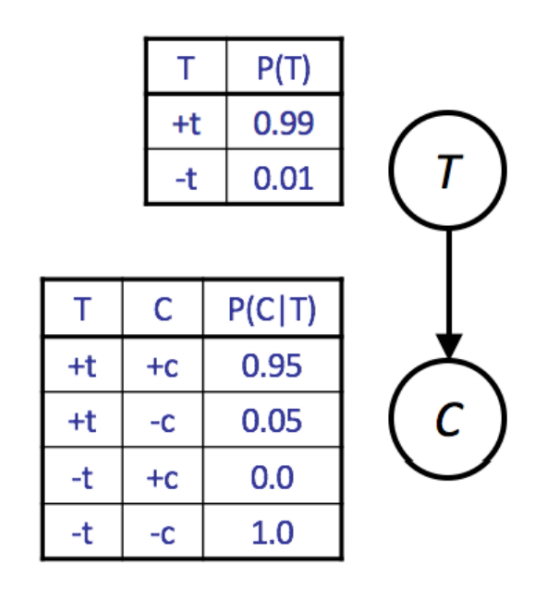
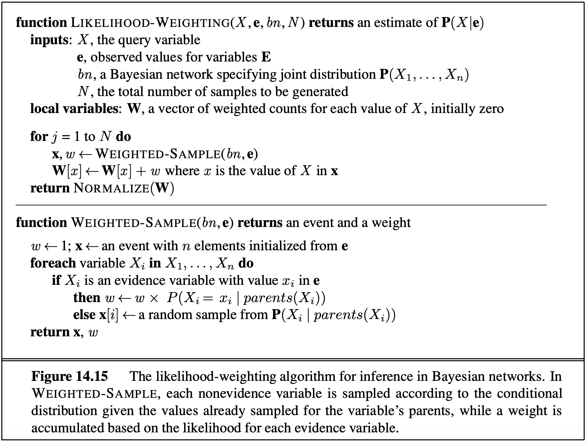
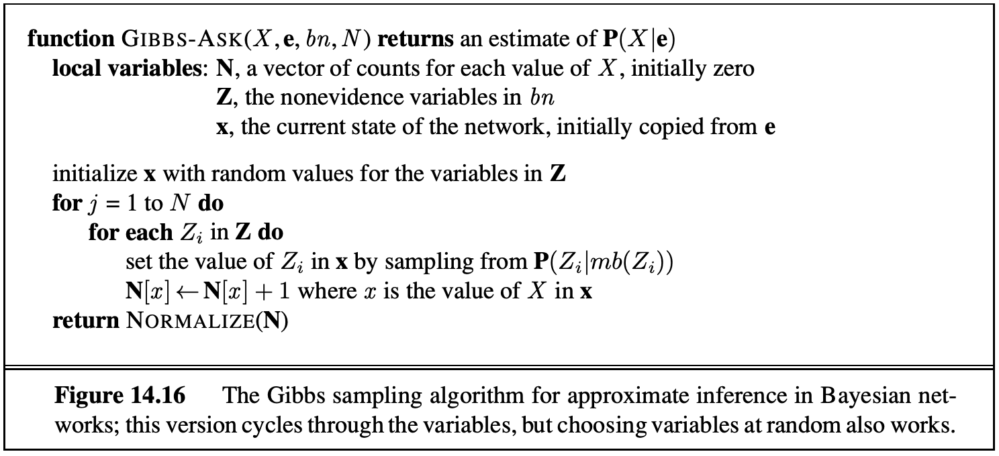

# 6.1 Approximate Inference in Bayes Nets: Sampling

An alternate approach for probabilistic reasoning is to implicitly calculate the probabilities for our query by simply counting samples. This will not yield the exact solution, as in IBE or Variable Elimination, but this approximate inference is often good enough, especially when taking into account massive savings in computation.

For example, suppose we wanted to calculate $$P(+t \mid +e)$$. If we had a magic machine that could generate samples from our distribution, we could collect all samples for which $$ E = +e $$, and then compute the fraction of those samples for which $$T = +t$$. We'd easily be able to compute any inference we'd want just by looking at the samples. Let's see some different methods for generating samples.

## 6.1.1 Prior Sampling

Given a Bayes Net model, we can easily write a simulator. For example, consider the CPTs given below for the simplified model with only two variables T and C.



A simple simulator in Python would be written as follows:

```python
import random

def get_t():
    if random.random() < 0.99:
        return True
    return False

def get_c(t):
    if t and random.random() < 0.95:
        return True
    return False

def get_sample():
    t = get_t()
    c = get_c(t)
    return [t, c]
```

We call this simple approach **prior sampling**. The downside of this approach is that it may require the generation of a very large number of samples in order to perform analysis of unlikely scenarios. If we wanted to compute $$ P(C \mid -t) $$, we'd have to throw away 99% of our samples.

## 6.1.2 Rejection Sampling

One way to mitigate the previously stated problem is to modify our procedure to early reject any sample inconsistent with our evidence. For example, for the query $$ P(C \mid -t) $$, we'd avoid generating a value for C unless t is false. This still means we have to throw away most of our samples, but at least the bad samples we generate take less time to create. We call this approach **rejection sampling**.

These two approaches work for the same reason: any valid sample occurs with the same probability as specified in the joint PDF.

## 6.1.3 Likelihood Weighting

A more exotic approach is **likelihood weighting**, which ensures that we never generate a bad sample. In this approach, we manually set all variables equal to the evidence in our query. For example, if we wanted to compute $$ P(C \mid -t) $$, we'd simply declare that $$ t $$ is false. The problem here is that this may yield samples that are inconsistent with the correct distribution.

If we simply force some variables to be equal to the evidence, then our samples occur with probability only equal to the products of the CPTs of the non-evidence variables. This means the joint PDF has no guarantee of being correct (though it may be for some cases like our two-variable Bayes Net). Instead, if we have sampled variables $$ Z_1 $$ through $$ Z_p $$ and fixed evidence variables $$ E_1 $$ through $$ E_m $$, a sample is given by the probability $$ P(Z_1 \ldots Z_p, E_1 \ldots E_m) = \prod_{i=1}^p P(Z_i \mid \text{Parents}(Z_i)) $$. What is missing is that the probability of a sample does not include all the probabilities of $$ P(E_i \mid \text{Parents}(E_i)) $$, i.e., not every CPT participates.

Likelihood weighting solves this issue by using a weight for each sample, which is the probability of the evidence variables given the sampled variables. That is, instead of counting all samples equally, we can define a weight $$ w_j $$ for sample $$ j $$ that reflects how likely the observed values for the evidence variables are, given the sampled values. In this way, we ensure that every CPT participates. To do this, we iterate through each variable in the Bayes net, as we do for normal sampling, sampling a value if the variable is not an evidence variable, or changing the weight for the sample if the variable is evidence.

For example, suppose we want to calculate $$ P(T \mid +c, +e) $$. For the $$j$$ th sample, we'd perform the following algorithm:

- Set $$ w_j $$ to 1.0, and $$ c = \text{true} $$ and $$ e = \text{true} $$.
- For $$ T $$: This is not an evidence variable, so we sample $$ t_j $$ from $$ P(T) $$.
- For $$ C $$: This is an evidence variable, so we multiply the weight of the sample by $$ P(+c \mid t_j) $$, i.e., $$ w_j = w_j \cdot P(+c \mid t_j) $$.
- For $$ S $$: sample $$ s_j $$ from $$ P(S \mid t_j) $$.
- For $$ E $$: multiply the weight of the sample by $$ P(+e \mid +c, s_j) $$, i.e., $$ w_j = w_j \cdot P(+e \mid +c, s_j) $$.

Then when we perform the usual counting process, we weight sample $$ j $$ by $$ w_j $$ instead of 1, where $$ 0 \leq w_j \leq 1 $$. This approach works because in the final calculations for the probabilities, the weights effectively serve to replace the missing CPTs. In effect, we ensure that the weighted probability of each sample is given by $$ P(z_1 \ldots z_p, e_1 \ldots e_m) = \left[\prod_{i=1}^p P(z_i \mid \text{Parents}(z_i))\right] \cdot \left[\prod_{i=1}^m P(e_i \mid \text{Parents}(e_i))\right] $$. The pseudocode for Likelihood Weighting is provided below.



For all three of our sampling methods (prior sampling, rejection sampling, and likelihood weighting), we can get increasing amounts of accuracy by generating additional samples. However, of the three, likelihood weighting is the most computationally efficient, for reasons beyond the scope of this course.

## 6.1.4 Gibbs Sampling

**Gibbs Sampling** is a fourth approach for sampling. In this approach, we first set all variables to some totally random value (not taking into account any CPTs). We then repeatedly pick one variable at a time, clear its value, and resample it given the values currently assigned to all other variables.

For the $$ T, C, S, E $$ example above, we might assign $$ t = \text{true} $$, $$ c = \text{true} $$, $$ s = \text{false} $$, and $$ e = \text{true} $$. We then pick one of our four variables to resample, say $$ S $$, and clear it. We then pick a new variable from the distribution $$ P(S \mid +t, +c, +e) $$. This requires us knowing this conditional distribution. It turns out that we can easily compute the distribution of any single variable given all other variables. More specifically, $$ P(S \mid T, C, E) $$ can be calculated only using the CPTs that connect S with its neighbors. Thus, in a typical Bayes Net, where most variables have only a small number of neighbors, we can precompute the conditional distributions for each variable given all of its neighbors in linear time.

We will not prove this, but if we repeat this process enough times, our later samples will eventually converge to the correct distribution even though we may start from a low-probability assignment of values. If you're curious, there are some caveats beyond the scope of the course that you can read about under the Failure Modes section of the Wikipedia article for Gibbs Sampling.

The pseudocode for Gibbs Sampling is provided below.



## 6.1.5 Summary

To summarize, Bayes' Nets is a powerful representation of joint probability distributions. Its topological structure encodes independence and conditional independence relationships, and we can use it to model arbitrary distributions to perform inference and sampling.

In this note, we covered two approaches to probabilistic inference: exact inference and probabilistic inference (sampling). In exact inference, we are guaranteed the exact correct probability, but the amount of computation may be prohibitive.

The exact inference algorithms covered were:
- Inference By Enumeration
- Variable Elimination

We can turn to sampling to approximate solutions while using less compute.

The sampling algorithms covered were:
- Prior Sampling
- Rejection Sampling
- Likelihood Weighting
- Gibbs Sampling

