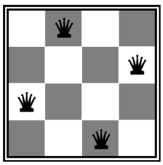
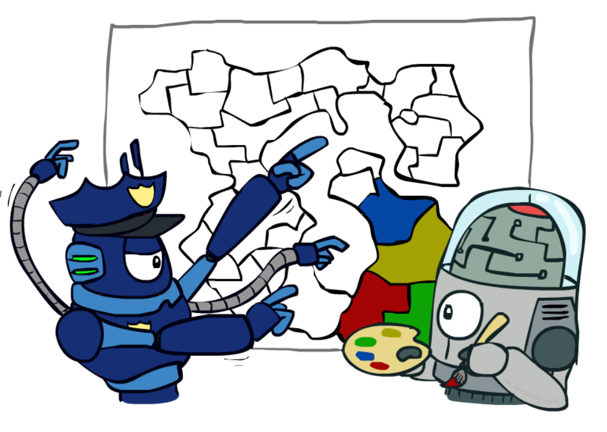
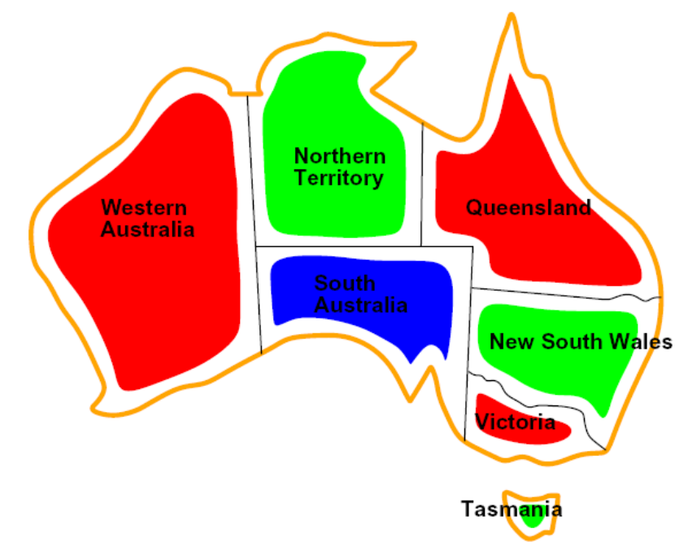
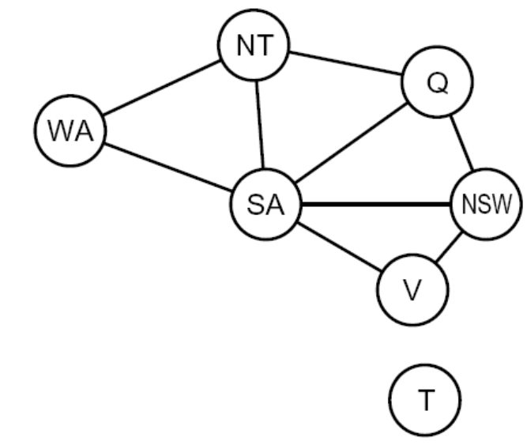

# 2.1 Constraint Satisfaction Problems

In the previous note, we learned how to find optimal solutions to search problems, a type of **planning problem**. Now, we'll learn about solving a related class of problems, **constraint satisfaction problems** (CSPs). Unlike search problems, CSPs are a type of **identification problem**, problems in which we must simply identify whether a state is a goal state or not, with no regard to how we arrive at that goal. CSPs are defined by three factors:

1. *Variables* - CSPs possess a set of $$ N $$ variables $$ X_1, \dots, X_N $$ that can each take on a single value from some defined set of values.
2. *Domain* - A set $$ \{x_1, \dots, x_d\} $$ representing all possible values that a CSP variable can take on.
3. *Constraints* - Constraints define restrictions on the values of variables, potentially with regard to other variables.

Consider the $$ N $$-queens identification problem: given an $$ N \times N $$ chessboard, can we find a configuration in which to place $$ N $$ queens on the board such that no two queens attack each another?

We can formulate this problem as a CSP as follows:

1. *Variables* - $$ X_{ij} $$, with $$ 0 \leq i, j < N $$. Each $$ X_{ij} $$ represents a grid position on our $$ N \times N $$ chessboard, with $$ i $$ and $$ j $$ specifying the row and column number respectively.
2. *Domain* - $$ \{0, 1\} $$. Each $$ X_{ij} $$ can take on either the value 0 or 1, a boolean value representing the existence of a queen at position $$ (i, j) $$ on the board.
3. *Constraints* - 
    - $$ \forall i,j,k \:\: (X_{ij}, X_{ik}) \in \{(0, 0), (0, 1), (1, 0)\} $$. This constraint states that if two variables have the same value for $$ i $$, only one of them can take on a value of 1. This effectively encapsulates the condition that no two queens can be in the same row.
    - $$ \forall i,j,k \:\: (X_{ij}, X_{kj}) \in \{(0, 0), (0, 1), (1, 0)\} $$. Almost identically to the previous constraint, this constraint states that if two variables have the same value for $$ j $$, only one of them can take on a value of 1, encapsulating the condition that no two queens can be in the same column.
    - $$ \forall i,j,k \:\: (X_{ij}, X_{i+k,j+k}) \in \{(0, 0), (0, 1), (1, 0)\} $$. With similar reasoning as above, we can see that this constraint and the next represent the conditions that no two queens can be in the same major or minor diagonals, respectively.
    - $$ \forall i,j,k \:\: (X_{ij}, X_{i+k,j-k}) \in \{(0, 0), (0, 1), (1, 0)\} $$.
    - $$ \sum_{i,j}X_{ij} = N $$. This constraint states that we must have exactly $$ N $$ grid positions marked with a 1, and all others marked with a 0, capturing the requirement that there are exactly $$ N $$ queens on the board.

Constraint satisfaction problems are **NP-hard**, which loosely means that there exists no known algorithm for finding solutions to them in polynomial time. Given a problem with $$ N $$ variables with domain of size $$ O(d) $$ for each variable, there are $$ O(d^N) $$ possible assignments, exponential in the number of variables. We can often get around this caveat by formulating CSPs as search problems, defining states as **partial assignments** (variable assignments to CSPs where some variables have been assigned values while others have not). Correspondingly, the successor function for a CSP state outputs all states with one new variable assigned, and the goal test verifies all variables are assigned and all constraints are satisfied in the state it's testing. Constraint satisfaction problems tend to have significantly more structure than traditional search problems, and we can exploit this structure by combining the above formulation with appropriate heuristics to hone in on solutions in a feasible amount of time.

## 2.1.1 Constraint Graphs

Let's introduce a second CSP example: map coloring. Map coloring solves the problem where we're given a set of colors and must color a map such that no two adjacent states or regions have the same color.

Constraint satisfaction problems are often represented as constraint graphs, where nodes represent variables and edges represent constraints between them. There are many different types of constraints, and each is handled slightly differently:

- *Unary Constraints* - Unary constraints involve a single variable in the CSP. They are not represented in constraint graphs, instead simply being used to prune the domain of the variable they constrain when necessary.
- *Binary Constraints* - Binary constraints involve two variables. They're represented in constraint graphs as traditional graph edges.
- *Higher-order Constraints* - Constraints involving three or more variables can also be represented with edges in a CSP graph, they just look slightly unconventional.

Consider map coloring the map of Australia:

The constraints in this problem are simply that no two adjacent states can be the same color. As a result, by drawing an edge between every pair of states that are adjacent to one another, we can generate the constraint graph for the map coloring of Australia as follows:

The value of constraint graphs is that we can use them to extract valuable information about the structure of the CSPs we are solving. By analyzing the graph of a CSP, we can determine things about it like whether it's sparsely or densely connected/constrained and whether or not it's tree-structured. We'll cover this more in depth as we discuss solving constraint satisfaction problems in more detail.