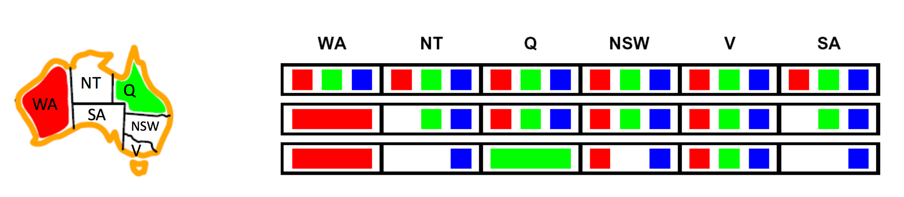
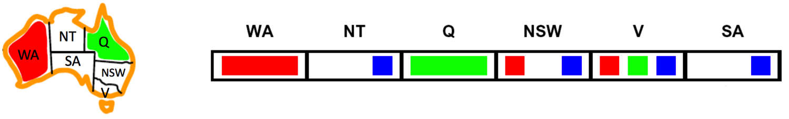
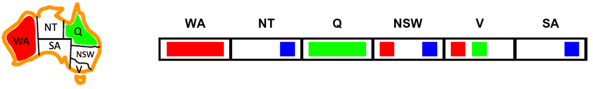
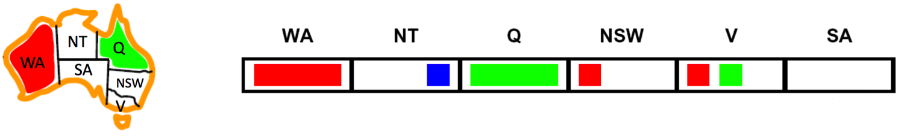
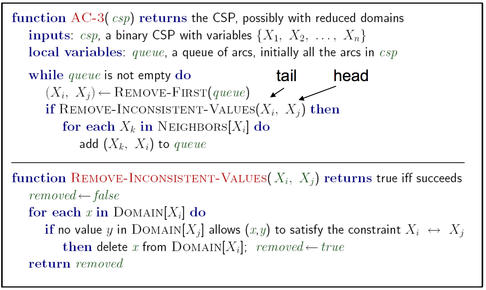

# 2.3 Filtering

The first improvement to CSP performance we'll consider is **filtering**, which checks if we can prune the domains of unassigned variables ahead of time by removing values we know will result in backtracking. A naïve method for filtering is **forward checking**, which whenever a value is assigned to a variable $$ X_i $$, prunes the domains of unassigned variables that share a constraint with $$ X_i $$ that would violate the constraint if assigned. Whenever a new variable is assigned, we can run forward checking and prune the domains of unassigned variables adjacent to the newly assigned variable in the constraint graph. Consider our map coloring example, with unassigned variables and their potential values:

Note how as we assign $$ WA = \text{red} $$ and then $$ Q = \text{green} $$, the size of the domains for $$ NT $$, $$ NSW $$, and $$ SA $$ (states adjacent to $$ WA $$, $$ Q $$, or both) decrease in size as values are eliminated. The idea of forward checking can be generalized into the principle of **arc consistency**. For arc consistency, we interpret each undirected edge of the constraint graph for a CSP as two directed edges pointing in opposite directions. Each of these directed edges is called an **arc**. The arc consistency algorithm works as follows:

- Begin by storing all arcs in the constraint graph for the CSP in a queue $$ Q $$.
- Iteratively remove arcs from $$ Q $$ and enforce the condition that in each removed arc $$ X_i \longrightarrow X_j $$, for every remaining value $$ v $$ for the tail variable $$ X_i $$, there is at least one remaining value $$ w $$ for the head variable $$ X_j $$ such that $$ X_i = v $$, $$ X_j = w $$ does not violate any constraints. If some value $$ v $$ for $$ X_i $$ would not work with any of the remaining values for $$ X_j $$, we remove $$ v $$ from the set of possible values for $$ X_i $$.
- If at least one value is removed for $$ X_i $$ when enforcing arc consistency for an arc $$ X_i \longrightarrow X_j $$, add arcs of the form $$ X_k \longrightarrow X_i $$ to $$ Q $$, for all unassigned variables $$ X_k $$. If an arc $$ X_k \longrightarrow X_i $$ is already in $$ Q $$ during this step, it doesn't need to be added again.
- Continue until $$ Q $$ is empty, or the domain of some variable is empty and triggers a backtrack.

The arc consistency algorithm is typically not the most intuitive, so let's walk through a quick example with map coloring:

We begin by adding all arcs between unassigned variables sharing a constraint to a queue $$ Q $$, which gives us:

$$
Q = [
    SA \rightarrow V, V \rightarrow SA, SA \rightarrow NSW, NSW \rightarrow SA, SA \rightarrow NT, NT \rightarrow SA, V \rightarrow NSW, NSW \rightarrow V]
$$

For our first arc, $$ SA \rightarrow V $$, we see that for every value in the domain of $$ SA $$, $$ \{blue\} $$, there is *at least* one value in the domain of $$ V $$, $$ \{red, green, blue\} $$, that violates no constraints, and so no values need to be pruned from $$ SA $$'s domain. However, for our next arc $$ V \rightarrow SA $$, if we set $$ V = \text{blue} $$ we see that $$ SA $$ will have no remaining values that violate no constraints, and so we prune $$ \text{blue} $$ from $$ V $$'s domain.

Because we pruned a value from the domain of $$ V $$, we need to enqueue all arcs with $$ V $$ at the head - $$ SA \rightarrow V $$, $$ NSW \rightarrow V $$. Since $$ NSW \rightarrow V $$ is already in $$ Q $$, we only need to add $$ SA \rightarrow V $$, leaving us with our updated queue:

$$
Q = [SA \rightarrow NSW, NSW \rightarrow SA, SA \rightarrow NT, NT \rightarrow SA, V \rightarrow NSW, NSW \rightarrow V, SA \rightarrow V]
$$

We can continue this process until we eventually remove the arc $$ SA \rightarrow NT $$ from $$ Q $$. Enforcing arc consistency on this arc removes $$ \text{blue} $$ from $$ SA $$'s domain, leaving it empty and triggering a backtrack. Note that the arc $$ NSW \rightarrow SA $$ appears before $$ SA \rightarrow NT $$ in $$ Q $$ and that enforcing consistency on this arc removes $$ \text{blue} $$ from the domain of $$ NSW $$.

Arc consistency is typically implemented with the AC-3 algorithm (Arc Consistency Algorithm #3), for which the pseudocode is as follows:

The AC-3 algorithm has a worst-case time complexity of $$ O(ed^3) $$, where $$ e $$ is the number of arcs (directed edges) and $$ d $$ is the size of the largest domain. Overall, arc consistency is more holistic of a domain pruning technique than forward checking and leads to fewer backtracks, but requires running significantly more computation in order to enforce. Accordingly, it's important to take into account this tradeoff when deciding which filtering technique to implement for the CSP you're attempting to solve.

As an interesting parting note about consistency, arc consistency is a subset of a more generalized notion of consistency known as **k-consistency**, which when enforced guarantees that for any set of $$ k $$ nodes in the CSP, a consistent assignment to any subset of $$ k-1 $$ nodes guarantees that the $$ k^{th} $$ node will have at least one consistent value. This idea can be further extended through the idea of **strong k-consistency**. A graph that is strong $$ k $$-consistent possesses the property that any subset of $$ k $$ nodes is not only $$ k $$-consistent but also $$ k-1, k-2, \dots, 1 $$-consistent as well. Not surprisingly, imposing a higher degree of consistency on a CSP is more expensive to compute. Under this generalized definition for consistency, we can see that arc consistency is equivalent to $$ 2 $$-consistency.
