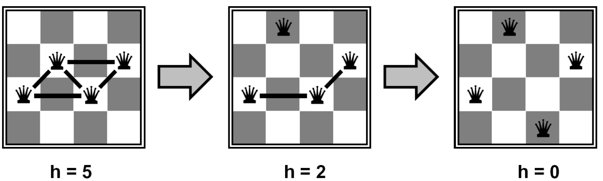
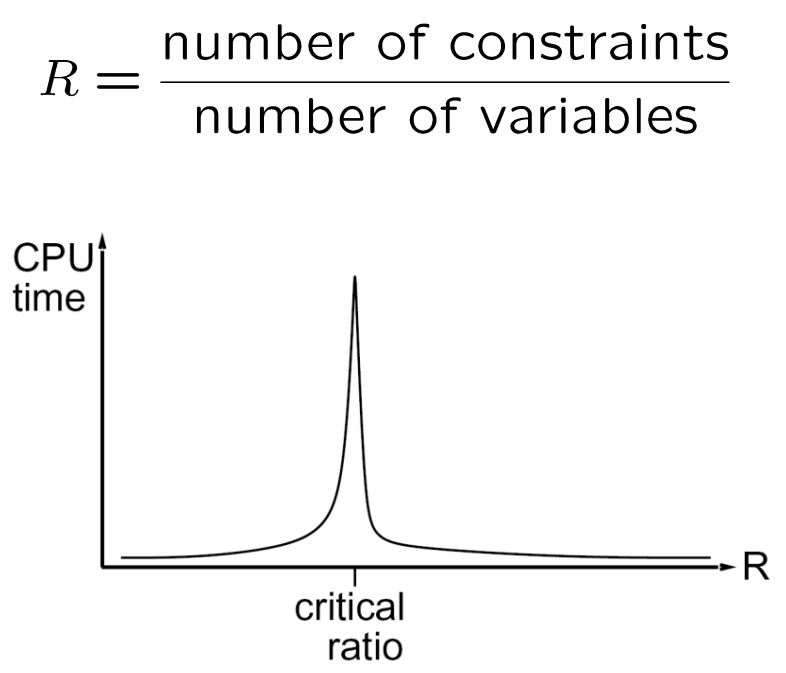

# 2.5 Local Search

As a final topic of interest, backtracking search is not the only algorithm that exists for solving constraint satisfaction problems. Another widely used algorithm is **local search**, for which the idea is childishly simple but remarkably useful. Local search works by iterative improvement—start with some random assignment to values, then iteratively select a random conflicted variable and reassign its value to the one that violates the fewest constraints until no more constraint violations exist (a policy known as the **min-conflicts heuristic**). Under such a policy, constraint satisfaction problems like $$N$$-queens become both very time-efficient and space-efficient to solve. For example, in the following example with 4 queens, we arrive at a solution after only 2 iterations:

In fact, local search appears to run in almost constant time and have a high probability of success not only for $$N$$-queens with arbitrarily large $$N$$, but also for any randomly generated CSP! However, despite these advantages, local search is both incomplete and suboptimal and so won't necessarily converge to an optimal solution. Additionally, there is a critical ratio around which using local search becomes extremely expensive:

The figure above shows the one-dimensional plot of an objective function on the state space. For that function, we wish to find the state that corresponds to the highest objective value. The basic idea of local search algorithms is that from each state, they locally move toward states that have a higher objective value until a maximum (hopefully the global) is reached.

We will be covering three such algorithms: **hill-climbing**, **simulated annealing**, and **genetic algorithms**. All these algorithms are also used in optimization tasks to either maximize or minimize an objective function.

---

## 2.5.1 Hill-Climbing Search

The hill-climbing search algorithm (or **steepest-ascent**) moves from the current state toward a neighboring state that increases the objective value. The algorithm does not maintain a search tree but only the states and the corresponding values of the objective. The "greediness" of hill-climbing makes it vulnerable to being trapped in **local maxima** (see figure below), as locally those points appear as global maxima to the algorithm, and **plateaux**. Plateaux can be categorized into "flat" areas at which no direction leads to improvement ("flat local maxima") or flat areas from which progress can be slow ("shoulders"). Variants of hill-climbing, like **stochastic hill-climbing**, which selects an action randomly among the uphill moves, have been proposed. This version of hill-climbing has been shown in practice to converge to higher maxima at the cost of more iterations.

The pseudocode of hill-climbing can be seen above. As the name suggests, the algorithm iteratively moves to a state with a higher objective value until no such progress is possible. Hill-climbing is incomplete. **Random-Restart hill-climbing**, on the other hand, conducts a number of hill-climbing searches, each time from a randomly chosen initial state, and is trivially complete, as at some point the randomly chosen initial state will coincide with the global maximum.

---

## 2.5.2 Simulated Annealing Search

The second local search algorithm we will cover is simulated annealing. Simulated annealing aims to combine random walk (randomly moving to nearby states) and hill-climbing to obtain a complete and efficient search algorithm. In simulated annealing, we allow moves to states that can decrease the objective. More specifically, the algorithm at each state chooses a random move. If the move leads to a higher objective, it is always accepted. If, on the other hand, it leads to smaller objectives, then the move is accepted with some probability. This probability is determined by the temperature parameter, which initially is high (more "bad" moves allowed) and decreases according to some schedule. If the temperature is decreased slowly enough, then the simulated annealing algorithm will reach the global maximum with a probability approaching 1.

---

## 2.5.3 Genetic Algorithms

Finally, we present **genetic algorithms**, which are a variant of local beam search and are also extensively used in many optimization tasks. Genetic algorithms begin as beam search with $$k$$ randomly initialized states called the **population**. States (or **individuals**) are represented as a string over a finite alphabet. To understand the topic better, let's revisit the 8-Queens problem presented in class. For the 8-Queens problem, we can represent each of the eight individuals with a number that ranges from 1–8, representing the location of each queen in the column (column (a) in Fig. 4.6). Each individual is evaluated using an evaluation function (**fitness function**), and they are ranked according to the values of that function. For the 8-Queens problem, this is the number of non-attacking pairs of queens.

The probability of choosing a state to "reproduce" is proportional to the value of that state. We proceed to select pairs of states to reproduce according to these probabilities (column (c) in Fig. 4.6). Offspring are generated by crossing over the parent strings at the crossover point. That crossover point is chosen randomly for each pair. Finally, each offspring is susceptible to some random mutation with independent probability. The pseudocode of the genetic algorithm can be seen in the following picture.

Genetic algorithms try to move uphill while exploring the state space and exchanging information between threads. Their main advantage is the use of crossovers since this allows for large blocks of letters, that have evolved and lead to high valuations, to be combined with other such blocks and produce a solution with a high total score.