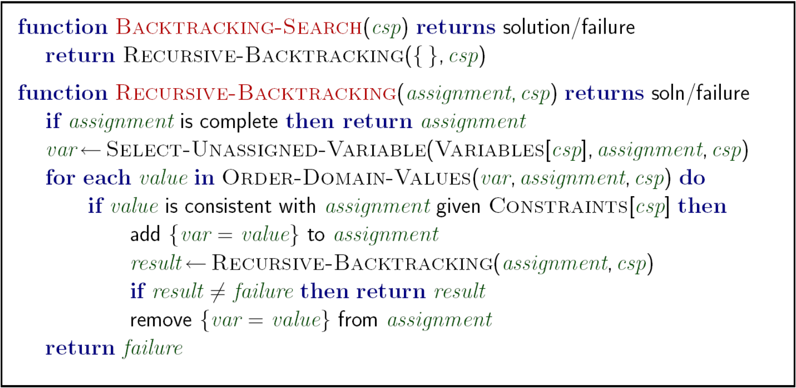
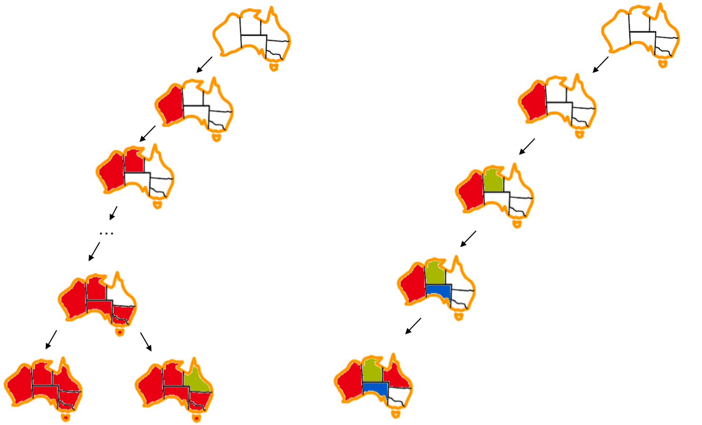

# 2.2 Solving Constraint Satisfaction Problems

Constraint satisfaction problems are traditionally solved using a search algorithm known as **backtracking search**. Backtracking search is an optimization on depth-first search used specifically for the problem of constraint satisfaction, with improvements coming from two main principles:

1. Fix an ordering for variables, and select values for variables in this order. Because assignments are commutative (e.g. assigning $$ WA = \text{Red},\:\: NT = \text{Green} $$ is identical to $$ NT = \text{Green},\:\: WA = \text{Red} $$), this is valid.
2. When selecting values for a variable, only select values that don't conflict with any previously assigned values. If no such values exist, backtrack and return to the previous variable, changing its value.

The pseudocode for how recursive backtracking works is presented below:

For a visualization of how this process works, consider the partial search trees for both depth-first search and backtracking search in map coloring:

Note how DFS regretfully colors everything red before ever realizing the need for change, and even then doesn't move too far in the right direction towards a solution. On the other hand, backtracking search only assigns a value to a variable if that value violates no constraints, leading to significantly less backtracking. Though backtracking search is a vast improvement over the brute-forcing of depth-first search, we can get more gains in speed still with further improvements through filtering, variable/value ordering, and structural exploitation.
