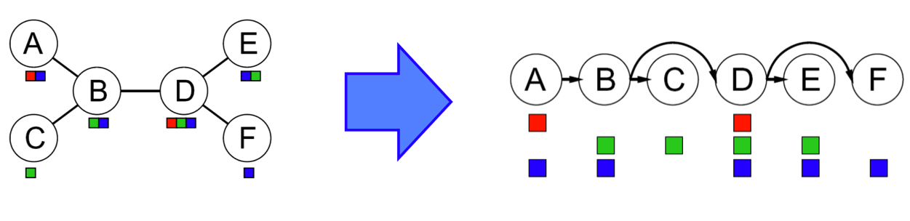
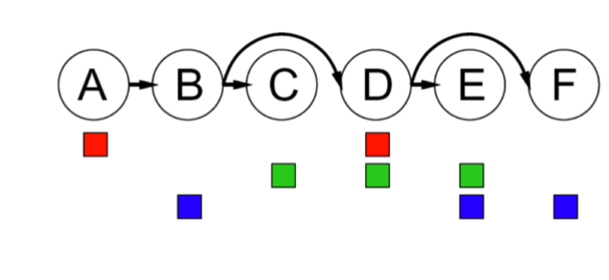
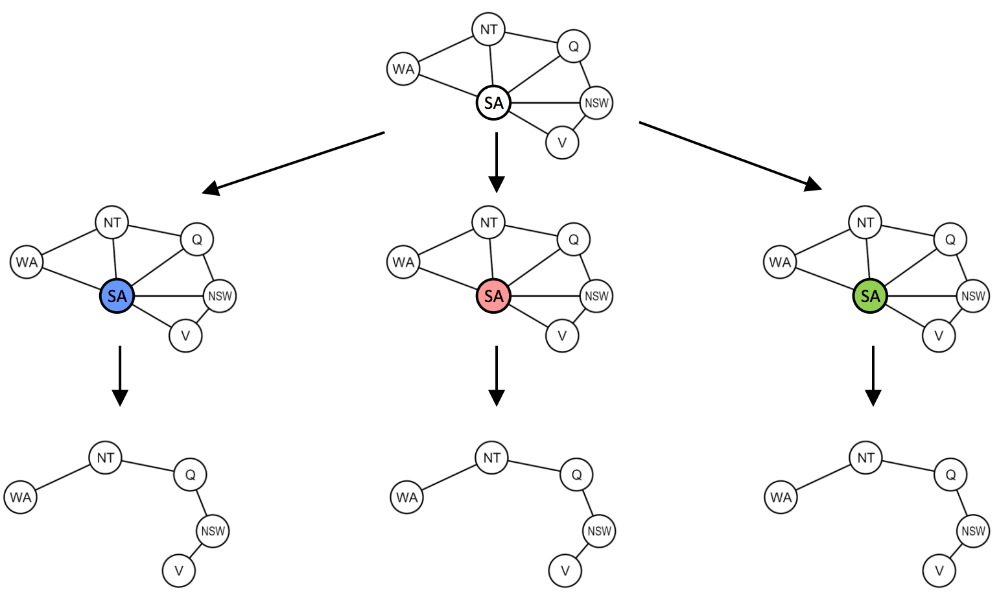

# 2.6 Structure

A final class of improvements to solving constraint satisfaction problems are those that exploit their structure. In particular, if we're trying to solve a **tree-structured CSP** (one that has no loops in its constraint graph), we can reduce the runtime for finding a solution from $$ O(d^N) $$ all the way to $$ O(nd^2) $$, linear in the number of variables. This can be done with the tree-structured CSP algorithm, outlined below:

- First, pick an arbitrary node in the constraint graph for the CSP to serve as the root of the tree (it doesn't matter which one because basic graph theory tells us any node of a tree can serve as a root).
- Convert all undirected edges in the tree to directed edges that point *away* from the root. Then **linearize** (or **topologically sort**) the resulting directed acyclic graph. In simple terms, this just means ordering the nodes of the graph such that all edges point rightwards. Noting that we select node $$ A $$ to be our root and direct all edges to point away from $$ A $$, this process results in the following conversion for the CSP presented below:

- Perform a **backwards pass** of arc consistency. Iterating from $$ i = n $$ down to $$ i = 2 $$, enforce arc consistency for all arcs $$ Parent(X_i) \longrightarrow X_i $$. For the linearized CSP from above, this domain pruning will eliminate a few values, leaving us with the following:

- Finally, perform a **forward assignment**. Starting from $$ X_1 $$ and going to $$ X_n $$, assign each $$ X_i $$ a value consistent with that of its parent. Because we've enforced arc consistency on all of these arcs, no matter what value we select for any node, we know that its children will each have at least one consistent value. Hence, this iterative assignment guarantees a correct solution, a fact which can be proven inductively without difficulty.

The tree-structured algorithm can be extended to CSPs that are reasonably close to being tree-structured with **cutset conditioning**. Cutset conditioning involves first finding the smallest subset of variables in a constraint graph such that their removal results in a tree (such a subset is known as a **cutset** for the graph). For example, in our map coloring example, South Australia ($$ SA $$) is the smallest possible cutset:

Once the smallest cutset is found, we assign all variables in it and prune the domains of all neighboring nodes. What's left is a tree-structured CSP, upon which we can solve with the tree-structured CSP algorithm from above! The initial assignment to a cutset of size $$ c $$ may leave the resulting tree-structured CSP(s) with no valid solution after pruning, so we may still need to backtrack up to $$ d^c $$ times. Since removal of the cutset leaves us with a tree-structured CSP with $$ (n - c) $$ variables, we know this can be solved (or determined that no solution exists) in $$ O((n - c)d^2) $$. Hence, the runtime of cutset conditioning on a general CSP is $$ O(d^c(n-c)d^2) $$, very good for small $$ c $$.