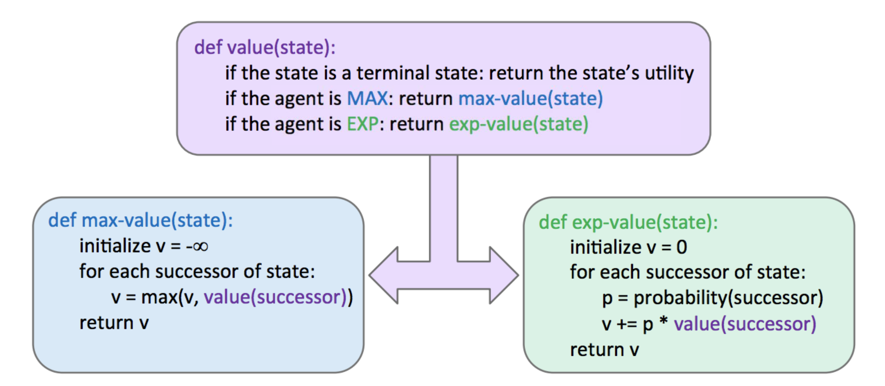
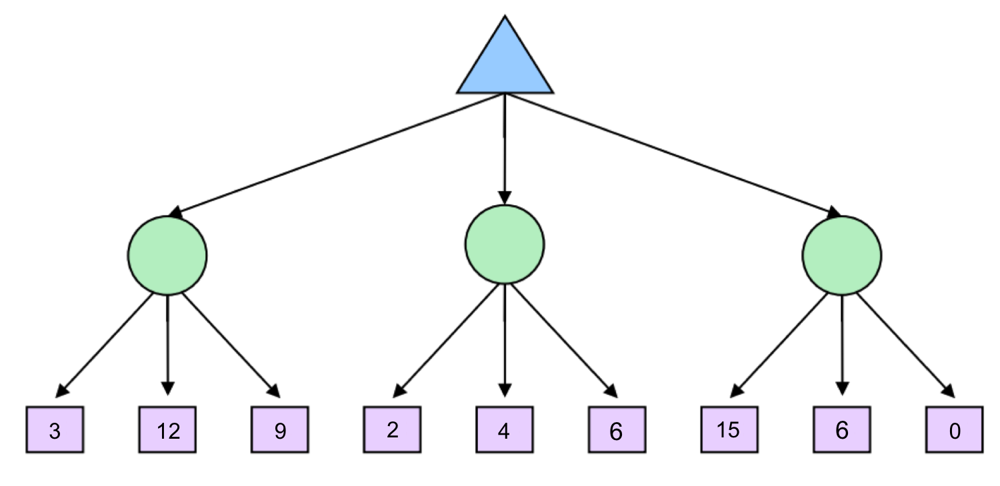
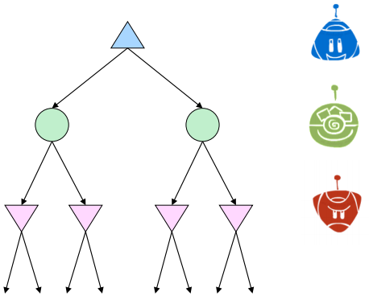

# 3.3 Expectimax

We've now seen how minimax works and how running full minimax allows us to respond optimally against an optimal opponent. However, minimax has some natural constraints on the situations to which it can respond. Because minimax believes it is responding to an optimal opponent, it's often overly pessimistic in situations where optimal responses to an agent's actions are not guaranteed. Such situations include scenarios with inherent randomness such as card or dice games or unpredictable opponents that move randomly or suboptimally. We'll talk about scenarios with inherent randomness much more in detail when we discuss **Markov decision processes** in the second half of the course.

This randomness can be represented through a generalization of minimax known as **expectimax**. Expectimax introduces *chance nodes* into the game tree, which instead of considering the worst-case scenario as minimizer nodes do, considers the *average case*. More specifically, while minimizers simply compute the minimum utility over their children, chance nodes compute the **expected utility** or expected value. Our rule for determining values of nodes with expectimax is as follows:

$$
\forall \text{agent-controlled states}, V(s) = \max_{s'\in successors(s)}V(s')
$$

$$
\forall \text{chance states}, V(s) = \sum_{s'\in successors(s)}p(s'|s)V(s')
$$

$$
\forall \text{terminal states}, V(s) = \text{known}
$$

In the above formulation, $$p(s'|s)$$ refers to either the probability that a given nondeterministic action results in moving from state $$s$$ to $$s'$$, or the probability that an opponent chooses an action that results in moving from state $$s$$ to $$s'$$, depending on the specifics of the game and the game tree under consideration. From this definition, we can see that minimax is simply a special case of expectimax. Minimizer nodes are simply chance nodes that assign a probability of 1 to their lowest-value child and probability 0 to all other children. In general, probabilities are selected to properly reflect the game state we're trying to model, but we'll cover how this process works in more detail in future notes. For now, it's fair to assume that these probabilities are simply inherent game properties.

The pseudocode for expectimax is quite similar to minimax, with only a few small tweaks to account for expected utility instead of minimum utility, since we're replacing minimizing nodes with chance nodes:

Before we continue, let's quickly step through a simple example. Consider the following expectimax tree, where chance nodes are represented by circular nodes instead of the upward/downward facing triangles for maximizers/minimizers.

Assume for simplicity that all children of each chance node have a probability of occurrence of $$\frac{1}{3}$$. Hence, from our expectimax rule for value determination, we see that from left to right the 3 chance nodes take on values of $$\frac{1}{3} \cdot 3 + \frac{1}{3} \cdot 12 + \frac{1}{3} \cdot 9 = \boxed{8}$$, $$\frac{1}{3} \cdot 2 + \frac{1}{3} \cdot 4 + \frac{1}{3} \cdot 6 = \boxed{4}$$, and $$\frac{1}{3} \cdot 15 + \frac{1}{3} \cdot 6 + \frac{1}{3} \cdot 0 = \boxed{7}$$. The maximizer selects the maximimum of these three values, $$\boxed{8}$$, yielding a filled-out game tree as follows:

As a final note on expectimax, it's important to realize that, in general, it's necessary to look at all the children of chance nodes -- we can't prune in the same way that we could for minimax. Unlike when computing minimums or maximums in minimax, a single value can skew the expected value computed by expectimax arbitrarily high or low. However, pruning can be possible when we have known, finite bounds on possible node values.

## 3.3.1 Mixed Layer Types

Though minimax and expectimax call for alternating maximizer/minimizer nodes and maximizer/chance nodes respectively, many games still don't follow the exact pattern of alternation that these two algorithms mandate. Even in Pacman, after Pacman moves, there are usually multiple ghosts that take turns making moves, not a single ghost. We can account for this by very fluidly adding layers into our game trees as necessary. In the Pacman example for a game with four ghosts, this can be done by having a maximizer layer followed by 4 consecutive ghost/minimizer layers before the second Pacman/maximizer layer. In fact, doing so inherently gives rise to cooperation across all minimizers, as they alternatively take turns further minimizing the utility attainable by the maximizer(s). It's even possible to combine chance node layers with both minimizers and maximizers. If we have a game of Pacman with two ghosts, where one ghost behaves randomly and the other behaves optimally, we could simulate this with alternating groups of maximizer-chance-minimizer nodes.

As is evident, there's quite a bit of room for robust variation in node layering, allowing development of game trees and adversarial search algorithms that are modified expectimax/minimax hybrids for any zero-sum game.