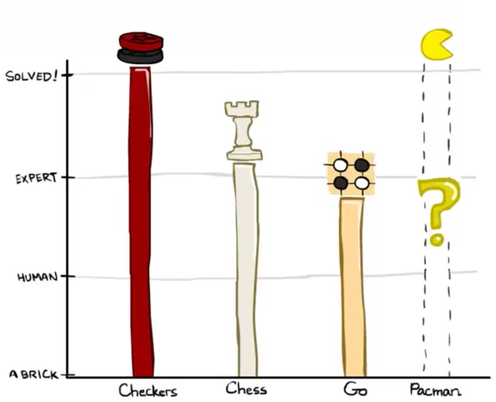

# 2.1 Games

In the first note, we talked about search problems and how to solve them efficiently and optimally — using powerful generalized search algorithms, our agents could determine the best possible plan and then simply execute it to arrive at a goal. Now, let's shift gears and consider scenarios where our agents have one or more **adversaries** who attempt to keep them from reaching their goal(s). Our agents can no longer run the search algorithms we've already learned to formulate a plan as we typically don't deterministically know how our adversaries will plan against us and respond to our actions. Instead, we'll need to run a new class of algorithms that yield solutions to **adversarial search problems**, more commonly known as **games**.

There are many different types of games. Games can have actions with either deterministic or **stochastic** (probabilistic) outcomes, can have any variable number of players, and may or may not be **zero-sum**. The first class of games we'll cover are **deterministic zero-sum games**, where actions are deterministic and our gain is directly equivalent to our opponent's loss and vice versa. The easiest way to think about such games is as being defined by a single variable value, which one team or agent tries to maximize and the opposing team or agent tries to minimize, effectively putting them in direct competition. In Pacman, this variable is your score, which you try to maximize by eating pellets quickly and efficiently, while ghosts try to minimize it by eating you first. Many common household games also fall under this class of games:

- *Checkers* - The first checkers computer player was created in 1950. Since then, checkers has become a **solved game**, meaning that any position can be evaluated as a win, loss, or draw deterministically for either side given both players act optimally.
- *Chess* - In 1997, Deep Blue became the first computer agent to defeat human chess champion Garry Kasparov in a six-game match. Deep Blue was constructed to use extremely sophisticated methods to evaluate over 200 million positions per second. Current programs are even better, though less historic.
- *Go* - The search space for Go is much larger than for chess, and most didn't believe Go computer agents would ever defeat human world champions for several years to come. However, AlphaGo, developed by Google, historically defeated Go champion Lee Sedol 4 games to 1 in March 2016.

All of the world champion agents above use, at least to some degree, the adversarial search techniques that we're about to cover. As opposed to normal search, which returned a comprehensive plan, adversarial search returns a **strategy**, or **policy**, which simply recommends the best possible move given some configuration of our agent(s) and their adversaries. We'll soon see that such algorithms have the beautiful property of giving rise to behavior through computation — the computation we run is relatively simple in concept and widely generalizable, yet innately generates cooperation between agents on the same team as well as "outthinking" of adversarial agents.

The standard game formulation consists of the following definitions:

- Initial state, $$s_0$$
- Players, $$Players(s)$$ denote whose turn it is
- Actions, $$Actions(s)$$ available actions for the player
- Transition model $$Result(s, a)$$
- Terminal test, $$Terminal-test(s)$$
- Terminal values, $$Utility(s, player)$$