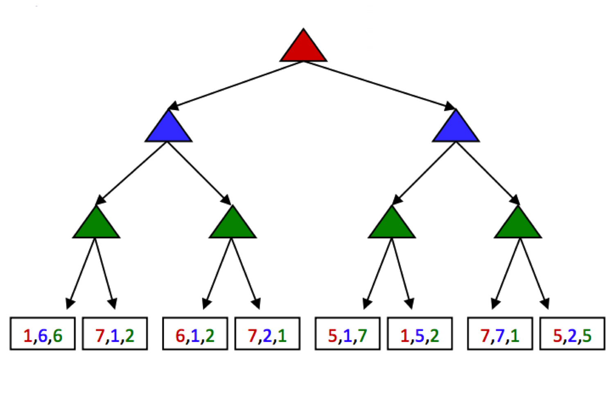

# 3.4 General Games

Not all games are zero-sum. Indeed, different agents may have have distinct tasks in a game that don't directly involve strictly competing with one another. Such games can be set up with trees characterized by **multi-agent utilities**. Such utilities, rather than being a single value that alternating agents try to minimize or maximize, are represented as tuples with different values within the tuple corresponding to unique utilities for different agents. Each agent then attempts to maximize their own utility at each node they control, ignoring the utilities of other agents. Consider the following tree:

The red, green, and blue nodes correspond to three separate agents, who maximize the red, green, and blue utilities respectively out of the possible options in their respective layers. Working through this example ultimately yields the utility tuple $(5, 2, 5)$ at the top of the tree. General games with multi-agent utilities are a prime example of the rise of behavior through computation, as such setups invoke cooperation since the utility selected at the root of the tree tends to yield a reasonable utility for all participating agents.