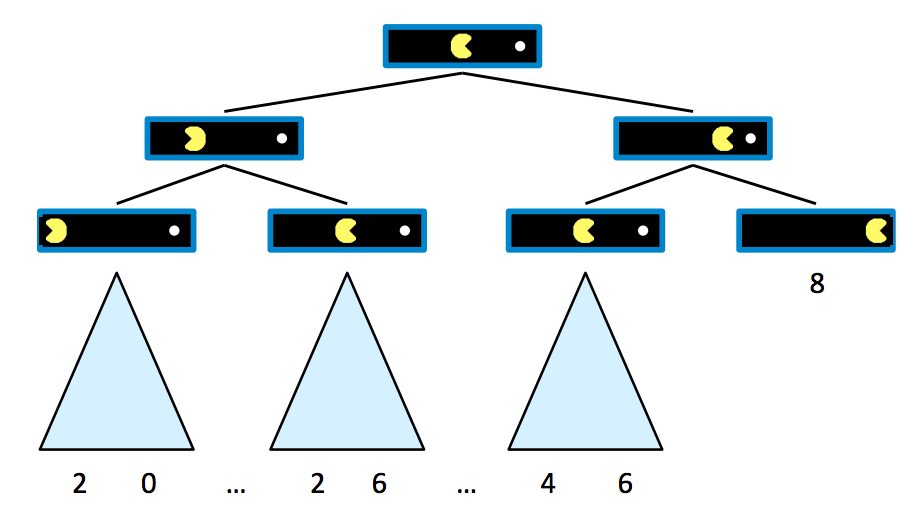
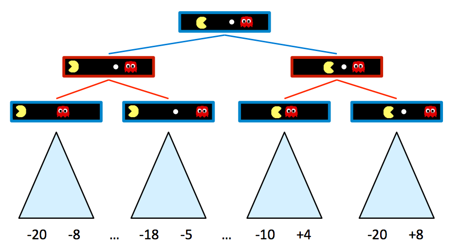
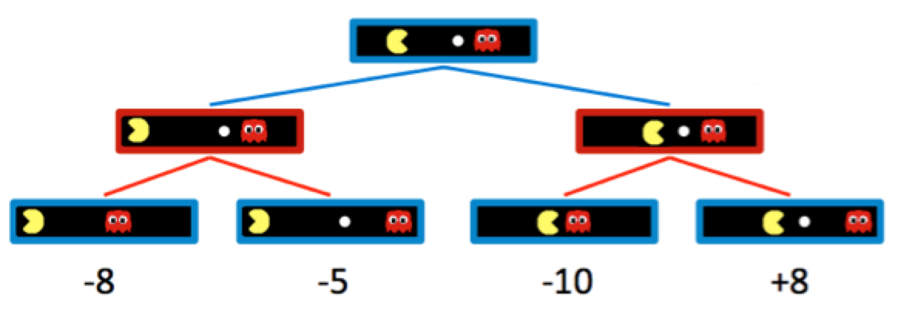
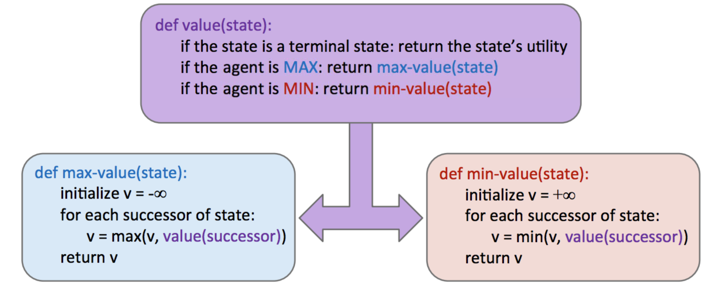
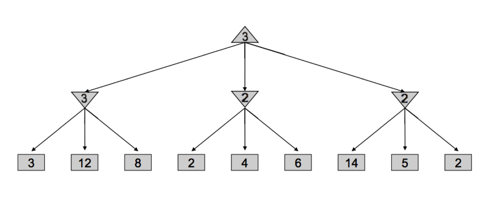
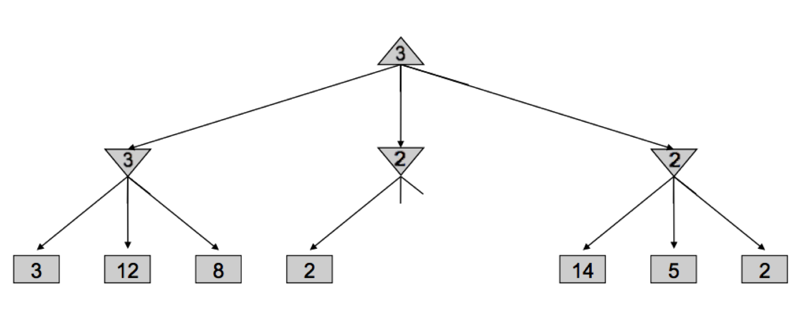
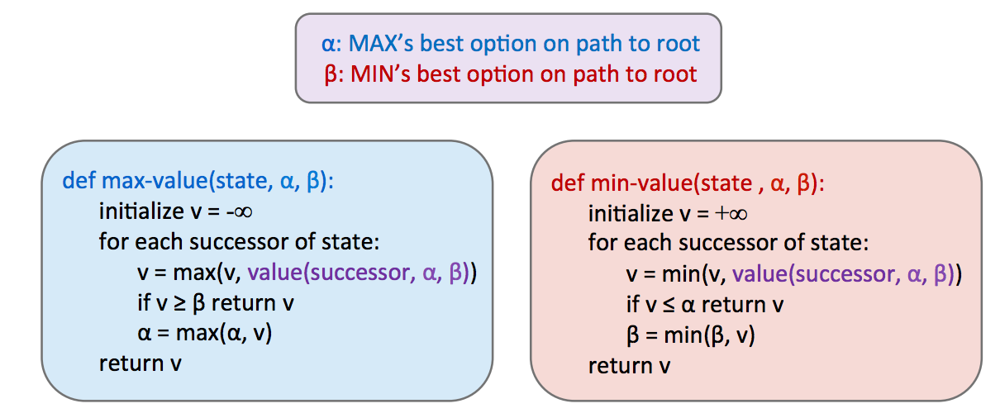

# 2.2 Minimax

The first zero-sum-game algorithm we will consider is **minimax**, which runs under the motivating assumption that the opponent we face behaves optimally, and will always perform the move that is worst for us. To introduce this algorithm, we must first formalize the notion of **terminal utilities** and **state value**. The value of a state is the optimal score attainable by the agent which controls that state. In order to get a sense of what this means, observe the following trivially simple Pacman game board:

Assume that Pacman starts with 10 points and loses 1 point per move until he eats the pellet, at which point the game arrives at a **terminal state** and ends. We can start building a **game tree** for this board as follows, where children of a state are successor states just as in search trees for normal search problems:

It's evident from this tree that if Pacman goes straight to the pellet, he ends the game with a score of 8 points, whereas if he backtracks at any point, he ends up with some lower valued score. Now that we've generated a game tree with several terminal and intermediary states, we're ready to formalize the meaning of the value of any of these states.

A state's value is defined as the best possible outcome (**utility**) an agent can achieve from that state. We'll formalize the concept of utility more concretely later, but for now it's enough to simply think of an agent's utility as its score or number of points it attains. The value of a terminal state, called a **terminal utility**, is always some deterministic known value and an inherent game property. In our Pacman example, the value of the rightmost terminal state is simply 8, the score Pacman gets by going straight to the pellet. Also, in this example, the value of a non-terminal state is defined as the maximum of the values of its children. Defining $$V(s)$$ as the function defining the value of a state $$s$$, we can summarize the above discussion:

$$
\forall \text{non-terminal states}, V(s) = \max_{s' \in \text{successors}(s)} V(s')
$$

$$
\forall \text{terminal states}, V(s) = \text{known}
$$

This sets up a very simple recursive rule, from which it should make sense that the value of the root node's direct right child will be 8, and the root node's direct left child will be 6, since these are the maximum possible scores the agent can obtain if it moves right or left, respectively, from the start state. It follows that by running such computation, an agent can determine that it's optimal to move right, since the right child has a greater value than the left child of the start state.

Let's now introduce a new game board with an adversarial ghost that wants to keep Pacman from eating the pellet.

The rules of the game dictate that the two agents take turns making moves, leading to a game tree where the two agents switch off on layers of the tree that they "control". An agent having control over a node simply means that node corresponds to a state where it is that agent's turn, and so it's their opportunity to decide upon an action and change the game state accordingly. Here's the game tree that arises from the new two-agent game board above:

Blue nodes correspond to nodes that Pacman controls and can decide what action to take, while red nodes correspond to ghost-controlled nodes. Note that all children of ghost-controlled nodes are nodes where the ghost has moved either left or right from its state in the parent, and vice versa for Pacman-controlled nodes. For simplicity purposes, let's truncate this game tree to a depth-2 tree, and assign spoofed values to terminal states as follows:

Naturally, adding ghost-controlled nodes changes the move Pacman believes to be optimal, and the new optimal move is determined with the minimax algorithm. Instead of maximizing the utility over children at every level of the tree, the minimax algorithm only maximizes over the children of nodes controlled by Pacman, while minimizing over the children of nodes controlled by ghosts. Hence, the two ghost nodes above have values of $$\min(-8, -5) = -8$$ and $$\min(-10, +8) = -10$$ respectively. Correspondingly, the root node controlled by Pacman has a value of $$\max(-8, -10) = -8$$. Since Pacman wants to maximize his score, he'll go left and take the score of $$-8$$ rather than trying to go for the pellet and scoring $$-10$$. This is a prime example of the rise of behavior through computation - though Pacman wants the score of $$+8$$ he can get if he ends up in the rightmost child state, through minimax he "knows" that an optimally-performing ghost will not allow him to have it. In order to act optimally, Pacman is forced to hedge his bets and counterintuitively move away from the pellet to minimize the magnitude of his defeat. We can summarize the way minimax assigns values to states as follows:

$$
\forall \text{agent-controlled states}, V(s) = \max_{s'\in successors(s)} V(s')
$$

$$
\forall \text{opponent-controlled states}, V(s) = \min_{s'\in successors(s)}V(s')
$$

$$
\forall \text{terminal states}, V(s) = \text{known
$$

In implementation, minimax behaves similarly to depth-first search, computing values of nodes in the same order as DFS would, starting with the leftmost terminal node and iteratively working its way rightwards. More precisely, it performs a **postorder traversal** of the game tree. The resulting pseudocode for minimax is both elegant and intuitively simple, and is presented below. Note that minimax will return an action, which corresponds to the root node's branch to the child it has taken its value from.

## 2.2.1 Alpha-Beta Pruning

Minimax seems just about perfect - it's simple, it's optimal, and it's intuitive. Yet, its execution is very similar to depth-first search and its time complexity is identical, a dismal $$O(b^m)$$. Recalling that $$b$$ is the branching factor and $$m$$ is the approximate tree depth at which terminal nodes can be found, this yields far too great a runtime for many games. For example, chess has a branching factor $$b \approx 35$$ and tree depth $$m \approx 100$$. To help mitigate this issue, minimax has an optimization - **alpha-beta pruning**.

Conceptually, alpha-beta pruning is this: if you're trying to determine the value of a node $$n$$ by looking at its successors, stop looking as soon as you know that $$n$$'s value can at best equal the optimal value of $$n$$'s parent. Let's unravel what this tricky statement means with an example. Consider the following game tree, with square nodes corresponding to terminal states, downward-pointing triangles corresponding to minimizing nodes, and upward-pointing triangles corresponding to maximizer nodes:

Let's walk through how minimax derived this tree - it began by iterating through the nodes with values 3, 12, and 8, and assigning the value $$\min(3, 12, 8) = 3$$ to the leftmost minimizer. Then, it assigned $$\min(2, 4, 6) = 2$$ to the middle minimizer, and $$\min(14, 5, 2) = 2$$ to the rightmost minimizer, before finally assigning $$\max(3, 2, 2) = 3$$ to the maximizer at the root. However, if we think about this situation, we can come to the realization that as soon as we visit the child of the middle minimizer with value $$2$$, we no longer need to look at the middle minimizer's other children. Why? Since we've seen a child of the middle minimizer with value 2, we know that no matter what values the other children hold, the value of the middle minimizer can be at most 2. Now that this has been established, let's think one step further still - the maximizer at the root is deciding between the value of 3 of the left minimizer, and the value that's $$\leq 2$$, it's guaranteed to prefer the 3 returned by the left minimizer over the value returned by the middle minimizer, regardless of the values of its remaining children. This is precisely why we can **prune** the search tree, never looking at the remaining children of the middle minimizer:

Implementing such pruning can reduce our runtime to as good as $$O(b^{m/2})$$, effectively doubling our "solvable" depth. In practice, it's often a lot less, but generally can make it feasible to search down to at least one or two more levels. This is still quite significant, as the player who thinks 3 moves ahead is favored to win over the player who thinks 2 moves ahead. This pruning is exactly what the minimax algorithm with alpha-beta pruning does, and is implemented as follows:

Take some time to compare this with the pseudocode for vanilla minimax, and note that we can now return early without searching through every successor.

## 2.2.2 Evaluation Functions

Though alpha-beta pruning can help increase the depth for which we can feasibly run minimax, this still usually isn't even close to good enough to get to the bottom of search trees for a large majority of games. As a result, we turn to **evaluation functions**, functions that take in a state and output an estimate of the true minimax value of that node. Typically, this is plainly interpreted as "better" states being assigned higher values by a good evaluation function than "worse" states. Evaluation functions are widely employed in **depth-limited minimax**, where we treat non-terminal nodes located at our maximum solvable depth as terminal nodes, giving them mock terminal utilities as determined by a carefully selected evaluation function. Because evaluation functions can only yield estimates of the values of non-terminal utilities, this removes the guarantee of optimal play when running minimax.

A lot of thought and experimentation is typically put into the selection of an evaluation function when designing an agent that runs minimax, and the better the evaluation function is, the closer the agent will come to behaving optimally. Additionally, going deeper into the tree before using an evaluation function also tends to give us better results - burying their computation deeper in the game tree mitigates the compromising of optimality. These functions serve a very similar purpose in games as heuristics do in standard search problems.

The most common design for an evaluation function is a linear combination of **features**.

$$Eval(s) = w_1f_1(s) + w_2f_2(s) + ... + w_nf_n(s)$$

Each \( f_i(s) \) corresponds to a feature extracted from the input state \( s \), and each feature is assigned a corresponding **weight** $$w_i$$. Features are simply some element of a game state that we can extract and assign a numerical value. For example, in a game of checkers we might construct an evaluation function with 4 features: number of agent pawns, number of agent kings, number of opponent pawns, and number of opponent kings. We'd then select appropriate weights based loosely on their importance. In our checkers example, it makes most sense to select positive weights for our agent's pawns/kings and negative weights for our opponent's pawns/kings. Furthermore, we might decide that since kings are more valuable pieces in checkers than pawns, the features corresponding to our agent's/opponent's kings deserve weights with greater magnitude than the features concerning pawns. Below is a possible evaluation function that conforms to the features and weights we've just brainstormed:

$$Eval(s) = 2 \cdot agent\_kings(s) + agent\_pawns(s) - 2 \cdot opponent\_kings(s) - opponent\_pawns(s)$$

As you can tell, evaluation function design can be quite free-form, and don't necessarily have to be linear functions either. For example, nonlinear evaluation functions based on neural networks are very common in Reinforcement Learning applications. The most important thing to keep in mind is that the evaluation function yields higher scores for better positions as frequently as possible. This may require a lot of fine-tuning and experimenting on the performance of agents using evaluation functions with a multitude of different features and weights.
