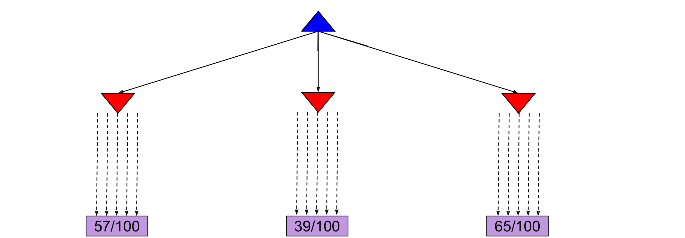
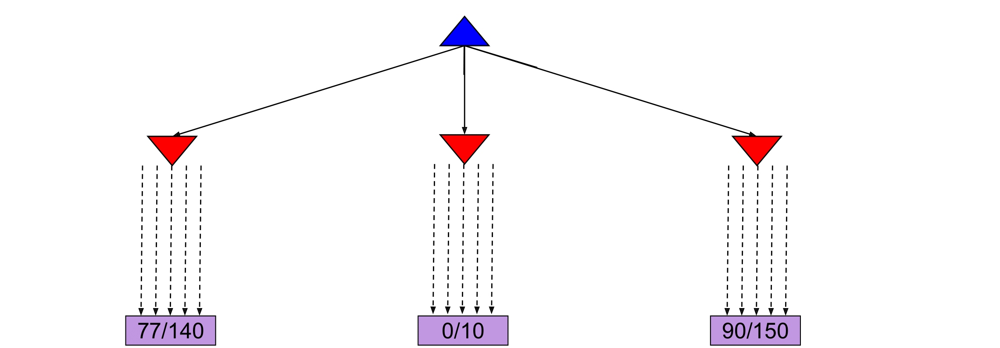

# 2.5 Monte Carlo Tree Search

For applications with a large branching factor, like playing Go, minimax can no longer be used. For such applications, we use the **Monte Carlo Tree Search (MCTS)** algorithm. MCTS is based on two ideas:

- **Evaluation by rollouts**: From state $$s$$ play many times using a policy (e.g. random) and count wins/losses.
- **Selective search**: Explore parts of the tree, without constraints on the horizon, that will improve the decision at the root.

In the Go example, from a given state, we play until termination according to a policy multiple times. We record the fraction of wins, which correlates well with the value of the state.

Consider the following example:

From the current state we have three different available actions (left, middle and right). We take each action $$100$$ times and we record the percentage of wins for each one. After the simulations, we are fairly confident that the right action is the best one. In this scenario, we allocated the same amount of simulations to each alternative action. However, it might become clear after a few simulations that a certain action does not return many wins and thus we might choose to allocate this computational effort in doing more simulations for the other actions. This case can be seen in the following figure, where we decided to allocate the remaining $$90$$ simulations for the middle action to the left and right actions.

An interesting case arises when some actions yield similar percentages of wins, but one of them has used far fewer simulations to estimate that percentage, as shown in the next figure. In this case, the estimate of the action that used fewer simulations will have higher variance, and hence we might want to allocate a few more simulations to that action to be more confident about the true percentage of wins.

The **UCB algorithm** captures this trade-off between "promising" and "uncertain" actions by using the following criterion at each node $$n$$:

$$UCB1(n)=\frac{U(n)}{N(n)}+C\times\sqrt{\frac{\log N(PARENT(n))}{N(n)}}$$

where $$N(n)$$ denotes the total number of rollouts from node $$n$$ and $$U(n)$$ the total number of wins for $$Player(Parent(n))$$. The first term captures how promising the node is, while the second captures how uncertain we are about that node's utility. The user-specified parameter $$C$$ balances the weight we put in the two terms ("exploration" and "exploitation") and depends on the application and perhaps the stage of the task (in later stages when we have accumulated many trials, we would probably explore less and exploit more).

The **MCTS UCT** algorithm uses the UCB criterion in tree search problems. More specifically, it repeats the following three steps multiple times:

1. The UCB criterion is used to move down the layers of a tree from the root node until an unexpanded leaf node is reached.
2. A new child is added to that leaf, and we run a rollout from that child to determine the number of wins from that node.
3. We update the number of wins from the child back up to the root node.

Once the above three steps are sufficiently repeated, we choose the action that leads to the child with the highest $$N$$. Note that because UCT inherently explores more promising children a higher number of times, as $$N \rightarrow \infty$$, UCT approaches the behavior of a minimax agent.