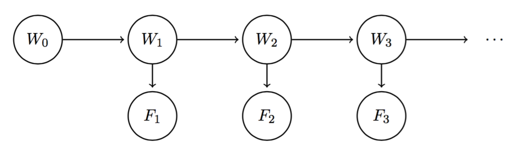

# 8.2 Hidden Markov Models

With Markov models, we saw how we could incorporate change over time through a chain of random variables. For example, if we want to know the weather on day 10 with our standard Markov model from above, we can begin with the initial distribution $$P(W_0)$$ and use the mini-forward algorithm with our transition model to compute $$P(W_{10})$$. However, between time $$t = 0$$ and time $$t = 10$$, we may collect new meteorological evidence that might affect our belief of the probability distribution over the weather at any given timestep. In simpler terms, if the weather forecasts an 80% chance of rain on day 10, but there are clear skies on the night of day 9, that 80% probability might drop drastically. This is exactly what the **Hidden Markov Model** helps us with—it allows us to observe some evidence at each timestep, which can potentially affect the belief distribution at each of the states. The Hidden Markov Model for our weather model can be described using a Bayes' net structure that looks like the following:

Unlike vanilla Markov models, we now have two different types of nodes. To make this distinction, we'll call each $$W_i$$ a **state variable** and each weather forecast $$F_i$$ an **evidence variable**. Since $$W_i$$ encodes our belief of the probability distribution for the weather on day $$i$$, it should be a natural result that the weather forecast for day $$i$$ is conditionally dependent upon this belief. The model implies similar conditional independence relationships as standard Markov models, with an additional set of relationships for the evidence variables:

$$ F_1 \perp W_0 \mid W_1 $$

$$ \forall i = 2, \dots, n; \quad W_i \perp \{W_0, \dots, W_{i-2}, F_1, \dots, F_{i-1}\} \mid W_{i-1} $$

$$ \forall i = 2, \dots, n; \quad F_i \perp \{W_0, \dots, W_{i-1}, F_1, \dots, F_{i-1}\} \mid W_i $$

Just like Markov models, Hidden Markov Models make the assumption that the transition model $$P(W_{i+1} \mid W_i)$$ is stationary. Hidden Markov Models make the additional simplifying assumption that the **sensor model** $$P(F_i \mid W_i)$$ is stationary as well. Hence any Hidden Markov Model can be represented compactly with just three probability tables: the initial distribution, the transition model, and the sensor model.

As a final point on notation, we'll define the **belief distribution** at time $$i$$ with all evidence $$F_1, \dots, F_i$$ observed up to date:

$$ B(W_i) = P(W_i \mid f_1, \dots, f_i)$$

Similarly, we'll define $$B'(W_i)$$ as the belief distribution at time $$i$$ with evidence $$f_1, \dots, f_{i-1}$$ observed:

$$ B'(W_i) = P(W_i \mid f_1, \dots, f_{i-1}) $$

Defining $$e_i$$ as evidence observed at timestep $$i$$, you might sometimes see the aggregated evidence from timesteps $$1 \leq i \leq t$$ re-expressed in the following form:

$$ e_{1:t} = e_1, \dots, e_t $$

Under this notation, $$P(W_i \mid f_1, \dots, f_{i-1})$$ can be written as $$P(W_i \mid f_{1:(i-1)})$$. This notation will become relevant in the upcoming sections, where we'll discuss time elapse updates that iteratively incorporate new evidence into our weather model.

## 8.2.1 The Forward Algorithm

Using the conditional probability assumptions stated above and marginalization properties of conditional probability tables, we can derive a relationship between $$B(W_i)$$ and $$B'(W_{i+1})$$ that's of the same form as the update rule for the mini-forward algorithm. We begin by using marginalization:

$$
B'(W_{i+1}) = P(W_{i+1} \mid f_1, \dots, f_i) = \sum_{w_i}P(W_{i+1}, w_i \mid f_1, \dots, f_i)
$$

This can be re-expressed then with the chain rule as follows:

$$
B'(W_{i+1}) = P(W_{i+1} \mid f_1, \dots, f_i) = \sum_{w_i}P(W_{i+1} \mid w_i, f_1, \dots, f_i)P(w_i \mid f_1, \dots, f_i)
$$

Noting that $$P(w_i \mid f_1, \dots, f_i)$$ is simply $$B(w_i)$$ and that $$W_{i+1} \perp \{f_1, \dots f_i\} \mid W_i$$, this simplifies to our final relationship between $$B(W_i)$$ and $$B'(W_{i+1})$$:

$$
\boxed{B'(W_{i+1}) = \sum_{w_i}P(W_{i+1} \mid w_i)B(w_i)}
$$

Now let's consider how we can derive a relationship between $$B'(W_{i+1})$$ and $$B(W_{i+1})$$. By application of the definition of conditional probability (with extra conditioning), we can see that
$$
B(W_{i+1}) = P(W_{i+1} | f_1, ..., f_{i+1}) = \frac{P(W_{i+1}, f_{i+1} | f_1, ..., f_i)}{P(f_{i+1} | f_1, ..., f_i)}
$$
When dealing with conditional probabilities, a commonly used trick is to delay normalization until we require the normalized probabilities, a trick we'll now employ. More specifically, since the denominator in the above expansion of $$B(W_{i+1})$$ is common to every term in the probability table represented by $$B(W_{i+1})$$, we can omit actually dividing by $$P(f_{i+1} | f_1, ..., f_i)$$. Instead, we can simply note that $$B(W_{i+1})$$ is proportional to $$P(W_{i+1}, f_{i+1} | f_1, ..., f_i)$$:
$$
B(W_{i+1}) \propto P(W_{i+1}, f_{i+1} | f_1, ..., f_i)
$$
with a constant of proportionality equal to $$P(f_{i+1} | f_1, ..., f_i)$$. Whenever we decide we want to recover the belief distribution $$B(W_{i+1})$$, we can divide each computed value by this constant of proportionality. Now, using the chain rule we can observe the following:
$$
B(W_{i+1}) \propto P(W_{i+1}, f_{i+1} | f_1, ..., f_i) = P(f_{i+1} | W_{i+1}, f_1, ..., f_i)P(W_{i+1} | f_1, ..., f_i)
$$
By the conditional independence assumptions associated with Hidden Markov Models stated previously, $$P(f_{i+1} | W_{i+1}, f_1, ..., f_i)$$ is equivalent to simply $$P(f_{i+1} | W_{i+1})$$ and by definition $$P(W_{i+1} | f_1, ..., f_i) = B'(W_{i+1})$$. This allows us to express the relationship between $$B'(W_{i+1})$$ and $$B(W_{i+1})$$ in its final form:
$$
\boxed{B(W_{i+1}) \propto P(f_{i+1} | W_{i+1})B'(W_{i+1})}
$$
Combining the two relationships we've just derived yields an iterative algorithm known as the **forward algorithm**, the Hidden Markov Model analog of the mini-forward algorithm from earlier:
$$
\boxed{B(W_{i+1}) \propto P(f_{i+1} | W_{i+1})\sum_{w_i}P(W_{i+1} | w_i)B(w_i)}
$$
The forward algorithm can be thought of as consisting of two distinctive steps: the **time elapse update**, which corresponds to determining $$B'(W_{i+1})$$ from $$B(W_i)$$, and the **observation update**, which corresponds to determining $$B(W_{i+1})$$ from $$B'(W_{i+1})$$. Hence, in order to advance our belief distribution by one timestep (i.e. compute $$B(W_{i+1})$$ from $$B(W_i)$$), we must first advance our model's state by one timestep with the time elapse update, then incorporate new evidence from that timestep with the observation update. Consider the following initial distribution, transition model, and sensor model:

| $$W_0$$ | $$B(W_0)$$ |
|---------|------------|
| sun     | 0.8        |
| rain    | 0.2        |

| $$W_{i+1}$$ | $$W_i$$ | $$P(W_{i+1} \mid W_i)$$ |
|-------------|---------|------------------------|
| sun         | sun     | 0.6                    |
| rain        | sun     | 0.4                    |
| sun         | rain    | 0.1                    |
| rain        | rain    | 0.9                    |

| $$F_i$$ | $$W_i$$ | $$P(F_i \mid W_i)$$ |
|---------|---------|-----------------|
| good    | sun     | 0.8             |
| bad     | sun     | 0.2             |
| good    | rain    | 0.3             |
| bad     | rain    | 0.7             |

To compute $$B(W_1)$$, we begin by performing a time update to get $$B'(W_1)$$:

$$
B'(W_1 = sun) = \sum_{w_0}P(W_1 = sun | w_0)B(w_0) = P(W_1 = sun | W_0 = sun)B(W_0 = sun) + P(W_1 = sun | W_0 = rain)B(W_0 = rain)
$$

$$
B'(W_1 = sun) = 0.6 \cdot 0.8 + 0.1 \cdot 0.2 = \boxed{0.5}
$$

$$
B'(W_1 = rain) = \sum_{w_0}P(W_1 = rain | w_0)B(w_0) = P(W_1 = rain | W_0 = sun)B(W_0 = sun) + P(W_1 = rain | W_0 = rain)B(W_0 = rain)
$$

$$
B'(W_1 = rain) = 0.4 \cdot 0.8 + 0.9 \cdot 0.2 = \boxed{0.5}
$$

Hence:

| $$W_1$$ | $$B'(W_1)$$ |
|---------|-------------|
| sun     | 0.5         |
| rain    | 0.5         |

Next, we'll assume that the weather forecast for day 1 was good (i.e. $$F_1 = good$$), and perform an observation update to get $$B(W_1)$$:

$$
B(W_1 = sun) \propto P(F_1 = good | W_1 = sun)B'(W_1 = sun) = 0.8 \cdot 0.5 = \boxed{0.4}
$$

$$
B(W_1 = rain) \propto P(F_1 = good | W_1 = rain)B'(W_1 = rain) = 0.3 \cdot 0.5 = \boxed{0.15}
$$

The last step is to normalize $$B(W_1)$$, noting that the entries in the table for $$B(W_1)$$ sum to $$0.4 + 0.15 = 0.55$$:

$$
B(W_1 = sun) = 0.4 / 0.55 = \frac{8}{11}
$$

$$
B(W_1 = rain) = 0.15 / 0.55 = \frac{3}{11}
$$

Our final table for $$B(W_1)$$ is thus the following:

| $$W_1$$ | $$B(W_1)$$ |
|---------|------------|
| sun     | $$ \frac{8}{11} $$ |
| rain    | $$ \frac{3}{11} $$ |

Note the result of observing the weather forecast. Because the weatherman predicted good weather, our belief that it would be sunny increased from $$ \frac{1}{2} $$ after the time update to $$ \frac{8}{11} $$ after the observation update.

As a parting note, the normalization trick discussed above can actually simplify computation significantly when working with Hidden Markov Models. If we began with some initial distribution and were interested in computing the belief distribution at time $$t$$, we could use the forward algorithm to iteratively compute $$B(W_1), ..., B(W_t)$$ and normalize only once at the end by dividing each entry in the table for $$B(W_t)$$ by the sum of its entries.
