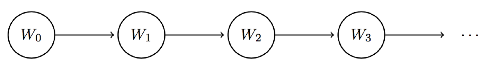

# 8.1 Markov Models

In previous notes, we talked about Bayes' nets and how they are a wonderful structure used for compactly representing relationships between random variables. We'll now cover a very intrinsically related structure called a **Markov model**, which for the purposes of this course can be thought of as analogous to a chain-like, infinite-length Bayes' net. The running example we'll be working with in this section is the day-to-day fluctuations in weather patterns. Our weather model will be **time-dependent** (as are Markov models in general), meaning we'll have a separate random variable for the weather on each day. If we define $$ W_i $$ as the random variable representing the weather on day $$ i $$, the Markov model for our weather example would look like this:

What information should we store about the random variables involved in our Markov model? To track how our quantity under consideration (in this case, the weather) changes over time, we need to know both its **initial distribution** at time $$ t = 0 $$ and some sort of **transition model** that characterizes the probability of moving from one state to another between timesteps. The initial distribution of a Markov model is enumerated by the probability table given by $$ P(W_0) $$ and the transition model of transitioning from state $$ i $$ to $$ i + 1 $$ is given by $$ P(W_{i+1} | W_i) $$. Note that this transition model implies that the value of $$ W_{i+1} $$ is conditionally dependent only on the value of $$ W_i $$. In other words, the weather at time $$ t = i + 1 $$ satisfies the **Markov property** or **memoryless property**, and is independent of the weather at all other timesteps besides $$ t = i $$.

Using our Markov model for weather, if we wanted to reconstruct the joint between $$ W_0 $$, $$ W_1 $$, and $$ W_2 $$ using the chain rule, we would want:

$$ P(W_0, W_1, W_2) = P(W_0)P(W_1 | W_0)P(W_2 | W_1, W_0)  $$

However, with our assumption that the Markov property holds true and $$ W_0 \perp W_2 | W_1 $$, the joint simplifies to:

$$ P(W_0, W_1, W_2) = P(W_0)P(W_1 | W_0)P(W_2 | W_1) $$

And we have everything we need to calculate this from the Markov model. More generally, Markov models make the following independence assumption at each timestep: $$ W_{i+1} \perp \{W_0, \dots, W_{i-1}\} | W_i $$. This allows us to reconstruct the joint distribution for the first $$ n + 1 $$ variables via the chain rule as follows:

$$ P(W_0, W_1, \dots, W_n) = P(W_0)P(W_1|W_0)P(W_2|W_1)\dots P(W_n|W_{n-1}) = P(W_0)\prod_{i=0}^{n-1}P(W_{i+1}|W_{i}) $$

A final assumption that's typically made in Markov models is that the transition model is **stationary**. In other words, for all values of $$ i $$ (all timesteps), $$ P(W_{i+1} | W_i) $$ is identical. This allows us to represent a Markov model with only two tables: one for $$ P(W_0) $$ and one for $$ P(W_{i+1} | W_i) $$.

# 8.1.1 The Mini-Forward Algorithm

We now know how to compute the joint distribution across timesteps of a Markov model. However, this doesn't explicitly help us answer the question of the distribution of the weather on some given day $$ t $$. Naturally, we can compute the joint and then **marginalize** (sum out) over all other variables, but this is typically extremely inefficient since if we have $$ j $$ variables each of which can take on $$ d $$ values, the size of the joint distribution is $$ O(d^j) $$. Instead, we'll present a more efficient technique called the **mini-forward algorithm**.

Here's how it works. By properties of marginalization, we know that

$$ P(W_{i+1}) = \sum_{w_i}P(w_i, W_{i+1}) $$

By the chain rule, we can re-express this as follows:

$$ \boxed{P(W_{i+1}) = \sum_{w_i}P(W_{i+1}|w_i)P(w_i)} $$

This equation should make some intuitive sense — to compute the distribution of the weather at timestep $$ i + 1 $$, we look at the probability distribution at timestep $$ i $$ given by $$ P(W_i) $$ and "advance" this model a timestep with our transition model $$ P(W_{i+1} | W_i) $$. With this equation, we can iteratively compute the distribution of the weather at any timestep of our choice by starting with our initial distribution $$ P(W_0) $$ and using it to compute $$ P(W_1) $$, then in turn using $$ P(W_1) $$ to compute $$ P(W_2) $$, and so on. Let's walk through an example, using the following initial distribution and transition model:

| $$ W_0 $$ | $$ P(W_0) $$ |
|:-------------:|:----------------:|
| sun           | 0.8              |
| rain          | 0.2              |

| $$ W_{i+1} $$ | $$ W_i $$ | $$ P(W_{i+1} \| W_i) $$ |
|:-----------------:|:-------------:|:--------------------------:|
| sun               | sun           | 0.6                        |
| rain              | sun           | 0.4                        |
| sun               | rain          | 0.1                        |
| rain              | rain          | 0.9                        |

Using the mini-forward algorithm, we can compute $$ P(W_1) $$ as follows:

$$ P(W_1 = sun) = \sum_{w_0}P(W_1 = sun | w_0)P(w_0) $$
$$ = P(W_1 = sun | W_0 = sun)P(W_0 = sun) + P(W_1 = sun | W_0 = rain)P(W_0 = rain) $$
$$ = 0.6 \cdot 0.8 + 0.1 \cdot 0.2 = \boxed{0.5} $$

$$ P(W_1 = rain) = \sum_{w_0}P(W_1 = rain | w_0)P(w_0) $$
$$ = P(W_1 = rain | W_0 = sun)P(W_0 = sun) + P(W_1 = rain | W_0 = rain)P(W_0 = rain) $$
$$ = 0.4 \cdot 0.8 + 0.9 \cdot 0.2 = \boxed{0.5} $$

Hence our distribution for $$ P(W_1) $$ is:

| **$$ W_1 $$** | **$$ P(W_1) $$** |
|:-------------:|:----------------:|
| sun           | 0.5              |
| rain          | 0.5              |

Notably, the probability that it will be sunny has decreased from 80% at time $$ t = 0 $$ to only 50% at time $$ t = 1 $$. This is a direct result of our transition model, which favors transitioning to rainy days over sunny days. This gives rise to a natural follow-up question: does the probability of being in a state at a given timestep ever converge? We'll address the answer to this problem in the following section.

# 8.1.2 Stationary Distribution

To solve the problem stated above, we must compute the **stationary distribution** of the weather. As the name suggests, the stationary distribution is one that remains the same after the passage of time, i.e.

$$ P(W_{t+1}) = P(W_t) $$

We can compute these converged probabilities of being in a given state by combining the above equivalence with the same equation used by the mini-forward algorithm:

$$ P(W_{t+1}) = P(W_t) = \sum_{w_t}P(W_{t+1} | w_t)P(w_t) $$

For our weather example, this gives us the following two equations:

$$ P(W_t = sun) = P(W_{t+1} = sun | W_t = sun)P(W_t = sun) + P(W_{t+1} = sun | W_t = rain)P(W_t = rain) $$
$$ = 0.6 \cdot P(W_t = sun) + 0.1 \cdot P(W_t = rain) $$

$$  P(W_t = rain) = P(W_{t+1} = rain | W_t = sun)P(W_t = sun) + P(W_{t+1} = rain | W) $$

Now we have two equations in two unknowns. To solve, note that the sum of these probabilities must equal one, i.e.

$$ P(W_t = sun) + P(W_t = rain) = 1 $$

Thus, if we let $$ x = P(W_t = sun) $$ and $$ y = P(W_t = rain) $$, we can write the following system of equations:

1. $$x + y = 1$$
2. $$0.6x + 0.1y = x$$
3. $$0.4x + 0.9y = y$$

Using the first equation, we can substitute $$ y = 1 - x $$ into the other two, which gives us a single equation in one unknown:

$$0.6x + 0.1(1 - x) = x$$

Solving this equation yields $$x = 1/5$$, and substituting this value into the first equation gives $$y = 4/5$$. Thus, our stationary distribution is:

| **$$W$$** | **$$P(W)$$** |
|:-----------:|:--------------:|
| sun         | 0.2            |
| rain        | 0.8            |

From this result, we can conclude that as we proceed through our mini-forward algorithm and let time go to infinity, the probability that it will be rainy converges to 80%. This is another direct result of our transition model, which favors transitioning to rainy days over sunny days.

