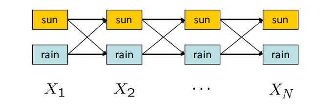

# 8.3 Viterbi Algorithm

In the Forward Algorithm, we used recursion to solve for $$P(X_N|e_{1:N})$$, the probability distribution over states the system could inhabit given the evidence variables observed so far. Another important question related to Hidden Markov Models is: *What is the most likely sequence of hidden states the system followed given the observed evidence variables so far?* In other words, we would like to solve for $$ \arg\max_{x_{1:N}} P(x_{1:N}|e_{1:N}) = \arg\max_{x_{1:N}} P(x_{1:N},e_{1:N}) $$. This trajectory can also be solved for using dynamic programming with the Viterbi algorithm

The algorithm consists of two passes: the first runs forward in time and computes the probability of the best path to each (state, time) tuple given the evidence observed so far. The second pass runs backwards in time: first it finds the terminal state that lies on the path with the highest probability, and then traverses backward through time along the path that leads into this state (which must be the best path).

To visualize the algorithm, consider the following **state trellis**, a graph of states and transitions over time:

In this HMM with two possible hidden states, sun or rain, we would like to compute the highest probability path (assignment of a state for every timestep) from $$X_1$$ to $$X_N$$. The weights on an edge from $$X_{t-1}$$ to $$X_t$$ is equal to $$P(X_t|X_{t-1})P(E_t|X_t)$$, and the probability of a path is computed by taking the *product* of its edge weights. The first term in the weight formula represents how likely a particular transition is and the second term represents how well the observed evidence fits the resulting state.

Recall that:
$$P(X_{1:N},e_{1:N}) = P(X_1)P(e_1|X_1)\prod_{t=2}^N P(X_t|X_{t-1})P(e_t|X_t)$$
The Forward Algorithm computes (up to normalization)
$$P(X_N,e_{1:N}) = \sum_{x_1,..,x_{N-1}} P(X_N, x_{1:N-1},e_{1:N})$$
In the Viterbi Algorithm, we want to compute
$$\arg\max_{x_1,..,x_{N}}P(x_{1:N},e_{1:N})$$

to find the maximum likelihood estimate of the sequence of hidden states. Notice that each term in the product is exactly the expression for the edge weight between layer $$t-1$$ to layer $$t$$. So, the product of weights along the path on the trellis gives us the probability of the path given the evidence.

We could solve for a joint probability table over all of the possible hidden states, but this results in an exponential space cost. Given such a table, we could use dynamic programming to compute the best path in polynomial time. However, because we can use dynamic programming to compute the best path, we don't necessarily need the whole table at any given time.

Define $$m_t[x_t] = \max_{x_{1:t-1}} P(x_{1:t},e_{1:t})$$, or the maximum probability of a path starting at any $$x_0$$ and the evidence seen so far to a given $$x_t$$ at time $$t$$. This is the same as the highest weight path through the trellis from step $$1$$ to $$t$$. Also note that
\begin{align}
m_t[x_t] &= \max_{x_{1:t-1}} P(e_t|x_t)P(x_t|x_{t-1})P(x_{1:t-1},e_{1:t-1})\\
&= P(e_t|x_t)\max_{x_{t-1}} P(x_t|x_{t-1})\max_{x_{1:t-2}}P(x_{1:t-1},e_{1:t-1})\\
&= P(e_t|x_t)\max_{x_{t-1}} P(x_t|x_{t-1})m_{t-1}[x_{t-1}].
\end{align}
This suggests that we can compute $$m_t$$ for all $$t$$ recursively via dynamic programming. This makes it possible to determine the last state $$x_N$$ for the most likely path, but we still need a way to backtrack to reconstruct the entire path. Let's define $$a_t[x_t] = P(e_t|x_t)\arg\max_{x_{t-1}} P(x_t|x_{t-1})m_{t-1}[x_{t-1}] = \arg\max_{x_{t-1}} P(x_t|x_{t-1})m_{t-1}[x_{t-1}]$$ to keep track of the last transition along the best path to $$x_t$$. We can now outline the algorithm.

<pre><code>
Result: Most likely sequence of hidden states x1:N
/* Forward pass
for t=1 to N:
    for xt in X:
        if t=1:
            mt[xt] = P(xt)P(e0|xt)
        else:
            at[xt] = argmaxx{t-1} P(xt|xt-1)mt-1[xt-1];
            mt[xt] = P(et|xt)P(xt|at[xt])mt-1[at[x_t]];
        
    

/* Find the most likely path's ending point
xN = argmaxxN mN[xN];
/* Work backwards through our most likely path and find the hidden states
For t=N to 2:
    xt-1 = at[xt];

</code></pre>

Notice that our $$a$$ arrays define a set of $$N$$ sequences, each of which is the most likely sequence to a particular end state $$x_N$$. Once we finish the forward pass, we look at the likelihood of the $$N$$ sequences, pick the best one, and reconstruct it in the backwards pass. We have thus computed the most likely explanation for our evidence in polynomial space and time.
