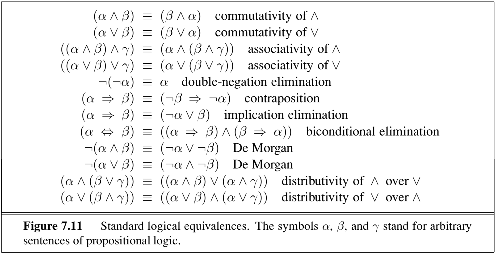

# 11.3 Propositional Logic 

Like other languages, logic has multiple dialects. We will introduce two: propositional logic and first-order logic. **Propositional logic** is written in sentences composed of **proposition symbols**, possibly joined by logical connectives. A proposition symbol is generally represented as a single uppercase letter. Each proposition symbol stands for an atomic proposition about the world. A **model** is an assignment of true or false to all the proposition symbols, which we might think of as a "possible world." For example, if we had the propositions A = "today it rained" and B = "I forgot my umbrella" then the possible models (or "worlds") are:

1. {A=true, B=true} ("Today it rained and I forgot my umbrella.")
2. {A=true, B=false} ("Today it rained and I didn't forget my umbrella.")
3. {A=false, B=true} ("Today it didn't rain and I forgot my umbrella.")
4. {A=false, B=false} ("Today it didn't rain and I did not forget my umbrella.")

In general, for $$N$$ symbols, there are $$2^N$$ possible models. We say a sentence is **valid** if it is true in all of these models (e.g. the sentence _True_), **satisfiable** if there is at least one model in which it is true, and **unsatisfiable** if it is not true in any models.  For example, the sentence $$A \wedge B$$ is satisfiable because it is true in model 1, but not valid since it is false in models 2, 3, 4. On the other hand, $$\neg A \wedge A$$ is unsatisfiable as no choice for $$A$$ returns True.

Below are some useful logical equivalences, which can be used for simplifying sentences to forms that are easier to work and reason with.

One particularly useful syntax in propositional logic is the **conjunctive normal form** or **CNF** which is a conjunction of clauses, each of which a disjunction of literals. It has the general form $$(P_1 \vee \cdots \vee P_i) \wedge \cdots \wedge (P_j \vee \cdots \vee P_n)$$, i.e. it is an 'AND' of 'OR's. As we'll see, a sentence in this form is good for some analyses. Importantly, every logical sentence has a logically equivalent conjunctive normal form. This means that we can formulate all the information contained in our knowledge base (which is just a conjunction of different sentences) as one large CNF statement, by 'AND'-ing these CNF statements together.

CNF representation is particularly important in propositional logic. Here we will see an example of converting a sentence to CNF representation. Assume we have the sentence $$A\Leftrightarrow (B\vee C)$$ and we want to convert it to CNF. The derivation is based on the rules in Figure 7.11.

1. **Eliminate** $$\Leftrightarrow$$: expression becomes $$(A\Rightarrow (B\vee C))\wedge ((B\vee C)\Rightarrow A)$$ using **biconditional elimination**.
2. **Eliminate** $$\Rightarrow$$: expression becomes $$(\neg A\vee B\vee C)\wedge (\neg(B\vee C )\vee A)$$ using **implication elimination**.
3. For CNF representation, the "nots" ($$\neg$$) must appear only on literals. Using **De Morgan's** rule we obtain $$(\neg A\vee B\vee C)\wedge ((\neg B\wedge \neg C )\vee A)$$.
4. As a last step, we apply the **distributivity law** and obtain $$(\neg A\vee B\vee C)\wedge (\neg B\vee A )\wedge (\neg C\vee A)$$.

The final expression is a conjunction of three OR clauses and so it is in CNF form.