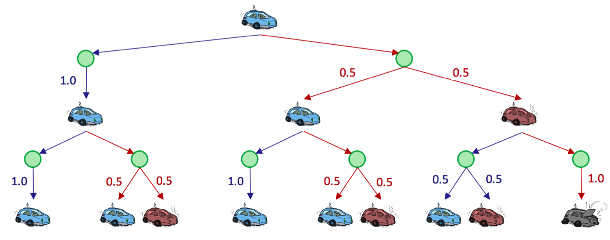

# 4.1 Markov Decision Processes

A Markov Decision Process is defined by several properties:

- A set of states $$S$$. States in MDPs are represented in the same way as states in traditional search problems.
- A set of actions $$A$$. Actions in MDPs are also represented in the same way as in traditional search problems.
- A start state.
- Possibly one or more terminal states.
- Possibly a **discount factor** $$\gamma$$. We'll cover discount factors shortly.
- A **transition function** $$T(s, a, s')$$. Since we have introduced the possibility of nondeterministic actions, we need a way to delineate the likelihood of the possible outcomes after taking any given action from any given state. The transition function for an MDP does exactly this—it's a probability function which represents the probability that an agent taking an action $$a \in A$$ from a state $$s \in S$$ ends up in a state $$s' \in S$$.
- A **reward function** $$R(s, a, s')$$. Typically, MDPs are modeled with small "living" rewards at each step to reward an agent's survival, along with large rewards for arriving at a terminal state. Rewards may be positive or negative depending on whether or not they benefit the agent in question, and the agent's objective is naturally to acquire the maximum reward possible before arriving at some terminal state.

Constructing an MDP for a situation is quite similar to constructing a state-space graph for a search problem, with a couple additional caveats. Consider the motivating example of a racecar:

There are three possible states, $$S = \{cool, warm, overheated\}$$, and two possible actions $$A = \{slow, fast\}$$. Just like in a state-space graph, each of the three states is represented by a node, with edges representing actions. *Overheated* is a terminal state, since once a racecar agent arrives at this state, it can no longer perform any actions for further rewards (it's a *sink state* in the MDP and has no outgoing edges). Notably, for nondeterministic actions, there are multiple edges representing the same action from the same state with differing successor states. Each edge is annotated not only with the action it represents but also with a transition probability and corresponding reward. These are summarized below:

**Transition Function**: $$T(s, a, s')$$
- $$T(cool, slow, cool) = 1$$
- $$T(warm, slow, cool) = 0.5$$
- $$T(warm, slow, warm) = 0.5$$
- $$T(cool, fast, cool) = 0.5$$
- $$T(cool, fast, warm) = 0.5$$
- $$T(warm, fast, overheated) = 1$$

**Reward Function**: $$R(s, a, s')$$
- $$R(cool, slow, cool) = 1$$
- $$R(warm, slow, cool) = 1$$
- $$R(warm, slow, warm) = 1$$
- $$R(cool, fast, cool) = 2$$
- $$R(cool, fast, warm) = 2$$
- $$R(warm, fast, overheated) = -10$$

We represent the movement of an agent through different MDP states over time with discrete **timesteps**, defining $$s_t \in S$$ and $$a_t \in A$$ as the state in which an agent exists and the action which an agent takes at timestep $$t$$ respectively. An agent starts in state $$s_0$$ at timestep 0 and takes an action at every timestep. The movement of an agent through an MDP can thus be modeled as follows:

$$
s_0 \xrightarrow{a_0} s_1 \xrightarrow{a_1} s_2 \xrightarrow{a_2} s_3 \xrightarrow{a_3}...
$$

Additionally, knowing that an agent's goal is to maximize its reward across all timesteps, we can correspondingly express this mathematically as a maximization of the following utility function:

$$
U([s_0, a_0, s_1, a_1, s_2, ...]) = R(s_0, a_0, s_1) + R(s_1, a_1, s_2) + R(s_2, a_2, s_3) + ...
$$

Markov decision processes, like state-space graphs, can be unraveled into search trees. Uncertainty is modeled in these search trees with **Q-states**, also known as **action states**, essentially identical to expectimax chance nodes. This is a fitting choice, as Q-states use probabilities to model the uncertainty that the environment will land an agent in a given state just as expectimax chance nodes use probabilities to model the uncertainty that adversarial agents will land our agent in a given state through the move these agents select. The Q-state represented by having taken action $$a$$ from state $$s$$ is notated as the tuple $$(s, a)$$.

Observe the unraveled search tree for our racecar, truncated to depth-2:

The green nodes represent Q-states, where an action has been taken from a state but has yet to be resolved into a successor state. It's important to understand that agents spend zero timesteps in Q-states, and that they are simply a construct created for ease of representation and development of MDP algorithms.

## 4.1.1 Finite Horizons and Discounting

There is an inherent problem with our racecar MDP—we haven't placed any time constraints on the number of timesteps for which a racecar can take actions and collect rewards. With our current formulation, it could routinely choose $$a = slow$$ at every timestep forever, safely and effectively obtaining infinite reward without any risk of overheating. This is prevented by the introduction of **finite horizons** and/or **discount factors**. An MDP enforcing a finite horizon is simple—it essentially defines a "lifetime" for agents, which gives them some set number of timesteps $$n$$ to accrue as much reward as they can before being automatically terminated. We'll return to this concept shortly.

Discount factors are slightly more complicated, and are introduced to model an exponential decay in the value of rewards over time. Concretely, with a discount factor of $$\gamma$$, taking action $$a_t$$ from state $$s_t$$ at timestep $$t$$ and ending up in state $$s_{t+1}$$ results in a reward of $$\gamma^t R(s_t, a_t, s_{t+1})$$ instead of just $$R(s_t, a_t, s_{t+1})$$. Now, instead of maximizing the **additive utility** 
$$ U([s_0, a_0, s_1, a_1, s_2, ...]) = R(s_0, a_0, s_1) + R(s_1, a_1, s_2) + R(s_2, a_2, s_3) + ... $$ 
we attempt to maximize **discounted utility**
$$ U([s_0, a_0, s_1, a_1, s_2, ...]) = R(s_0, a_0, s_1) + \gamma R(s_1, a_1, s_2) + \gamma^2 R(s_2, a_2, s_3) + ... $$

Noting that the above definition of a discounted utility function looks similar to a **geometric series** with ratio $$\gamma$$, we can prove that it's guaranteed to be finite-valued as long as the constraint $$|\gamma| < 1$$ (where $$|n|$$ denotes the absolute value operator) is met through the following logic:
$$
U([s_0, s_1, s_2, ...]) = R(s_0, a_0, s_1) + \gamma R(s_1, a_1, s_2) + \gamma^2 R(s_2, a_2, s_3) + ...
$$
$$
= \sum_{t=0}^{\infty} \gamma^t R(s_t, a_t, s_{t+1}) \leq \sum_{t=0}^{\infty} \gamma^t R_{max} = \boxed{\frac{R_{max}}{1 - \gamma}}
$$
where $$R_{max}$$ is the maximum possible reward attainable at any given timestep in the MDP. Typically, $$\gamma$$ is selected strictly from the range $$0 < \gamma < 1$$ since values in the range $$-1 < \gamma \leq 0$$ are simply not meaningful in most real-world situations— a negative value for $$\gamma$$ means the reward for a state $$s$$ would flip-flop between positive and negative values at alternating timesteps.

## 4.1.2 Markovianess

Markov decision processes are "markovian" in the sense that they satisfy the **Markov property**, or **memoryless property**, which states that the future and the past are conditionally independent, given the present. Intuitively, this means that, if we know the present state, knowing the past doesn't give us any more information about the future. To express this mathematically, consider an agent that has visited states $$s_0, s_1, ..., s_t$$ after taking actions $$a_0, a_1, ..., a_{t-1}$$ in some MDP, and has just taken action $$a_t$$. The probability that this agent then arrives at state $$s_{t+1}$$ given their history of previous states visited and actions taken can be written as follows:
$$ P(S_{t+1} = s_{t+1} \mid S_t = s_t, A_t = a_t, S_{t-1} = s_{t-1}, A_{t-1} = a_{t-1}, ..., S_0 = s_0) $$

where each $$S_t$$ denotes the random variable representing our agent's state and $$A_t$$ denotes the random variable representing the action our agent takes at time $$t$$. The Markov property states that the above probability can be simplified as follows:
$$ P(S_{t+1} = s_{t+1} \mid S_t = s_t, A_t = a_t, S_{t-1} = s_{t-1}, A_{t-1} = a_{t-1}, ..., S_0 = s_0) = P(S_{t+1} = s_{t+1} \mid S_t = s_t, A_t = a_t) $$

which is "memoryless" in the sense that the probability of arriving in a state $$s'$$ at time $$t+1$$ depends only on the state $$s$$ and action $$a$$ taken at time $$t$$, not on any earlier states or actions. In fact, it is these memoryless probabilities which are encoded by the transition function: $$\boxed{T(s, a, s') = P(s' \mid s, a)}$$.