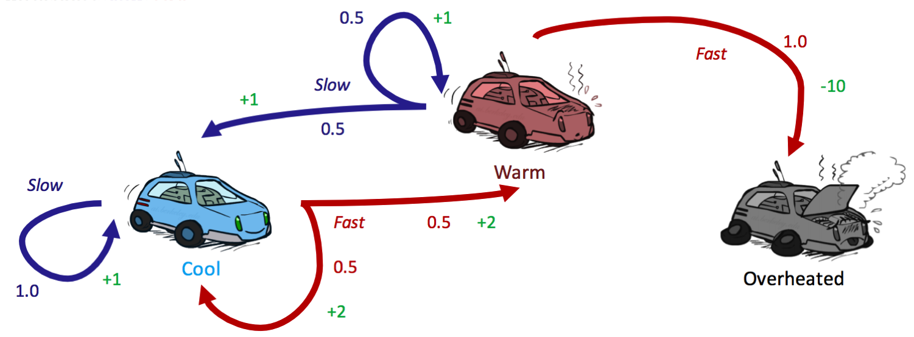

# 4.4 Policy Iteration
Value iteration can be quite slow. At each iteration, we must update the values of all $$|S|$$ states (where $$|n|$$ refers to the cardinality operator), each of which requires iteration over all $$|A|$$ actions as we compute the Q-value for each action. The computation of each of these Q-values, in turn, requires iteration over each of the $$|S|$$ states again, leading to a poor runtime of $$O(|S|^2|A|)$$. Additionally, when all we want to determine is the optimal policy for the MDP, value iteration tends to do a lot of overcomputation since the policy as computed by policy extraction generally converges significantly faster than the values themselves. The fix for these flaws is to use **policy iteration** as an alternative, an algorithm that maintains the optimality of value iteration while providing significant performance gains. Policy iteration operates as follows:

1. Define an *initial policy*. This can be arbitrary, but policy iteration will converge faster the closer the initial policy is to the eventual optimal policy.
2. Repeat the following until convergence:
   - Evaluate the current policy with **policy evaluation**. For a policy $$\pi$$, policy evaluation means computing $$U^{\pi}(s)$$ for all states $$s$$, where $$U^{\pi}(s)$$ is expected utility of starting in state $$s$$ when following $$\pi$$:
     $$
     U^{\pi}(s) = \sum_{s'}T(s, \pi(s), s')[R(s, \pi(s), s') + \gamma U^{\pi}(s')]
     $$
     Define the policy at iteration $$i$$ of policy iteration as $$\pi_i$$. Since we are fixing a single action for each state, we no longer need the $$\max$$ operator, which effectively leaves us with a system of $$|S|$$ equations generated by the above rule. Each $$U^{\pi_i}(s)$$ can then be computed by simply solving this system.
     Alternatively, we can also compute $$U^{\pi_i}(s)$$ by using the following update rule until convergence, just like in value iteration:
     $$
     U^{\pi_i}_{k+1}(s) \leftarrow \sum_{s'}T(s, \pi_i(s), s')[R(s, \pi_i(s), s') + \gamma U^{\pi_i}_k(s')]
     $$
     However, this second method is typically slower in practice.
   - Once we've evaluated the current policy, use **policy improvement** to generate a better policy. Policy improvement uses policy extraction on the values of states generated by policy evaluation to generate this new and improved policy:
     $$
     \pi_{i+1}(s) = \underset{a}{\operatorname{argmax}}\: \sum_{s'}T(s, a, s')[R(s, a, s') + \gamma U^{\pi_i}(s')]
     $$ 
     If $$\pi_{i+1} = \pi_i$$, the algorithm has converged, and we can conclude that $$\pi_{i+1} = \pi_i = \pi^*$$.

Let's run through our racecar example one last time (getting tired of it yet?) to see if we get the same policy using policy iteration as we did with value iteration. Recall that we were using a discount factor of $$\gamma = 0.5$$.

We start with an initial policy of *Always go slow*:

|  | **cool** | **warm** | **overheated** |  
|---|---|---|---|  
| $$\pi_0$$ | slow | slow | — |

Because terminal states have no outgoing actions, no policy can assign a value to one. Hence, it's reasonable to disregard the state *overheated* from consideration as we have done, and simply assign $$\forall i, \:\: U^{\pi_i}(s) = 0$$ for any terminal state $$s$$. The next step is to run a round of policy evaluation on $$\pi_0$$:

$$
\begin{aligned}
U^{\pi_0}(cool) &= 1 \cdot [1 + 0.5 \cdot U^{\pi_0}(cool)] \\
U^{\pi_0}(warm) &= 0.5 \cdot [1 + 0.5 \cdot U^{\pi_0}(cool)]
                + 0.5 \cdot [1 + 0.5 \cdot U^{\pi_0}(warm)] 
\end{aligned}
$$

Solving this system of equations for $$U^{\pi_0}(cool)$$ and $$U^{\pi_0}(warm)$$ yields:

|  | **cool** | **warm** | **overheated** |  
|---|---|---|---|  
| $$U^{\pi_0}$$ | 2 | 2 | 0 |

We can now run policy extraction with these values:

$$
\begin{aligned}
\pi_{1}(cool) &= {\operatorname{argmax}}\{slow: 1 \cdot [1 + 0.5 \cdot 2],\:\: fast: 0.5 \cdot [2 + 0.5 \cdot 2] + 0.5 \cdot [2 + 0.5 \cdot 2]\} \\

&= {\operatorname{argmax}}\{slow: 2,\:\: fast: 3\} \\
&= \boxed{fast}\\

\pi_{1}(warm) &= {\operatorname{argmax}}\{slow: 0.5 \cdot [1 + 0.5 \cdot 2] + 0.5 \cdot [1 + 0.5 \cdot 2] ,\:\: fast: 1 \cdot [-10 + 0.5 \cdot 0]\} \\

&= {\operatorname{argmax}}\{slow: 3,\:\: fast: -10\} \\
&= \boxed{slow} 
\end{aligned}
$$

Running policy iteration for a second round yields $$\pi_2(cool) = fast$$ and $$\pi_2(warm) = slow$$. Since this is the same policy as $$\pi_1$$, we can conclude that $$\pi_1 = \pi_2 = \pi^*$$. Verify this for practice!

|  | **cool** | **warm** |  
|---|---|---|  
| $$\pi_0$$ | slow | slow |  
| $$\pi_1$$ | fast | slow |  
| $$\pi_2$$ | fast | slow |  

This example shows the true power of policy iteration: with only two iterations, we've already arrived at the optimal policy for our racecar MDP! This is more than we can say for when we ran value iteration on the same MDP, which was still several iterations from convergence after the two updates we performed.