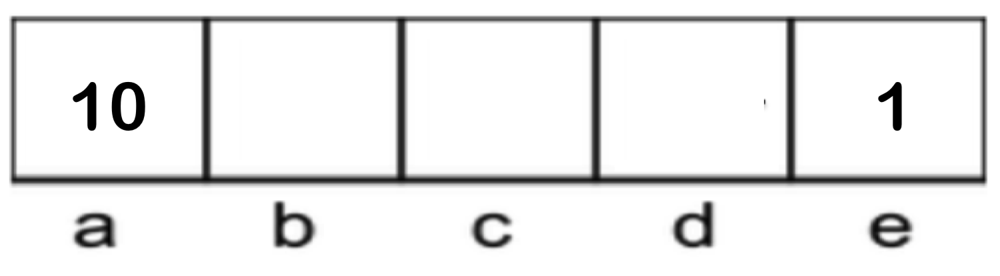
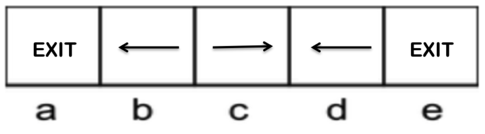
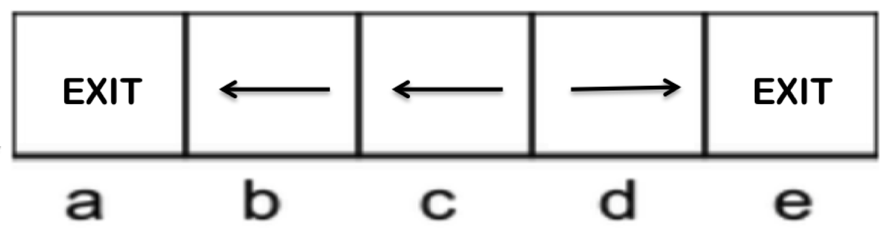

# 4.2 Solving Markov Decision Processes

Recall that in deterministic, non-adversarial search, solving a search problem means finding an optimal plan to arrive at a goal state. Solving a Markov decision process, on the other hand, means finding an optimal **policy** $$\pi^*: S \rightarrow A$$, a function mapping each state $$s \in S$$ to an action $$a \in A$$. An explicit policy $$\pi$$ defines a reflex agent - given a state $$s$$, an agent at $$s$$ implementing $$\pi$$ will select $$a = \pi(s)$$ as the appropriate action to make without considering future consequences of its actions. An optimal policy is one that if followed by the implementing agent, will yield the maximum expected total reward or utility.

Consider the following MDP with $$S = \{a, b, c, d, e\}$$, $$A = \{East, West, Exit\}$$ (with $$Exit$$ being a valid action only in states $$a$$ and $$e$$ and yielding rewards of 10 and 1 respectively), a discount factor $$\gamma = 0.1$$, and deterministic transitions:

Two potential policies for this MDP are as follows:

|  |  |
|:-----------------------------:|:-----------------------------:|
| Policy 1                      | Policy 2                      |

With some investigation, it's not hard to determine that Policy 2 is optimal. Following the policy until making action $$a = Exit$$ yields the following rewards for each start state:

| **Start State** | **Reward** |
|-----------------|------------|
| a               | 10         |
| b               | 1          |
| c               | 0.1        |
| d               | 0.1        |
| e               | 1          |

We'll now learn how to solve such MDPs (and much more complex ones!) algorithmically using the **Bellman equation** for Markov decision processes.

## 4.2.1 The Bellman Equation

In order to talk about the Bellman equation for MDPs, we must first introduce two new mathematical quantities:

- The optimal value of a state $$s$$, $$U^*(s)$$ — the optimal value of $$s$$ is the expected value of the utility an optimally-behaving agent that starts in $$s$$ will receive, over the rest of the agent's lifetime. Note that frequently in the literature the same quantity is denoted with $$V^*(s)$$.
- The optimal value of a Q-state $$(s, a)$$, $$Q^*(s, a)$$ — the optimal value of $$(s, a)$$ is the expected value of the utility an agent receives after starting in $$s$$, taking $$a$$, and acting optimally henceforth.

Using these two new quantities and the other MDP quantities discussed earlier, the Bellman equation is defined as follows:

$$ U^*(s) = \max_a \sum_{s'}T(s, a, s')[R(s, a, s') + \gamma U^*(s')] $$

Before we begin interpreting what this means, let's also define the equation for the optimal value of a Q-state (more commonly known as an optimal **Q-value**):

$$ Q^*(s, a) = \sum_{s'}T(s, a, s')[R(s, a, s') + \gamma U^*(s')] $$

Note that this second definition allows us to re-express the Bellman equation as

$$ U^*(s) = \max_a Q^*(s, a) $$

which is a dramatically simpler quantity. The Bellman equation is an example of a *dynamic programming equation*, an equation that decomposes a problem into smaller subproblems via an inherent recursive structure. We can see this inherent recursion in the equation for the Q-value of a state, in the term $$[R(s, a, s') + \gamma U^*(s')]$$. This term represents the total utility an agent receives by first taking $$a$$ from $$s$$ and arriving at $$s'$$ and then acting optimally henceforth. The immediate reward from the action $$a$$ taken, $$R(s, a, s')$$, is added to the optimal discounted sum of rewards attainable from $$s'$$, $$U^*(s')$$, which is discounted by $$\gamma$$ to account for the passage of one timestep in taking action $$a$$. Though in most cases there exists a vast number of possible sequences of states and actions from $$s'$$ to some terminal state, all this detail is abstracted away and encapsulated in a single recursive value, $$U^*(s')$$.

We can now take another step outwards and consider the full equation for Q-value. Knowing $$[R(s, a, s') + \gamma U^*(s')]$$ represents the utility attained by acting optimally after arriving in state $$s'$$ from Q-state $$(s, a)$$, it becomes evident that the quantity

$$ \sum_{s'}T(s, a, s')[R(s, a, s') + \gamma U^*(s')] $$

is simply a weighted sum of utilities, with each utility weighted by its probability of occurrence. This is by definition the *expected utility* of acting optimally from Q-state $$(s, a)$$ onwards! This completes our analysis and gives us enough insight to interpret the full Bellman equation — the optimal value of a state, $$U^*(s)$$, is simply the *maximum expected utility* over all possible actions from $$s$$. Computing maximum expected utility for a state $$s$$ is essentially the same as running expectimax — we first compute the expected utility from each Q-state $$(s, a)$$ (equivalent to computing the value of chance nodes), then compute the maximum over these nodes to compute the maximum expected utility (equivalent to computing the value of a maximizer node).

One final note on the Bellman equation — its usage is as a *condition* for optimality. In other words, if we can somehow determine a value $$U(s)$$ for every state $$s \in S$$ such that the Bellman equation holds true for each of these states, we can conclude that these values are the optimal values for their respective states. Indeed, satisfying this condition implies $$\forall s \in S, \: U(s) = U^*(s)$$.
