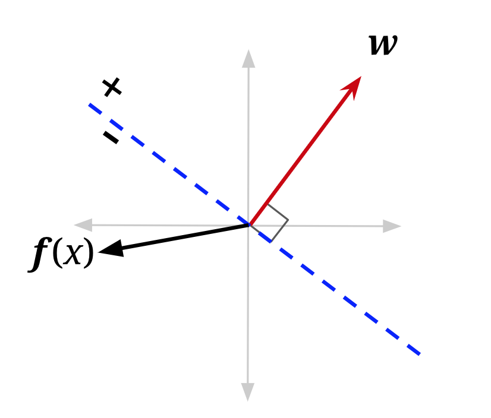
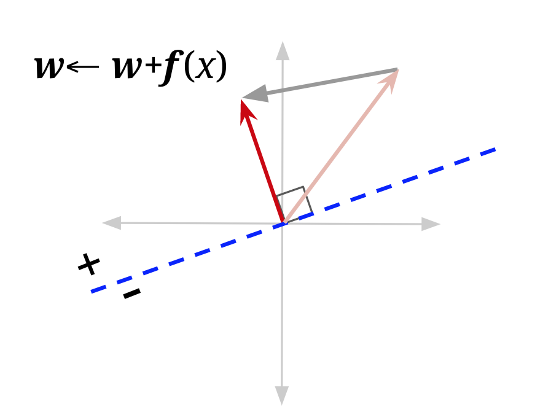
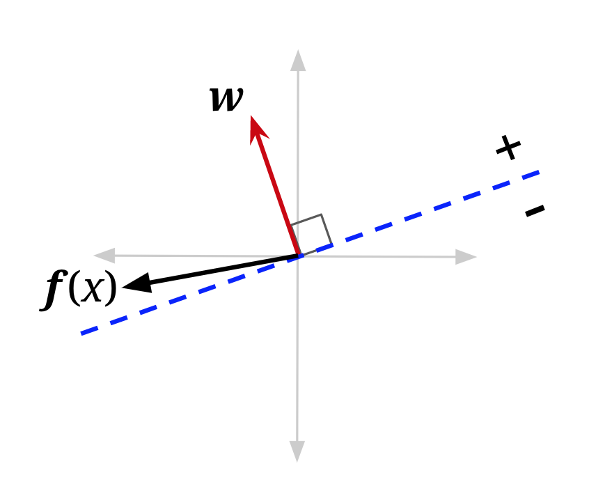
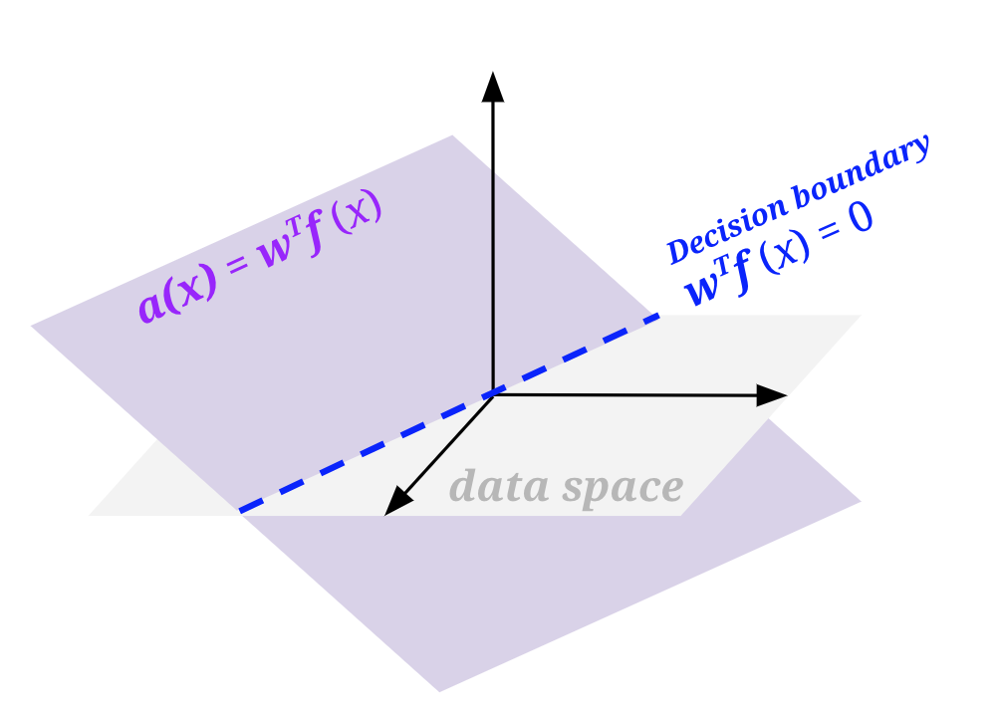
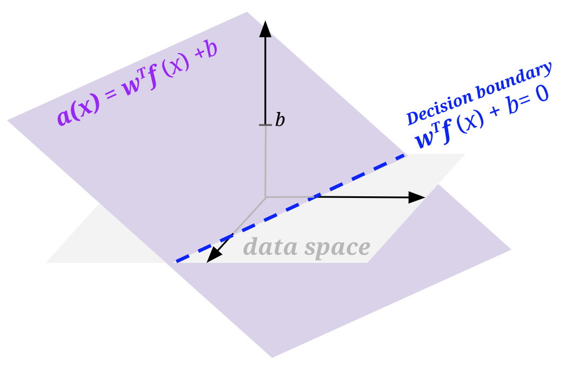

# 9.4 Binary Perceptron

Great, now you know how linear classifiers work, but how do we build a good one? When building a classifier, you start with data, which are labeled with the correct class; we call this the **training set**. You build a classifier by evaluating it on the training data, comparing that to your training labels, and adjusting the parameters of your classifier until you reach your goal.

Let's explore one specific implementation of a simple linear classifier: the binary perceptron. The perceptron is a binary classifier—though it can be extended to work on more than two classes. The goal of the binary perceptron is to find a decision boundary that perfectly separates the training data. In other words, we're seeking the best possible weights—the best $$\mathbf{w}$$—such that any featured training point that is multiplied by the weights can be perfectly classified.

**The Algorithm**

The perceptron algorithm works as follows:

1. Initialize all weights to 0: **w** = **0**

2. For each training sample, with features **f**(**x**) and true class label **y*** ∈ {-1, +1}, do:
   
   2.1 Classify the sample using the current weights, let **y** be the class predicted by your current **w**:
   
   $$
   y = \text{classify}(x) =
   \begin{cases}
   +1 & \text{if } h_{\mathbf{w}}(\mathbf{x}) = \mathbf{w}^T \mathbf{f}(\mathbf{x}) > 0 \\
   -1 & \text{if } h_{\mathbf{w}}(\mathbf{x}) = \mathbf{w}^T \mathbf{f}(\mathbf{x}) < 0 
   \end{cases}
   $$
   
   2.2 Compare the predicted label **y** to the true label **y***:
      - If **y** = **y***, do nothing
      - Otherwise, if **y** ≠ **y***, then update your weights: **w** ← **w** + **y*** **f**(**x**)

3. If you went through **every** training sample without having to update your weights (all samples predicted correctly), then terminate. Else, repeat step 2

**Updating weights**

Let's examine and justify the procedure for updating our weights. Recall that in step 2b above, when our classifier is right, nothing changes. But when our classifier is wrong, the weight vector is updated as follows:

$$
\mathbf{w} \leftarrow \mathbf{w} + y^* \mathbf{f}(\mathbf{x})
$$

where **y*** is the true label, which is either 1 or -1, and **x** is the training sample that we misclassified. You can interpret this update rule as follows:

**Case 1:** Mis-classified positive as negative

$$
\mathbf{w} \leftarrow \mathbf{w} + \mathbf{f}(\mathbf{x})
$$

**Case 2:** Mis-classified negative as positive

$$
\mathbf{w} \leftarrow \mathbf{w} - \mathbf{f}(\mathbf{x})
$$

Why does this work? One way to look at this is to see it as a balancing act. Mis-classification happens either when the activation for a training sample is much smaller than it should be (causes a Case 1 misclassification) or much larger than it should be (causes a Case 2 misclassification).

Consider Case 1, where activation is negative when it should be positive. In other words, the activation is too small. How we adjust **w** should strive to fix that and make the activation larger for that training sample. To convince yourself that our update rule **w** ← **w** + **f**(**x**) does that, let us update **w** and see how the activation changes.

$$
h_{\mathbf{w} + \mathbf{f}(\mathbf{x})}(\mathbf{x}) = (\mathbf{w} + \mathbf{f}(\mathbf{x}))^T \mathbf{f}(\mathbf{x}) = \mathbf{w}^T \mathbf{f}(\mathbf{x}) + \mathbf{f}(\mathbf{x})^T \mathbf{f}(\mathbf{x}) = h_{\mathbf{w}}(\mathbf{x}) + \mathbf{f}(\mathbf{x})^T \mathbf{f}(\mathbf{x})
$$

Using our update rule, we see that the new activation increases by **f**(**x**)T**f**(**x**), which is a positive number, therefore showing that our update makes sense. The activation is getting larger—closer to becoming positive. You can repeat the same logic for when the classifier is misclassifying because the activation is too large (activation is positive when it should be negative). You'll see that the update will cause the new activation to decrease by **f**(**x**)T**f**(**x**), thus getting smaller and closer to classifying correctly.

While this makes it clear why we are adding and subtracting *something*, why would we want to add and subtract our sample point's features? A good way to think about it is that the weights aren't the only thing that determines this score. The score is determined by multiplying the weights by the relevant sample. This means that certain parts of a sample contribute more than others. Consider the following situation where **x** is a training sample we are given with true label **y*** = -1:

$$
\mathbf{w}^T = \begin{bmatrix}2 & 2 & 2\end{bmatrix}, \quad \mathbf{f}(\mathbf{x}) = \begin{bmatrix}4 \\ 0 \\ 1\end{bmatrix} \quad h_{\mathbf{w}}(\mathbf{x}) = (2 \times 4) + (2 \times 0) + (2 \times 1) = 10
$$

We know that our weights need to be smaller because activation needs to be negative to classify correctly. We don't want to change them all the same amount though. You'll notice that the first element of our sample, the 4, contributed much more to our score of 10 than the third element, and that the second element did not contribute at all. An appropriate weight update, then, would change the first weight a lot, the third weight a little, and the second weight should not be changed at all. After all, the second and third weights might not even be that broken, and we don't want to fix what isn't broken!

When thinking about a good way to change our weight vector in order to fulfill the above desires, it turns out just using the sample itself does in fact do what we want; it changes the first weight by a lot, the third weight by a little, and doesn't change the second weight at all!

A visualization may also help. In the figure below, **f**(**x**) is the feature vector for a data point with positive class (**y*** = +1) that is currently misclassified — it lies on the wrong side of the decision boundary defined by "old **w**". Adding it to the weight vector produces a new weight vector which has a smaller angle to **f**(**x**). It also shifts the decision boundary. In this example, it has shifted the decision boundary enough so that **x** will now be correctly classified (note that the mistake won't always be fixed — it depends on the size of the weight vector, and how far over the boundary **f**(**x**) currently is).

  

    
    
<b>Mis-classifying x with old w</b>

  

  

    
    
<b>Updating w</b>

  

  

    
    
<b>Updated classification of x</b>

  

**Bias**

If you tried to implement a perceptron based on what has been mentioned thus far, you will notice one particularly unfriendly quirk. Any decision boundary that you end up drawing will be crossing the origin. Basically, your perceptron can only produce a decision boundary that could be represented by the function **w**T**f**(**x**) = 0, where **w**, **f**(**x**) ∈ ℝn. The problem is, even among problems where there is a linear decision boundary that separates the positive and negative classes in the data, that boundary may not go through the origin, and we want to be able to draw those lines.

To do so, we will modify our features and weights to add a bias term: add a feature to your sample feature vectors that is always 1, and add an extra weight for this feature to your weight vector. Doing so essentially allows us to produce a decision boundary representable by **w**T**f**(**x**) + **b** = 0, where **b** is the weighted bias term (i.e., 1 * the last weight in the weight vector).

Geometrically, we can visualize this by thinking about what the activation function looks like when it is **w**T**f**(**x**) and when there is a bias **w**T**f**(**x**) + **b**. To do so, we need to be one dimension higher than the space of our featurized data (labeled data space in the figures below). In all the above sections, we had only been looking at a flat view of the data space.

  

    
    
<b>Without bias</b>

  

  

    
    
<b>With bias</b>

  

**Example**

Let's see an example of running the perceptron algorithm step by step.

Let's run one pass through the data with the perceptron algorithm, taking each data point in order. We'll start with the weight vector `[w_0, w_1, w_2] = [-1, 0, 0]` (where **w**0 is the weight for our bias feature, which remember is always 1).

**Training Set**

| #  | **f**1 | **f**2 | **y*** |
|----|------------------|------------------|-------------------|
| 1  | 1                | 1                | -                 |
| 2  | 3                | 2                | +                 |
| 3  | 2                | 4                | +                 |
| 4  | 3                | 4                | +                 |
| 5  | 2                | 3                | -                 |

**Single Perceptron Update Pass**

| step | Weights    | Score                                            | Correct? | Update       |
|------|------------|--------------------------------------------------|----------|--------------|
| 1    | [-1, 0, 0] | -1 * 1 + 0 * 1 + 0 * 1 = -1                     | yes      | none         |
| 2    | [-1, 0, 0] | -1 * 1 + 0 * 3 + 0 * 2 = -1                     | no       | +[1, 3, 2]  |
| 3    | [0, 3, 2]  | 0 * 1 + 3 * 2 + 2 * 4 = 14                      | yes      | none         |
| 4    | [0, 3, 2]  | 0 * 1 + 3 * 3 + 2 * 4 = 17                      | yes      | none         |
| 5    | [0, 3, 2]  | 0 * 1 + 3 * 2 + 2 * 3 = 12                      | no       | -[1, 2, 3]  |
| 6    | [-1, 1, -1]|                                                  |          |              |

We'll stop here, but in actuality, this algorithm would run for many more passes through the data before all the data points are classified correctly in a single pass.

## 9.4.1 Multiclass Perceptron

The perceptron presented above is a binary classifier, but we can extend it to account for multiple classes rather easily. The main difference is in how we set up weights and how we update said weights. For the binary case, we had one weight vector, which had a dimension equal to the number of features (plus the bias feature). For the multi-class case, we will have one weight vector for each class. So, in the 3-class case, we have 3 weight vectors. In order to classify a sample, we compute a score for each class by taking the dot product of the feature vector with each of the weight vectors. Whichever class yields the highest score is the one we choose as our prediction.

For example, consider the 3-class case. Let our sample have features **f**(**x**) = [-2, 3, 1] and our weights for classes 0, 1, and 2 be:

$$
\mathbf{w}_0 = \begin{bmatrix}-2 & 2 & 1\end{bmatrix}
$$

$$
\mathbf{w}_1 = \begin{bmatrix}0 & 3 & 4\end{bmatrix}
$$

$$
\mathbf{w}_2 = \begin{bmatrix}1 & 4 & -2\end{bmatrix}
$$

Taking dot products for each class gives us scores $$s_0 = 11$$, $$s_1 = 13$$, $$s_2 = 8$$. We would thus predict that **x** belongs to class 1.

An important thing to note is that in actual implementation, we do not keep track of the weights as separate structures; we usually stack them on top of each other to create a weight matrix. This way, instead of doing as many dot products as there are classes, we can instead do a single matrix-vector multiplication. This tends to be much more efficient in practice (because matrix-vector multiplication usually has a highly optimized implementation).

In our above case, that would be:

$$
\mathbf{W} = \begin{bmatrix}
-2 & 2 & 1 \\
0 & 3 & 4 \\
1 & 4 & -2
\end{bmatrix}, \quad \mathbf{x} = \begin{bmatrix}-2 \\ 3 \\ 1\end{bmatrix}
$$

And our label would be:

$$
\arg\max (\mathbf{Wx}) = \arg\max \begin{bmatrix}11 \\ 13 \\ 8\end{bmatrix} = 1
$$

Along with the structure of our weights, our weight update also changes when we move to a multi-class case. If we correctly classify our data point, then do nothing, just like in the binary case. If we chose incorrectly, say we chose class $$y \neq y^*$$, then we add the feature vector to the weight vector for the true class $$y^*$$ and subtract the feature vector from the weight vector corresponding to the predicted class $$y$$. In our above example, let's say that the correct class was class 2, but we predicted class 1. We would now take the weight vector corresponding to class 1 and subtract **x** from it:

$$
\mathbf{w}_1 = \begin{bmatrix}0 & 3 & 4\end{bmatrix} - \begin{bmatrix}-2 & 3 & 1\end{bmatrix} = \begin{bmatrix}2 & 0 & 3\end{bmatrix}
$$

Next, we take the weight vector corresponding to the correct class, class 2 in our case, and add **x** to it:

$$
\mathbf{w}_2 = \begin{bmatrix}1 & 4 & -2\end{bmatrix} + \begin{bmatrix}-2 & 3 & 1\end{bmatrix} = \begin{bmatrix}-1 & 7 & -1\end{bmatrix}
$$

What this amounts to is 'rewarding' the correct weight vector, 'punishing' the misleading, incorrect weight vector, and leaving alone other weight vectors. With the difference in the weights and weight updates taken into account, the rest of the algorithm is essentially the same: cycle through every sample point, updating weights when a mistake is made, until you stop making mistakes.

In order to incorporate a bias term, do the same as we did for the binary perceptron—add an extra feature of 1 to every feature vector, and an extra weight for this feature to every class's weight vector (this amounts to adding an extra column to the matrix form).
