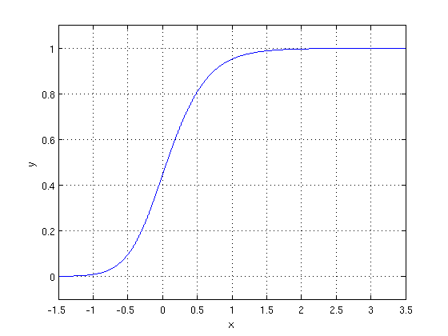

# 9.7 Logistic Regression

Let's again think about our previous method of linear regression. In it, we assumed that the output is a numeric real-valued number.

What if we instead want to predict a categorical variable? Logistic regression allows us to turn a linear combination of our input features into a probability using the logistic function:

$$
h_{\mathbf{w}}(\mathbf{x}) = \frac{1}{1 + e^{-\mathbf{w}^T \mathbf{x}}}
$$

It is important to note that though logistic regression is named as regression, this is a misnomer. Logistic regression is used to solve classification problems, not regression problems.

The logistic function $$g(z) = \frac{1}{1 + e^{-z}}$$ is frequently used to model binary outputs. Note that the output of the function is always between 0 and 1, as seen in the following figure:

    

Intuitively, the logistic function models the probability of a data point belonging to class with label $$1$$. The reason for that is that the output of the logistic function is bounded between 0 and 1, and we want our model to capture the probability of a feature having a specific label. For instance, after we have trained logistic regression, we obtain the output of the logistic function for a new data point. If the value of the output is greater than 0.5, we classify it with label $$1$$; otherwise, we classify it with label $$0$$. More specifically, we model the probabilities as follows:

$$
P(y = +1 \mid \mathbf{f}(\mathbf{x}); \mathbf{w}) = \frac{1}{1 + e^{-\mathbf{w}^T \mathbf{f}(\mathbf{x})}}
$$

$$
P(y = -1 \mid \mathbf{f}(\mathbf{x}); \mathbf{w}) = 1 - \frac{1}{1 + e^{-\mathbf{w}^T \mathbf{f}(\mathbf{x})}}
$$

where we use $$\mathbf{f}(\mathbf{x})$$ to denote the function (which often is the identity) of the feature vector $$\mathbf{x}$$ and the semicolon $$`;`$$ denotes that the probability is a function of the parameter weights $$\mathbf{w}$$.

A useful property to note is that the derivative of the logistic function is:

$$
g'(z) = g(z)(1 - g(z))
$$

How do we train the logistic regression model? The loss function for logistic regression is the $$L2$$ loss 

$$
\text{Loss}(\mathbf{w}) = \frac{1}{2} (\mathbf{y} - h_{\mathbf{w}}(\mathbf{x}))^2
$$

Since a closed form solution is not possible for logistic regression, we estimate the unknown weights $$\mathbf{w}$$ via gradient descent. For that, we need to compute the gradient of the loss function using the chain rule of differentiation. The gradient of the loss function with respect to the weight of coordinate $$i$$ is given by:

$$
\frac{\partial}{\partial w_i} \frac{1}{2} (y - h_{\mathbf{w}}(\mathbf{x}))^2 = -(y - h_{\mathbf{w}}(\mathbf{x})) h_{\mathbf{w}}(\mathbf{x}) (1 - h_{\mathbf{w}}(\mathbf{x})) x_i
$$

where we used the fact that the gradient of the logistic function $$g(z) = \frac{1}{1 + e^{-z}}$$ satisfies $$g'(z) = g(z)(1 - g(z))$$. We can then estimate the weights using gradient descent and then predict, as detailed above.