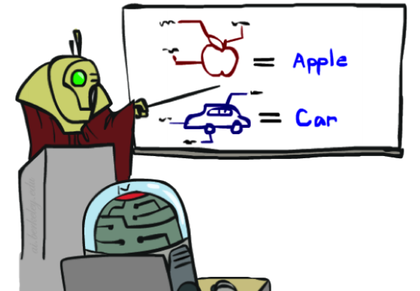

# 9.1 Machine Learning

In the previous few notes of this course, we've learned about various types of models that help us reason under uncertainty. Until now, we've assumed that the probabilistic models we've worked with can be taken for granted, and the methods by which the underlying probability tables we worked with were generated have been abstracted away. We'll begin to break down this abstraction barrier as we delve into our discussion of **machine learning**, a broad field of computer science that deals with constructing and/or learning the parameters of a specified model given some data.

There are many machine learning algorithms that deal with many different types of problems and different types of data, classified according to the tasks they hope to accomplish and the types of data that they work with. Two primary subgroups of machine learning algorithms are **supervised learning algorithms** and **unsupervised learning algorithms**. Supervised learning algorithms infer a relationship between input data and corresponding output data in order to predict outputs for new, previously unseen input data. Unsupervised learning algorithms, on the other hand, have input data that doesn't have any corresponding output data and so deal with recognizing inherent structure between or within datapoints and grouping and/or processing them accordingly. In this class, the algorithms we'll discuss will be limited to supervised learning tasks.

  

    
    
<b>(a) Training</b>

  

  

    
    
<b>(b) Validation</b>

  

  

    
    
<b>(c) Testing</b>

  

Once you have a dataset that you're ready to learn with, the machine learning process usually involves splitting your dataset into three distinct subsets. The first, **training data**, is used to actually generate a model mapping inputs to outputs. Then, **validation data** (also known as **hold-out** or **development data**) is used to measure your model's performance by making predictions on inputs and generating an accuracy score. If your model doesn't perform as well as you'd like it to, it's always okay to go back and train again, either by adjusting special model-specific values called **hyperparameters** or by using a different learning algorithm altogether until you're satisfied with your results. Finally, use your model to make predictions on the third and final subset of your data, the **test set**. The test set is the portion of your data that's never seen by your agent until the very end of development, and is the equivalent of a "final exam" to gauge performance on real-world data.

In what follows, we will be covering some foundational machine learning algorithms, such as Naive Bayes, Linear Regression, Logistic Regression, and the Perceptron algorithm.