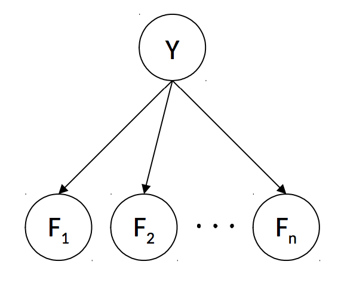

# 10.2 Naive Bayes

We'll motivate our discussion of machine learning with a concrete example of a machine learning algorithm. Let's consider the common problem of building an email spam filter, which sorts messages into spam (unwanted email) or ham (wanted email). Such a problem is called a **classification problem**—given various datapoints (in this case, each email is a datapoint), our goal is to group them into one of two or more **classes**. For classification problems, we're given a training set of datapoints along with their corresponding **labels**, which are typically one of a few discrete values.

Our goal will be to use this training data (emails, and a spam/ham label for each one) to learn some sort of relationship that we can use to make predictions on previously unseen emails. In this section, we'll describe how to construct a type of model for solving classification problems known as a **Naive Bayes Classifier**.

To train a model to classify emails as spam or ham, we need some training data consisting of preclassified emails that we can learn from. However, emails are simply strings of text, and in order to learn anything useful, we need to extract certain attributes from each of them known as **features**. Features can be anything ranging from specific word counts to text patterns (e.g., whether words are in all caps or not) to pretty much any other attribute of the data that you can imagine.

The specific features extracted for training are often dependent on the specific problem you're trying to solve, and which features you decide to select can impact the performance of your model dramatically. Deciding which features to utilize is known as **feature engineering**, and is fundamental to machine learning, but for the purposes of this course, you can assume you'll always be given the extracted features for any given dataset. In this note, **f(x)** refers to a feature function applied to all inputs **x** before putting them in the model.

Now let's say you have a dictionary of $$n$$ words, and from each email, you extract a feature vector $$F \in \mathbb{R}^{n}$$, where the $$i^{th}$$ entry in $$F$$ is a random variable $$F_i$$, which can take on a value of either $$0$$ or $$1$$, depending on whether the $$i^{th}$$ word in your dictionary appears in the email under consideration. For example, if $$F_{200}$$ is the feature for the word _free_, we will have $$F_{200} = 1$$ if _free_ appears in the email, and $$0$$ if it does not.

With these definitions, we can define more concretely how to predict whether an email is spam or ham—if we can generate a joint probability table between each $$F_i$$ and the label $$Y$$, we can compute the probability any email under consideration is spam or ham given its feature vector. Specifically, we can compute both

$$
P(Y = \text{spam} | F_1 = f_1, \dots, F_n = f_n)
$$

$$
P(Y = \text{ham} | F_1 = f_1, \dots, F_n = f_n)
$$

and simply label the email depending on which of the two probabilities is higher.

Unfortunately, since we have $$n$$ features and 1 label, each of which can take on 2 distinct values, the joint probability table corresponding to this distribution mandates a table size that's exponential in $$n$$, with $$2^{n+1}$$ entries—very impractical! This problem is solved by modeling the joint probability table with a Bayes' net, making the critical simplifying assumption that each feature $$F_i$$ is independent of all other features given the class label.

This is a very strong modeling assumption (and the reason that Naive Bayes is called _naive_), but it simplifies inference and usually works well in practice. It leads to the following Bayes' net to represent our desired joint probability distribution.

The rules of $$d$$-separation make it clear that in this Bayes' net, each $$F_i$$ is conditionally independent of all others, given $$Y$$. Now we have one table for $$P(Y)$$ with 2 entries and $$n$$ tables for each $$P(F_i | Y)$$, each with $$2^2 = 4$$ entries for a total of $$4n + 2$$ entries—linear in $$n$$! This simplifying assumption highlights the tradeoff that arises from the concept of **statistical efficiency**; sometimes we need to compromise our model's complexity to stay within computational limits.

Indeed, in cases where the number of features is sufficiently low, it's common to make more assumptions about relationships between features to generate a better model (corresponding to adding edges to your Bayes' net). With this model, making predictions for unknown data points amounts to running inference on our Bayes' net. We have observed values for $$F_1, \dots, F_n$$ and want to choose the value of $$Y$$ that has the highest probability conditioned on these features:

$$
\text{prediction}(f_1, \cdots, f_n) = \underset{y}{\text{argmax}}~P(Y=y \mid F_1=f_1, \ldots, F_N = f_n) \\
= \underset{y}{\text{argmax}}~P(Y=y, F_1=f_1, \ldots, F_N = f_n) \\
= \underset{y}{\text{argmax}}~P(Y=y) \prod_{i=1}^n P(F_i = f_i \mid Y=y)
$$

The first step is because the highest probability class will be the same in the normalized or unnormalized distribution, and the second comes directly from the Naive Bayes' independence assumption that features are independent given the class label (as seen in the graphical model structure).

Generalizing away from a spam filter, assume now that there are $$k$$ class labels (possible values for $$Y$$). Additionally, after noting that our desired probabilities—the probability of each label $$y_i$$ given our features, $$P(Y = y_i | F_1 = f_1, \dots, F_n = f_n)$$—is proportional to the joint $$P(Y = y_i, F_1 = f_1, \dots, F_n = f_n)$$, we can compute:

$$
P(Y, F_1 = f_1, \dots, F_n = f_n) =
\begin{bmatrix}
P(Y = y_1, F_1 = f_1, \dots, F_n = f_n) \\
P(Y = y_2, F_1 = f_1, \dots, F_n = f_n) \\
\vdots \\
P(Y = y_k, F_1 = f_1, \dots, F_n = f_n)
\end{bmatrix}
$$
$$
= \begin{bmatrix}
P(Y = y_1)\prod_i P(F_i = f_i | Y = y_1) \\
P(Y = y_2)\prod_i P(F_i = f_i | Y = y_2) \\
\vdots \\
P(Y = y_k)\prod_i P(F_i = f_i | Y = y_k)
\end{bmatrix}
$$

Our prediction for the class label corresponding to the feature vector $$F$$ is simply the label corresponding to the maximum value in the above computed vector:

$$
\text{prediction}(F) = \underset{y_i}{\text{argmax}}~P(Y = y_i)\prod_j P(F_j = f_j | Y = y_i)
$$

We've now learned the basic theory behind the modeling assumptions of the Naive Bayes classifier and how to make predictions with one, but have yet to touch on how exactly we learn the conditional probability tables used in our Bayes' net from the input data. This will have to wait for our next topic of discussion, **parameter estimation**.

## 10.2.1 Parameter Estimation

Assume you have a set of **sample points** or **observations**, $$x_1, \ldots, x_N$$, and you believe that this data was drawn from a distribution **parametrized** by an unknown value $$\theta$$. In other words, you believe that the probability $$P_{\theta}(x_i)$$ of each of your observations is a function of $$\theta$$. For example, we could be flipping a coin which has probability $$\theta$$ of coming up heads.

How can you "learn" the most likely value of $$\theta$$ given your sample? For example, if we have 10 coin flips, and saw that 7 of them were heads, what value should we choose for $$\theta$$? One answer to this question is to infer that $$\theta$$ is equal to the value that maximizes the probability of having selected your sample $$x_1, \ldots, x_N$$ from your assumed probability distribution. A frequently used and fundamental method in machine learning known as **maximum likelihood estimation** (MLE) does exactly this.

Maximum likelihood estimation typically makes the following simplifying assumptions:

- Each sample is drawn from the same distribution. In other words, each $$x_i$$ is **identically distributed**. In our coin flipping example, each coin flip has the same chance, $$\theta$$, of coming up heads.
- Each sample $$x_i$$ is conditionally **independent** of the others, given the parameters for our distribution. This is a strong assumption, but as we'll see greatly helps simplify the problem of maximum likelihood estimation and generally works well in practice. In the coin flipping example, the outcome of one flip doesn't affect any of the others.
- All possible values of $$\theta$$ are equally likely before we've seen any data (this is known as a **uniform prior**).

The first two assumptions above are often referred to as **independent, identically distributed** (i.i.d.). The third assumption above makes the MLE method a special case of the maximum a priori (MAP) method, which allows for non-uniform priors.

Let's now define the **likelihood** $$\mathcal{L}(\theta)$$ of our sample, a function which represents the probability of having drawn our sample from our distribution. For a fixed sample $$x_1, \ldots, x_N$$, the likelihood is just a function of $$\theta$$:

$$
\mathcal{L}(\theta) = P_{\theta}(x_1, \ldots, x_N)
$$

Using our simplifying assumption that the samples $$x_i$$ are i.i.d., the likelihood function can be re-expressed as follows:

$$
\mathcal{L}(\theta) = \prod_{i=1}^N P_{\theta}(x_i)
$$

How can we find the value of $$\theta$$ that maximizes this function? This will be the value of $$\theta$$ that best explains the data we saw. Recall from calculus that at points where a function's maxima and minima are realized, its first derivative with respect to each of its inputs (also known as the function's **gradient**) must be equal to zero. Hence, the maximum likelihood estimate for $$\theta$$ is a value that satisfies the following equation:

$$
\frac{\partial}{\partial\theta} \mathcal{L}(\theta) = 0
$$

Let's go through an example to make this concept more concrete. Say you have a bag filled with red and blue balls and don't know how many of each there are. You draw samples by taking a ball out of the bag, noting the color, then putting the ball back in (sampling with replacement). Drawing a sample of three balls from this bag yields `red`, `red`, `blue`. This seems to imply that we should infer that $$\frac{2}{3}$$ of the balls in the bag are red and $$\frac{1}{3}$$ of the balls are blue. We'll assume that each ball being taken out of the bag will be red with probability $$\theta$$ and blue with probability $$1 - \theta$$, for some value $$\theta$$ that we want to estimate (this is known as a Bernoulli distribution):

$$
P_{\theta}(x_i) =
\begin{cases}
\theta & \text{if } x_i = \text{red} \\
1 - \theta & \text{if } x_i = \text{blue}
\end{cases}
$$

The likelihood of our sample is then:

$$
\mathcal{L}(\theta) = \prod_{i=1}^3 P_{\theta}(x_i) = P_{\theta}(x_1 = \text{red}) \cdot P_{\theta}(x_2 = \text{red}) \cdot P_{\theta}(x_3 = \text{blue}) = \theta^2 \cdot (1 - \theta)
$$

The final step is to set the derivative of the likelihood to $$0$$ and solve for $$\theta$$:

$$
\frac{\partial}{\partial\theta} \mathcal{L}(\theta) = \frac{\partial}{\partial\theta} \left( \theta^2 \cdot (1 - \theta) \right) = \theta (2 - 3\theta) = 0
$$

Solving this equation for $$\theta$$ yields $$\theta = \frac{2}{3}$$, which intuitively makes sense! (There's a second solution, too, $$\theta = 0$$ -- but this corresponds to a minimum of the likelihood function, as $$\mathcal{L}(0) = 0 < \mathcal{L}(\frac{2}{3}) = \frac{4}{27}$$.)

## 10.2.2 Maximum Likelihood for Naive Bayes

Let's now return to the problem of inferring conditional probability tables for our spam classifier, beginning with a recap of variables we know:

- $$n$$ - the number of words in our dictionary.
- $$N$$ - the number of observations (emails) you have for training. For our upcoming discussion, let's also define $$N_h$$ as the number of training samples labeled as ham and $$N_s$$ as the number of training samples labeled as spam. Note $$N_h + N_s = N$$.
- $$F_i$$ - a random variable which is $$1$$ if the $$i^{th}$$ dictionary word is present in an email under consideration, and $$0$$ otherwise.
- $$Y$$ - a random variable that's either `spam` or `ham` depending on the label of the corresponding email.
- $$f_i^{(j)}$$ - this references the resolved value of the random variable $$F_i$$ in the $$j^{th}$$ item in the training set. In other words, each $$f_i^{(j)}$$ is a $$1$$ if word $$i$$ appeared in $$j^{th}$$ email under consideration and $$0$$ otherwise. This is the first time we're seeing this notation, but it'll come in handy in the upcoming derivation.

**Disclaimer**: Feel free to skip the following mathematical derivation. For CS 188, you're only required to know the result of the derivation summarized in the paragraph at the end of this section.

Now within each conditional probability table $$P(F_i | Y)$$, note that we have two distinct Bernoulli distributions: $$P(F_i | Y = ham)$$ and $$P(F_i | Y = spam)$$. For simplicity, let's specifically consider $$P(F_i | Y = ham)$$ and try to find the maximum likelihood estimate for a parameter $$\theta = P(F_i = 1 | Y = ham)$$ i.e. the probability that the $$i^{th}$$ word in our dictionary appears in a ham email. Since we have $$N_h$$ ham emails in our training set, we have $$N_h$$ observations of whether or not word $$i$$ appeared in a ham email. Because our model assumes a Bernoulli distribution for the appearance of each word given its label, we can formulate our likelihood function as follows:

$$
\mathcal{L}(\theta) = \prod_{j=1}^{N_h}P(F_i = f_i^{(j)}| Y = ham) = \prod_{j=1}^{N_h}\theta^{f_i^{(j)}}(1 - \theta)^{1 - f_i^{(j)}}
$$

The second step comes from a small mathematical trick: if $$f_i^{(j)} = 1$$ then 

$$
P(F_i = f_i^{(j)}| Y = ham) = \theta^1(1 - \theta)^0 = \theta
$$ 

and similarly if $$f_i^{(j)} = 0$$ then 

$$
P(F_i = f_i^{(j)}| Y = ham) = \theta^0(1 - \theta)^1 = (1 - \theta)
$$

In order to compute the maximum likelihood estimate for $$\theta$$, recall that the next step is to compute the derivative of $$\mathcal{L}(\theta)$$ and set it equal to $$0$$. Attempting this proves quite difficult, as it's no simple task to isolate and solve for $$\theta$$. Instead, we'll employ a trick that's very common in maximum likelihood derivations, and that's to instead find the value of $$\theta$$ that maximizes the $$\log$$ of the likelihood function. Because $$\log(x)$$ is a strictly increasing function (sometimes referred to as a **monotonic transformation**), finding a value that maximizes $$\log \mathcal{L}(\theta)$$ will also maximize $$\mathcal{L}(\theta)$$. The expansion of $$\log{\mathcal{L}(\theta)}$$ is below:

$$
\log{\mathcal{L}(\theta)} = \log\bigg(\prod_{j=1}^{N_h}\theta^{f_i^{(j)}}(1 - \theta)^{1 - f_i^{(j)}}\bigg)
$$

$$
= \sum_{j=1}^{N_h}\log\big(\theta^{f_i^{(j)}}(1 - \theta)^{1 - f_i^{(j)}}\big)
$$

$$
= \sum_{j=1}^{N_h}\log\big(\theta^{f_i^{(j)}}\big) + \sum_{j=1}^{N_h}\log\big((1 - \theta)^{1 - f_i^{(j)}}\big)
$$

$$
= \log(\theta)\sum_{j=1}^{N_h}f_i^{(j)} + \log(1 - \theta)\sum_{j=1}^{N_h}(1 - f_i^{(j)})
$$

Note that in the above derivation, we've used the properties of the log function that $$\log(a^c) = c \cdot \log(a)$$ and $$\log(ab) = \log(a) + \log(b)$$. Now we set the derivative of the log of the likelihood function to $$0$$ and solve for $$\theta$$:

$$
\frac{\partial}{\partial\theta}\bigg(\log(\theta)\sum_{j=1}^{N_h}f_i^{(j)} + \log(1 - \theta)\sum_{j=1}^{N_h}(1 - f_i^{(j)})\bigg) = 0
$$

$$
\frac{1}{\theta}\sum_{j=1}^{N_h}f_i^{(j)} - \frac{1}{(1 - \theta)}\sum_{j=1}^{N_h}(1 - f_i^{(j)}) = 0
$$

$$
\frac{1}{\theta}\sum_{j=1}^{N_h}f_i^{(j)} = \frac{1}{(1 - \theta)}\sum_{j=1}^{N_h}(1 - f_i^{(j)})
$$

$$
(1 - \theta)\sum_{j=1}^{N_h}f_i^{(j)} = \theta\sum_{j=1}^{N_h}(1 - f_i^{(j)})
$$

$$
\sum_{j=1}^{N_h}f_i^{(j)} - \theta\sum_{j=1}^{N_h}f_i^{(j)} = \theta\sum_{j=1}^{N_h}1 - \theta\sum_{j=1}^{N_h}f_i^{(j)}
$$

$$
\sum_{j=1}^{N_h}f_i^{(j)} = \theta \cdot N_h
$$

$$
\theta = \frac{1}{N_h}\sum_{j=1}^{N_h}f_i^{(j)}
$$

We've arrived at a remarkably simple final result! According to our formula above, the maximum likelihood estimate for $$\theta$$ (which, remember, is the probability that $$P(F_i = 1 | Y = ham)$$) corresponds to counting the number of ham emails in which word $$i$$ appears and dividing it by the total number of ham emails. You may think this was a lot of work for an intuitive result (and it was), but the derivation and techniques will be useful for more complex distributions than the simple Bernoulli distribution we are using for each feature here. To summarize, in this Naive Bayes model with Bernoulli feature distributions, within any given class the maximum likelihood estimate for the probability of any outcome corresponds to the count for the outcome divided by the total number of samples for the given class. The above derivation can be generalized to cases where we have more than two classes and more than two outcomes for each feature, though this derivation is not provided here.

## 10.2.3 Smoothing

Though maximum likelihood estimation is a very powerful method for parameter estimation, bad training data can often lead to unfortunate consequences. For example, if every time the word "minute" appears in an email in our training set, that email is classified as spam, our trained model will learn that 

$$
P(F_{minute} = 1 | Y = ham) = 0
$$

Hence in an unseen email, if the word `minute` ever shows up, 

$$
P(Y = ham) \prod_i P(F_i | Y = ham) = 0
$$

and so your model will never classify any email containing the word `minute` as ham. This is a classic example of **overfitting**, or building a model that doesn't generalize well to previously unseen data. Just because a specific word didn't appear in an email in your training data, that doesn't mean that it won't appear in an email in your test data or in the real world.

Overfitting with Naive Bayes' classifiers can be mitigated by **Laplace smoothing**. Conceptually, Laplace smoothing with strength $$k$$ assumes having seen $$k$$ extra of each outcome. Hence if for a given sample your maximum likelihood estimate for an outcome $$x$$ that can take on $$|X|$$ different values from a sample of size $$N$$ is 

$$
P_{MLE}(x) = \frac{count(x)}{N}
$$

then the Laplace estimate with strength $$k$$ is

$$
P_{LAP, k}(x) = \frac{count(x) + k}{N + k|X|}
$$

What does this equation say? We've made the assumption of seeing $$k$$ additional instances of each outcome, and so act as if we've seen $$count(x) + k$$ rather than $$count(x)$$ instances of $$x$$. Similarly, if we see $$k$$ additional instances of each of $$|X|$$ classes, then we must add $$k|X|$$ to our original number of samples $$N$$. Together, these two statements yield the above formula. A similar result holds for computing Laplace estimates for conditionals (which is useful for computing Laplace estimates for outcomes across different classes):

$$
P_{LAP, k}(x|y) = \frac{count(x, y) + k}{count(y) + k|X|}
$$

There are two particularly notable cases for Laplace smoothing. The first is when $$k = 0$$, then 

$$
P_{LAP, 0}(x) = P_{MLE}(x)
$$

The second is the case where $$k = \infty$$. Observing a very large, infinite number of each outcome makes the results of your actual sample inconsequential and so your Laplace estimates imply that each outcome is equally likely. Indeed:

$$
P_{LAP, \infty}(x) = \frac{1}{|X|}
$$

The specific value of $$k$$ that's appropriate to use in your model is typically determined by trial-and-error. $$k$$ is a hyperparameter in your model, which means that you can set it to whatever you want and see which value yields the best prediction accuracy/performance on your validation data.