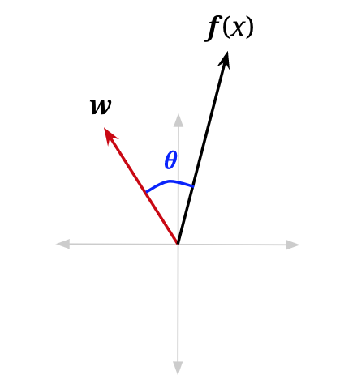
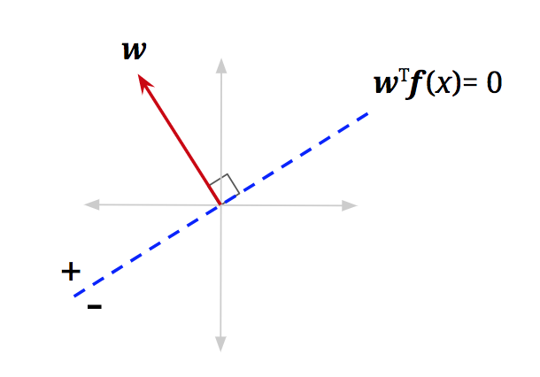
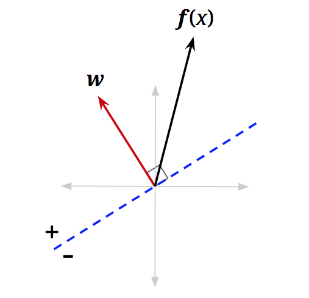
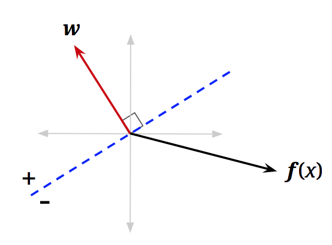

# 9.3 Perceptron

## 9.3.1 Linear Classifiers

The core idea behind Naive Bayes is to extract certain attributes of the training data called features and then estimate the probability of a label given the features: $$P(y|f_1, f_2, \ldots, f_n)$$. Thus, given a new data point, we can then extract the corresponding features and classify the new data point with the label with the highest probability given the features. However, this requires us to estimate distributions, which we did with MLE. What if instead we decided not to estimate the probability distribution? Let's start by looking at a simple linear classifier, which we can use for **binary classification**, where the label has two possibilities: positive or negative.

The basic idea of a **linear classifier** is to do classification using a linear combination of the features—a value which we call the **activation**. Concretely, the activation function takes in a data point, multiplies each feature of our data point, $$f_i(\mathbf{x})$$, by a corresponding weight, $$w_i$$, and outputs the sum of all the resulting values. In vector form, we can also write this as a dot product of our weights as a vector, $$\mathbf{w}$$, and our featurized data point as a vector $$\mathbf{f}(\mathbf{x})$$:

$$
\text{activation}_w(\mathbf{x}) = h_{\mathbf{w}}(\mathbf{x}) = \sum_i w_i f_i(\mathbf{x}) = \mathbf{w}^T \mathbf{f}(\mathbf{x}) = \mathbf{w} \cdot \mathbf{f}(\mathbf{x})
$$

How does one do classification using the activation? For binary classification, when the activation of a data point is positive, we classify that data point with the positive label, and if it is negative, we classify it with the negative label:

$$
\text{classify}(\mathbf{x}) =
\begin{cases}
+ & \text{if } h_{\mathbf{w}}(\mathbf{x}) > 0 \\
- & \text{if } h_{\mathbf{w}}(\mathbf{x}) < 0 
\end{cases}
$$

To understand this geometrically, let us reexamine the vectorized activation function. We can rewrite the dot product as follows, where $$\|\cdot\|$$ is the magnitude operator and $$\theta$$ is the angle between $$\mathbf{w}$$ and $$\mathbf{f}(\mathbf{x})$$:

$$
h_{\mathbf{w}}(\mathbf{x}) = \mathbf{w} \cdot \mathbf{f}(\mathbf{x}) = \|\mathbf{w}\| \|\mathbf{f}(\mathbf{x})\| \cos(\theta)
$$

    

Since magnitudes are always non-negative, and our classification rule looks at the sign of the activation, the only term that matters for determining the class is $$\cos(\theta)$$:

$$
\text{classify}(\mathbf{x}) =
\begin{cases}
+ & \text{if } \cos(\theta) > 0 \\
- & \text{if } \cos(\theta) < 0 
\end{cases}
$$

We are, therefore, interested in when $$\cos(\theta)$$ is negative or positive. It is easily seen that for $$\theta < \frac{\pi}{2}$$, $$\cos(\theta)$$ will be somewhere in the interval $$(0, 1]$$, which is positive. For $$\theta > \frac{\pi}{2}$$, $$\cos(\theta)$$ will be somewhere in the interval $$[-1, 0)$$, which is negative. You can confirm this by looking at a unit circle. Essentially, our simple linear classifier is checking to see if the feature vector of a new data point roughly "points" in the same direction as a predefined weight vector and applies a positive label if it does:

$$
\text{classify}(\mathbf{x}) =
\begin{cases}
+ & \text{if } \theta < \frac{\pi}{2} \text{ (i.e., when } \theta \text{ is less than 90°, or acute)} \\
- & \text{if } \theta > \frac{\pi}{2} \text{ (i.e., when } \theta \text{ is greater than 90°, or obtuse)} 
\end{cases}
$$

Up to this point, we haven't considered the points where $$\text{activation}_w(\mathbf{x}) = \mathbf{w}^T \mathbf{f}(\mathbf{x}) = 0$$. Following all the same logic, we will see that $$\cos(\theta) = 0$$ for those points. Furthermore, $$\theta = \frac{\pi}{2}$$ (i.e., $$\theta$$ is 90\textdegree) for those points. In other words, these are the data points with feature vectors that are orthogonal to $$\mathbf{w}$$. We can add a dotted blue line, orthogonal to $$\mathbf{w}$$, where any feature vector that lies on this line will have activation equal to $$0$$:

    
    
<b>Decision Boundary</b>

We call this blue line the **decision boundary** because it is the boundary that separates the region where we classify data points as positive from the region of negatives. In higher dimensions, a linear decision boundary is generically called a **hyperplane**. A hyperplane is a linear surface that is one dimension lower than the latent space, thus dividing the surface into two. For general classifiers (non-linear ones), the decision boundary may not be linear, but is simply defined as a surface in the space of feature vectors that separates the classes. To classify points that end up on the decision boundary, we can apply either label since both classes are equally valid (in the algorithms below, we'll classify points on the line as positive).

  

    
    
<b>x classified into positive class</b>

  

  

    
    
<b>x classified into negative class</b>

  

