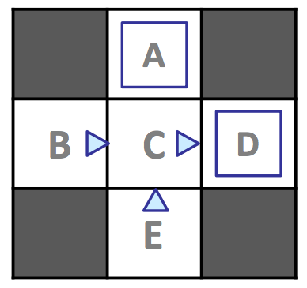
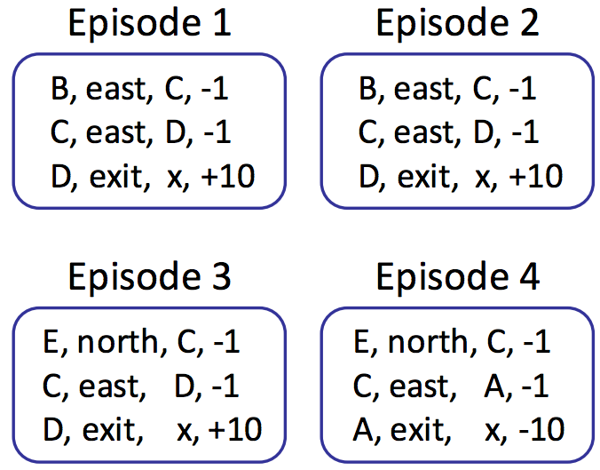

# 6.2 Model-Based Learning

In model-based learning, an agent generates an approximation of the transition function, $$\hat{T}(s, a, s')$$, by keeping counts of the number of times it arrives in each state $$s'$$ after entering each Q-state $$(s, a)$$. The agent can then generate the approximate transition function $$\hat{T}$$ upon request by **normalizing** the counts it has collected—dividing the count for each observed tuple $$(s, a, s')$$ by the sum over the counts for all instances where the agent was in Q-state $$(s, a)$$. Normalization of counts scales them such that they sum to one, allowing them to be interpreted as probabilities. 

Consider the following example MDP with states $$S = \{A, B, C, D, E, x\}$$, with $$x$$ representing the terminal state, and discount factor $$\gamma = 1$$:

Assume we allow our agent to explore the MDP for four episodes under the policy $$\pi_{explore}$$ delineated above (a directional triangle indicates motion in the direction the triangle points, and a blue square represents taking `exit` as the action of choice), yielding the following results:

We now have a collective 12 samples, 3 from each episode with counts as follows:

| $$s$$  | $$a$$   | $$s'$$ | $$count$$ |
|--------|---------|--------|-----------|
| $$A$$    | $$exit$$  | $$x$$    | 1         |
| $$B$$    | $$east$$  | $$C$$    | 2         |
| $$C$$    | $$east$$  | $$A$$    | 1         |
| $$C$$    | $$east$$  | $$D$$    | 3         |
| $$D$$    | $$exit$$  | $$x$$    | 3         |
| $$E$$    | $$north$$ | $$C$$    | 2         |

Recalling that $$T(s, a, s') = P(s' | a, s)$$, we can estimate the transition function with these counts by dividing the counts for each tuple $$(s, a, s')$$ by the total number of times we were in Q-state $$(s, a)$$, and the reward function directly from the rewards we reaped during exploration:

**Transition Function**: 
$$\hat{T}(s, a, s')$$

$$\hat{T}(A, exit, x) = \frac{\#(A, exit, x)}{\#(A, exit)} = \frac{1}{1} = 1$$

$$\hat{T}(B, east, C) = \frac{\#(B, east, C)}{\#(B, east)} = \frac{2}{2} = 1$$

$$\hat{T}(C, east, A) = \frac{\#(C, east, A)}{\#(C, east)} = \frac{1}{4} = 0.25$$

$$\hat{T}(C, east, D) = \frac{\#(C, east, D)}{\#(C, east)} = \frac{3}{4} = 0.75$$

$$\hat{T}(D, exit, x) = \frac{\#(D, exit, x)}{\#(D, exit)} = \frac{3}{3} = 1$$

$$\hat{T}(E, north, C) = \frac{\#(E, north, C)}{\#(E, north)} = \frac{2}{2} = 1$$

**Reward Function**: 
$$\hat{R}(s, a, s')$$

$$\hat{R}(A, exit, x) = -10$$

$$\hat{R}(B, east, C) = -1$$

$$\hat{R}(C, east, A) = -1$$

$$\hat{R}(C, east, D) = -1$$

$$\hat{R}(D, exit, x) = +10$$

$$\hat{R}(E, north, C) = -1$$

By the **law of large numbers**, as we collect more and more samples by having our agent experience more episodes, our models of $$\hat{T}$$ and $$\hat{R}$$ will improve, with $$\hat{T}$$ converging towards $$T$$ and $$\hat{R}$$ acquiring knowledge of previously undiscovered rewards as we discover new $$(s, a, s')$$ tuples. Whenever we see fit, we can end our agent's training to generate a policy $$\pi_{exploit}$$ by running value or policy iteration with our current models for $$\hat{T}$$ and $$\hat{R}$$ and use $$\pi_{exploit}$$ for exploitation, having our agent traverse the MDP, taking actions seeking reward maximization rather than seeking learning.

We'll soon discuss methods for how to allocate time between exploration and exploitation effectively. Model-based learning is very simple and intuitive yet remarkably effective, generating $$\hat{T}$$ and $$\hat{R}$$ with nothing more than counting and normalization. However, it can be expensive to maintain counts for every $$(s, a, s')$$ tuple seen, and so in the next section on model-free learning, we'll develop methods to bypass maintaining counts altogether and avoid the memory overhead required by model-based learning.