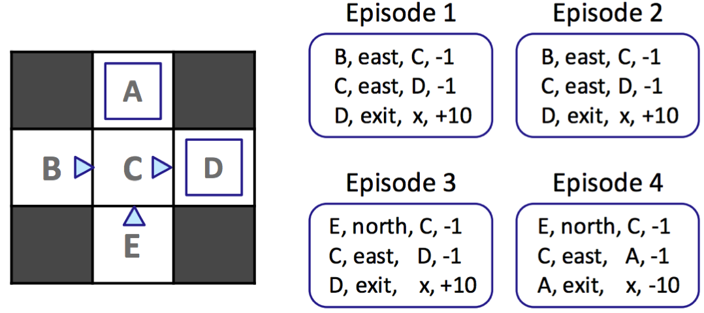
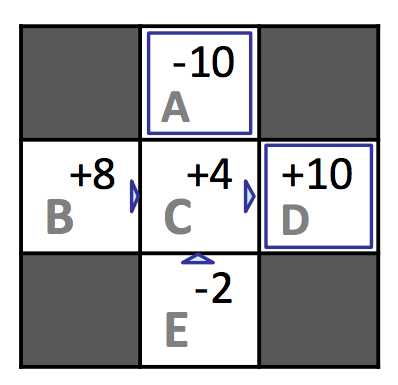

# 6.3 Model-Free Learning

Onward to model-free learning! There are several model-free learning algorithms, and we'll cover three of them: direct evaluation, temporal difference learning, and Q-learning. Direct evaluation and temporal difference learning fall under a class of algorithms known as **passive reinforcement learning**. In passive reinforcement learning, an agent is given a policy to follow and learns the value of states under that policy as it experiences episodes, which is exactly what is done by policy evaluation for MDPs when $$T$$ and $$R$$ are known. Q-learning falls under a second class of model-free learning algorithms known as **active reinforcement learning**, during which the learning agent can use the feedback it receives to iteratively update its policy while learning until eventually determining the optimal policy after sufficient exploration.

## 6.3.1 Direct Evaluation

The first passive reinforcement learning technique we'll cover is known as **direct evaluation**, a method that's as boring and simple as the name makes it sound. All direct evaluation does is fix some policy $$\pi$$ and have the agent experience several episodes while following $$\pi$$. As the agent collects samples through these episodes it maintains counts of the total utility obtained from each state and the number of times it visited each state. At any point, we can compute the estimated value of any state $$s$$ by dividing the total utility obtained from $$s$$ by the number of times $$s$$ was visited. Let's run direct evaluation on our example from earlier, recalling that $$\gamma = 1$$.

Walking through the first episode, we can see that from state $$D$$ to termination we acquired a total reward of $$10$$, from state $$C$$ we acquired a total reward of $$(-1) + 10 = 9$$, and from state $$B$$ we acquired a total reward of $$(-1) + (-1) + 10 = 8$$. Completing this process yields the total reward across episodes for each state and the resulting estimated values as follows:

| $$\mathbf{s}$$ | $$\mathbf{Total\ Reward}$$ | $$\mathbf{Times\ Visited}$$ | $$\mathbf{V^{\pi}(s)}$$ |
|:---:|:---:|:---:|:---:|
| $$A$$ | $$-10$$ | $$1$$ | $$-10$$ |
| $$B$$ | $$16$$ | $$2$$ | $$8$$ |
| $$C$$ | $$16$$ | $$4$$ | $$4$$ |
| $$D$$ | $$30$$ | $$3$$ | $$10$$ |
| $$E$$ | $$-4$$ | $$2$$ | $$-2$$ |

Though direct evaluation eventually learns state values for each state, it's often unnecessarily slow to converge because it wastes information about transitions between states.

In our example, we computed $$V^{\pi}(E) = -2$$ and $$V^{\pi}(B) = 8$$, though based on the feedback we received both states only have $$C$$ as a successor state and incur the same reward of $$-1$$ when transitioning to $$C$$. According to the Bellman equation, this means that both $$B$$ and $$E$$ should have the same value under $$\pi$$. However, of the 4 times our agent was in state $$C$$, it transitioned to $$D$$ and reaped a reward of $$10$$ three times and transitioned to $$A$$ and reaped a reward of $$-10$$ once. It was purely by chance that the single time it received the $$-10$$ reward it started in state $$E$$ rather than $$B$$, but this severely skewed the estimated value for $$E$$. With enough episodes, the values for $$B$$ and $$E$$ will converge to their true values, but cases like this cause the process to take longer than we'd like. This issue can be mitigated by choosing to use our second passive reinforcement learning algorithm, temporal difference learning.

## 6.3.2 Temporal Difference Learning

Temporal difference learning (TD learning) uses the idea of _learning from every experience_, rather than simply keeping track of total rewards and number of times states are visited and learning at the end as direct evaluation does. In policy evaluation, we used the system of equations generated by our fixed policy and the Bellman equation to determine the values of states under that policy (or used iterative updates like with value iteration).

$$
V^{\pi}(s) = \sum_{s'}T(s, \pi(s), s')[R(s, \pi(s), s') + \gamma V^{\pi}(s')]
$$

Each of these equations equates the value of one state to the weighted average over the discounted values of that state's successors plus the rewards reaped in transitioning to them. TD learning tries to answer the question of how to compute this weighted average without the weights, cleverly doing so with an **exponential moving average**. We begin by initializing $$\forall s, \:\: V^{\pi}(s) = 0$$. At each time step, an agent takes an action $$\pi(s)$$ from a state $$s$$, transitions to a state $$s'$$, and receives a reward $$R(s, \pi(s), s')$$. We can obtain a **sample value** by summing the received reward with the discounted current value of $$s'$$ under $$\pi$$:

$$
\text{sample} = R(s, \pi(s), s') + \gamma V^{\pi}(s')
$$

This sample is a new estimate for $$V^{\pi}(s)$$. The next step is to incorporate this sampled estimate into our existing model for $$V^{\pi}(s)$$ with the exponential moving average, which adheres to the following update rule:

$$
V^{\pi}(s) \leftarrow (1-\alpha)V^{\pi}(s) + \alpha \cdot \text{sample}
$$

Above, $$\alpha$$ is a parameter constrained by $$0 \leq \alpha \leq 1$$ known as the **learning rate** that specifies the weight we want to assign our existing model for $$V^{\pi}(s)$$, $$1 - \alpha$$, and the weight we want to assign our new sampled estimate, $$\alpha$$. It's typical to start out with learning rate of $$\alpha = 1$$, accordingly assigning $$V^{\pi}(s)$$ to whatever the first $$\text{sample}$$ happens to be, and slowly shrinking it towards 0, at which point all subsequent samples will be zeroed out and stop affecting our model of $$V^{\pi}(s)$$. 

Let's stop and analyze the update rule for a minute. Annotating the state of our model at different points in time by defining $$V^{\pi}_k(s)$$ and $$\text{sample}_k$$ as the estimated value of state $$s$$ after the $$k^{th}$$ update and the $$k^{th}$$ sample respectively, we can re-express our update rule:

$$
V^{\pi}_{k}(s) \leftarrow (1-\alpha)V^{\pi}_{k-1}(s) + \alpha \cdot \text{sample}_k
$$

This recursive definition for $$V^{\pi}_k(s)$$ happens to be very interesting to expand:

$$
V^{\pi}_{k}(s) \leftarrow \alpha \cdot [(1-\alpha)^{k-1} \cdot \text{sample}_1 + ... + (1-\alpha) \cdot \text{sample}_{k-1} + \text{sample}_k]
$$

Because $$0 \leq (1 - \alpha) \leq 1$$, as we raise the quantity $$(1 - \alpha)$$ to increasingly larger powers, it grows closer and closer to 0. By the update rule expansion we derived, this means that older samples are given exponentially less weight, exactly what we want since these older samples are computed using older (and hence worse) versions of our model for $$V^{\pi}(s)$$! This is the beauty of temporal difference learning - with a single straightforward update rule, we are able to:

- Learn at every time step, hence using information about state transitions as we get them since we're using iteratively updated versions of $$V^{\pi}(s')$$ in our samples rather than waiting until the end to perform any computation.
- Give exponentially less weight to older, potentially less accurate samples.
- Converge to learning true state values much faster with fewer episodes than direct evaluation.

## 6.3.3 Q-Learning

Both direct evaluation and TD learning will eventually learn the true value of all states under the policy they follow. However, they both have a major inherent issue — we want to find an optimal *policy* for our agent, which requires knowledge of the Q-values of states. To compute Q-values from the values we have, we require a transition function and reward function as dictated by the Bellman equation.

$$
Q^*(s, a) = \sum_{s'} T(s, a, s')[R(s, a, s') + \gamma V^*(s')]
$$

As a result, TD learning or direct evaluation are typically used in tandem with some model-based learning to acquire estimates of $$T$$ and $$R$$ in order to effectively update the policy followed by the learning agent. This became avoidable by a revolutionary new idea known as **Q-learning**, which proposed learning the Q-values of states directly, bypassing the need to ever know any values, transition functions, or reward functions. As a result, Q-learning is entirely model-free. Q-learning uses the following update rule to perform what's known as **Q-value iteration**:

$$
Q_{k+1}(s, a) \leftarrow \sum_{s'}T(s, a, s')[R(s, a, s') + \gamma \max_{a'} Q_k(s', a')]
$$

Note that this update is only a slight modification over the update rule for value iteration. Indeed, the only real difference is that the position of the $$\max$$ operator over actions has been changed since we select an action before transitioning when we're in a state, but we transition before selecting a new action when we're in a Q-state.

With this new update rule under our belt, Q-learning is derived essentially the same way as TD learning, by acquiring **Q-value samples**:

$$
\text{sample} = R(s, a, s') + \gamma \max_{a'}Q(s', a')
$$

and incorporating them into an exponential moving average.

$$
Q(s, a) \leftarrow (1-\alpha)Q(s, a) + \alpha \cdot \text{sample}
$$

As long as we spend enough time in exploration and decrease the learning rate $$\alpha$$ at an appropriate pace, Q-learning learns the optimal Q-values for every Q-state. This is what makes Q-learning so revolutionary — while TD learning and direct evaluation learn the values of states under a policy by following the policy before determining policy optimality via other techniques, Q-learning can learn the optimal policy directly even by taking suboptimal or random actions. This is called **off-policy learning** (contrary to direct evaluation and TD learning, which are examples of **on-policy learning**).

## 6.3.4 Approximate Q-Learning

Q-learning is an incredible learning technique that continues to sit at the center of developments in the field of reinforcement learning. Yet, it still has some room for improvement. As it stands, Q-learning just stores all Q-values for states in tabular form, which is not particularly efficient given that most applications of reinforcement learning have several thousands or even millions of states. This means we can't visit all states during training and can't store all Q-values even if we could for lack of memory.

Above, if Pacman learned that Figure 1 is unfavorable after running vanilla Q-learning, it would still have no idea that Figure 2 or even Figure 3 are unfavorable as well. **Approximate Q-learning** tries to account for this by learning about a few general situations and extrapolating to many similar situations. The key to generalizing learning experiences is the **feature-based representation** of states, which represents each state as a vector known as a **feature vector**. For example, a feature vector for Pacman may encode:

- the distance to the closest ghost.
- the distance to the closest food pellet.
- the number of ghosts.
- is Pacman trapped? 0 or 1.

With feature vectors, we can treat values of states and Q-states as **linear value functions**:

$$
V(s) = w_1 \cdot f_1(s) + w_2 \cdot f_2(s) + ... + w_n \cdot f_n(s) = \vec{w} \cdot \vec{f}(s)
$$

$$
Q(s, a) = w_1 \cdot f_1(s, a) + w_2 \cdot f_2(s, a) + ... + w_n \cdot f_n(s, a) = \vec{w} \cdot \vec{f}(s, a)
$$

where 

$$
\vec{f}(s) = \begin{bmatrix}f_1(s)&f_2(s)&...&f_n(s)\end{bmatrix}^T 
$$

and 

$$
\vec{f}(s, a) = \begin{bmatrix}f_1(s, a)&f_2(s, a)&...&f_n(s, a)\end{bmatrix}^T
$$

represent the feature vectors for state $$s$$ and Q-state $$(s, a)$$ respectively and $$\vec{w} = \begin{bmatrix}w_1&w_2&...&w_n\end{bmatrix}$$ represents a weight vector. Defining **difference** as

$$
\text{difference} = [R(s, a, s') + \gamma \max_{a'}Q(s', a')] - Q(s, a)
$$

approximate Q-learning works almost identically to Q-learning, using the following update rule:

$$
w_i \leftarrow w_i + \alpha \cdot \text{difference} \cdot f_i(s, a)
$$

Rather than storing Q-values for each and every state, with approximate Q-learning we only need to store a single weight vector and can compute Q-values on-demand as needed. As a result, this gives us not only a more generalized version of Q-learning, but a significantly more memory-efficient one as well.

As a final note on Q-learning, we can re-express the update rule for exact Q-learning using **difference** as follows:

$$
Q(s, a) \leftarrow Q(s, a) + \alpha \cdot \text{difference}
$$

This second notation gives us a slightly different but equally valuable interpretation of the update: it's computing the difference between the sampled estimate and the current model of $$Q(s, a)$$, and shifting the model in the direction of the estimate with the magnitude of the shift being proportional to the magnitude of the difference.
