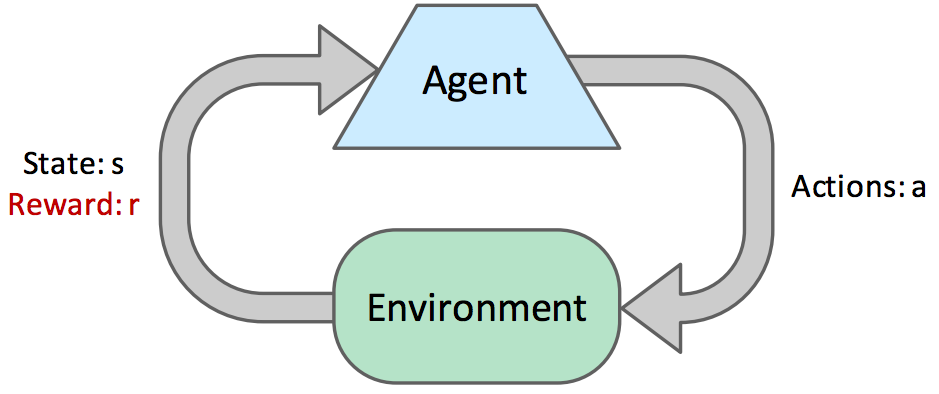

# 6.1 Reinforcement Learning

In the previous note, we discussed Markov decision processes, which we solved using techniques such as value iteration and policy iteration to compute the optimal values of states and extract optimal policies. Solving Markov decision processes is an example of **offline planning**, where agents have full knowledge of both the **transition** function and the **reward** function, all the information they need to precompute optimal actions in the world encoded by the MDP without ever actually taking any actions. 

In this note, we'll discuss **online planning**, during which an agent has no prior knowledge of rewards or transitions in the world (still represented as an MDP). In online planning, an agent must try **exploration**, during which it performs actions and receives **feedback** in the form of the successor states it arrives in and the corresponding rewards it reaps. The agent uses this feedback to estimate an optimal policy through a process known as **reinforcement learning** before using this estimated policy for **exploitation** or reward maximization.

Let's start with some basic terminology. At each time step during online planning, an agent starts in a state $$s$$, then takes an action $$a$$ and ends up in a successor state $$s'$$, attaining some reward $$r$$. Each $$(s, a, s', r)$$ tuple is known as a **sample**. Often, an agent continues to take actions and collect samples in succession until arriving at a terminal state. Such a collection of samples is known as an **episode**. Agents typically go through many episodes during exploration in order to collect sufficient data needed for learning.

There are two types of reinforcement learning, **model-based learning** and **model-free learning**. Model-based learning attempts to estimate the transition and reward functions with the samples attained during exploration before using these estimates to solve the MDP normally with value or policy iteration. Model-free learning, on the other hand, attempts to estimate the values or Q-values of states directly, without ever using any memory to construct a model of the rewards and transitions in the MDP.
