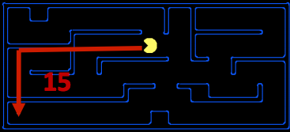
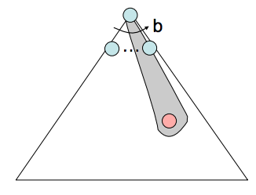
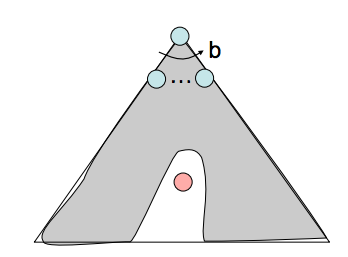
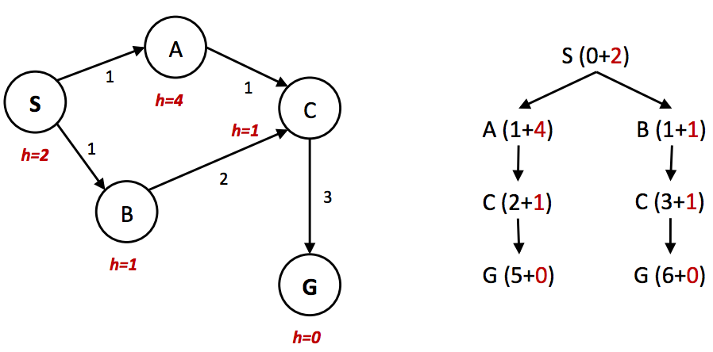
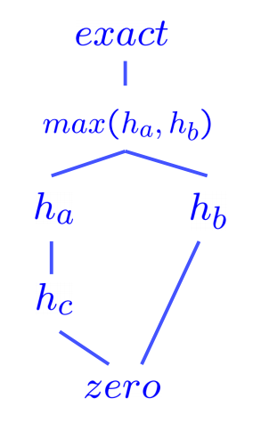

# Informed Search

Uniform cost search is good because it's both complete and optimal, but it can be fairly slow because it expands in every direction from the start state while searching for a goal. If we have some notion of the direction in which we should focus our search, we can significantly improve performance and "hone in" on a goal much more quickly. This is exactly the focus of **informed search**.

## Heuristics

**Heuristics** are the driving force that allow estimation of distance to goal states - they're functions that take in a state as input and output a corresponding estimate. The computation performed by such a function is specific to the search problem being solved. For reasons that we'll see in A* search, below, we usually want heuristic functions to be a lower bound on this remaining distance to the goal, and so heuristics are typically solutions to **relaxed problems** (where some of the constraints of the original problem have been removed).  Turning to our Pacman example, let's consider the pathing problem described earlier. A common heuristic that's used to solve this problem is the **Manhattan distance**, which for two points ($$x_1$$, $$y_1$$) and ($$x_2$$, $$y_2$$) is defined as follows:

$$
Manhattan(x_1, y_1, x_2, y_2) = |x_1 - x_2| + |y_1 - y_2|
$$



The above visualization shows the relaxed problem that the Manhattan distance helps solve - assuming Pacman desires to get to the bottom left corner of the maze, it computes the distance from Pacman's current location to Pacman's desired location *assuming a lack of walls in the maze*. This distance is the *exact* goal distance in the relaxed search problem, and correspondingly is the *estimated* goal distance in the actual search problem. With heuristics, it becomes very easy to implement logic in our agent that enables them to "prefer" expanding states that are estimated to be closer to goal states when deciding which action to perform. This concept of preference is very powerful, and is utilized by the following two search algorithms that implement heuristic functions: greedy search and A*.

## Greedy Search

- *Description* - Greedy search is a strategy for exploration that always selects the frontier node with the *lowest heuristic value* for expansion, which corresponds to the state it believes is nearest to a goal.
- *Frontier Representation* - Greedy search operates identically to UCS, with a priority queue Frontier Representation. The difference is that instead of using *computed backward cost* (the sum of edge weights in the path to the state) to assign priority, greedy search uses *estimated forward cost* in the form of heuristic values.
- *Completeness and Optimality* - Greedy search is not guaranteed to find a goal state if one exists, nor is it optimal, particularly in cases where a very bad heuristic function is selected. It generally acts fairly unpredictably from scenario to scenario, and can range from going straight to a goal state to acting like a badly-guided DFS and exploring all the wrong areas.




## A* Search

- *Description* - A* search is a strategy for exploration that always selects the frontier node with the *lowest estimated total cost* for expansion, where total cost is the entire cost from the start node to the goal node.
- *Frontier Representation* - Just like greedy search and UCS, A* search also uses a priority queue to represent its frontier. Again, the only difference is the method of priority selection. A* combines the total backward cost (sum of edge weights in the path to the state) used by UCS with the estimated forward cost (heuristic value) used by greedy search by adding these two values, effectively yielding an *estimated total cost* from start to goal. Given that we want to minimize the total cost from start to goal, this is an excellent choice.
- *Completeness and Optimality* - A* search is both complete and optimal, given an appropriate heuristic (which we'll cover in a minute). It's a combination of the good from all the other search strategies we've covered so far, incorporating the generally high speed of greedy search with the optimality and completeness of UCS!

## Admissibility

Now that we've discussed heuristics and how they are applied in both greedy and A* search, let's spend some time discussing what constitutes a good heuristic. To do so, let's first reformulate the methods used for determining priority queue ordering in UCS, greedy search, and A* with the following definitions:

- $$g(n)$$ - The function representing total backwards cost computed by UCS.
- $$h(n)$$ - The *heuristic value* function, or estimated forward cost, used by greedy search.
- $$f(n)$$ - The function representing estimated total cost, used by A* search. $$f(n) = g(n) + h(n)$$.

Before attacking the question of what constitutes a "good" heuristic, we must first answer the question of whether A* maintains its properties of completeness and optimality regardless of the heuristic function we use. Indeed, it's very easy to find heuristics that break these two coveted properties. As an example, consider the heuristic function $$h(n) = 1 - g(n)$$. Regardless of the search problem, using this heuristic yields:

$$
f(n) = g(n) + h(n)
     = g(n) + (1 - g(n))
     = 1
$$

Hence, such a heuristic reduces A* search to BFS, where all edge costs are equivalent. As we've already shown, BFS is not guaranteed to be optimal in the general case where edge weights are not constant.

The condition required for optimality when using A* tree search is known as **admissibility**. The admissibility constraint states that the value estimated by an admissible heuristic is neither negative nor an overestimate. Defining h*(n) as the true optimal forward cost to reach a goal state from a given node n, we can formulate the admissibility constraint mathematically as follows:

$$
∀n, 0 ≤ h(n) ≤ h*(n)
$$

**Theorem.** For a given search problem, if the admissibility constraint is satisfied by a heuristic function h, using A* tree search with h on that search problem will yield an optimal solution.

*Proof.* Assume two reachable goal states are located in the search tree for a given search problem, an optimal goal $$A$$ and a suboptimal goal $$B$$. Some ancestor $$n$$ of $$A$$ (including perhaps $$A$$ itself) must currently be on the frontier, since $$A$$ is reachable from the start state. We claim $$n$$ will be selected for expansion before $$B$$, using the following three statements:

1. $$g(A) < g(B)$$. Because $$A$$ is given to be optimal and $$B$$ is given to be suboptimal, we can conclude that $$A$$ has a lower backwards cost to the start state than $$B$$.
2. $$h(A) = h(B) = 0$$, because we are given that our heuristic satisfies the admissibility constraint. Since both $$A$$ and $$B$$ are both goal states, the true optimal cost to a goal state from $$A$$ or $$B$$ is simply $$h*(n) = 0$$; hence $$0 ≤ h(n) ≤ 0$$.
3. $$f(n) ≤ f(A)$$, because, through admissibility of $$h$$, $$f(n)=g(n)+h(n)≤g(n) +h*(n) = g(A) = f(A)$$. The total cost through node $$n$$ is at most the true backward cost of $$A$$, which is also the total cost of $$A$$.

We can combine statements 1. and 2. to conclude that $$f(A) < f(B)$$ as follows:

$$
f(A) = g(A) + h(A) = g(A) < g(B) = g(B) + h(B) = f(B)
$$

A simple consequence of combining the above derived inequality with statement 3. is the following:

$$
f(n) ≤ f(A) ∧ f(A) < f(B) ⇒ f(n) < f(B)
$$

Hence, we can conclude that $$n$$ is expanded before $$B$$. Because we have proven this for arbitrary $$n$$, we can conclude that *all* ancestors of $$A$$ (including $$A$$ itself) expand before $$B$$.

One problem we found above with tree search was that in some cases it could fail to ever find a solution, getting stuck searching the same cycle in the state space graph infinitely. Even in situations where our search technique doesn't involve such an infinite loop, it's often the case that we revisit the same node multiple times because there's multiple ways to get to that same node. This leads to exponentially more work, and the natural solution is to simply keep track of which states you've already expanded, and never expand them again. More explicitly, maintain a "reached" set of expanded nodes while utilizing your search method of choice. Then, ensure that each node isn't already in the set before expansion and add it to the set after expansion if it's not. Tree search with this added optimization is known as **graph search**.[^1] Additionally, there is one other key factor that is required to maintain optimality. Consider the following simple state space graph and corresponding search tree, annotated with weights and heuristic values:



In the above example, it's clear that the optimal route is to follow $$S → A → C → G$$, yielding a total path cost of 1 + 1 + 3 = 5. The only other path to the goal, $$S → B → C → G$$ has a path cost of 1 + 2 + 3 = 6. However, because the heuristic value of node A is so much larger than the heuristic value of node $$B$$, node $$C$$ is first expanded along the second, suboptimal path as a child of node $$B$$. It's then placed into the "reached" set, and so A* graph search fails to reexpand it when it visits it as a child of $$A$$, so it never finds the optimal solution. Hence, to maintain optimality under A* graph search, we not only need to check whether A* has already visited a node, but also if it has found a cheaper path to it.

```
function A*-GRAPH-SEARCH(problem, frontier) return a solution or failure
    reached ← an empty dict mapping nodes to the cost to each one
    frontier ← INSERT((MAKE-NODE(INITIAL-STATE[problem]),0), frontier)
    while not IS-EMPTY(frontier) do
        node, node.CostToNode ← POP(frontier)
        if problem.IS-GOAL(node.STATE) then return node
        if node.STATE is not in reached or reached[node.STATE] > node.CostToNode then
            reached[node.STATE] = node.CostToNode
            for each child-node in EXPAND(problem, node) do
                frontier ← INSERT((child-node, child-node.COST + CostToNode), frontier)
    return failure
```

Note that in implementation, it's critically important to store the reached set as a disjoint set and not a list. Storing it as a list requires costs $$O(n)$$ operations to check for membership, which eliminates the performance improvement graph search is intended to provide.

A couple of important highlights from the discussion above before we proceed: for heuristics that are admissible to be valid, it must by definition be the case that $$h(G) = 0$$ for any goal state $$G$$.

## Dominance

Now that we've established the property of admissibility and its role in maintaining the optimality of A* search, we can return to our original problem of creating "good" heuristics, and how to tell if one heuristic is better than another. The standard metric for this is that of **dominance**. If heuristic $$$$ is dominant over heuristic $$b$$, then the estimated goal distance for $$a$$ is greater than the estimated goal distance for $$b$$ for every node in the state space graph. Mathematically,

$$
∀n: h_a(n) ≥ h_b(n)
$$

Dominance very intuitively captures the idea of one heuristic being better than another - if one admissible heuristic is dominant over another, it must be better because it will always more closely estimate the distance to a goal from any given state. Additionally, the **trivial heuristic** is defined as $$h(n) = 0$$, and using it reduces A* search to UCS. All admissible heuristics dominate the trivial heuristic. The trivial heuristic is often incorporated at the base of a **semi-lattice** for a search problem, a dominance hierarchy of which it is located at the bottom. Below is an example of a semi-lattice that incorporates various heuristics $$h_a$$, $$h_b$$, and $$h_c$$ ranging from the trivial heuristic at the bottom to the exact goal distance at the top:



As a general rule, the max function applied to multiple admissible heuristics will also always be admissible. This is simply a consequence of all values output by the heuristics for any given state being constrained by the admissibility condition, $$0 ≤ h(n) ≤ h*(n)$$. The maximum of numbers in this range must also fall in the same range. It's common practice to generate multiple admissible heuristics for any given search problem and compute the max over the values output by them to generate a heuristic that dominates (and hence is better than) all of them individually.

[^1]: In other courses, such as CS70 and CS170, you may have been introduced to "trees" and "graphs" in the graph theory context. Specifically, a tree being a type of graph that satisfies certain constraints (connected and acyclic). This is not the distinction between tree search and graph search that we make in this course.