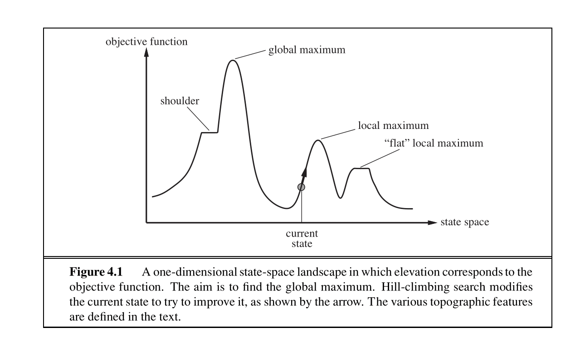
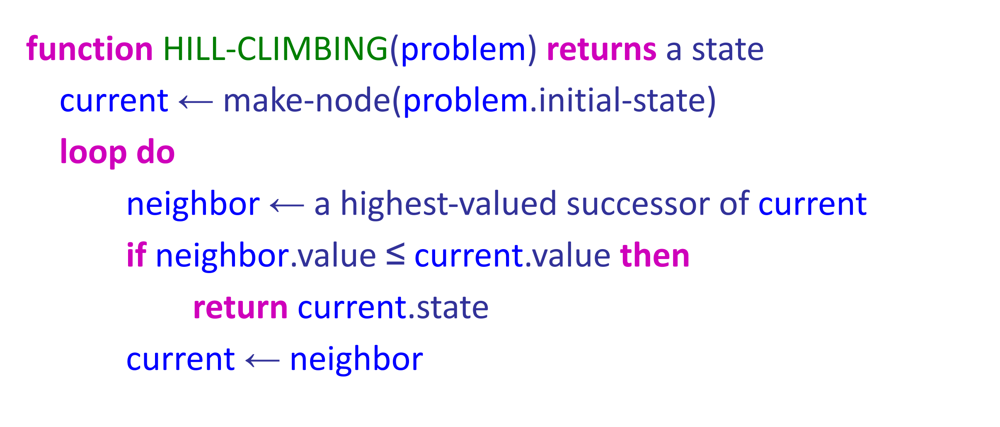
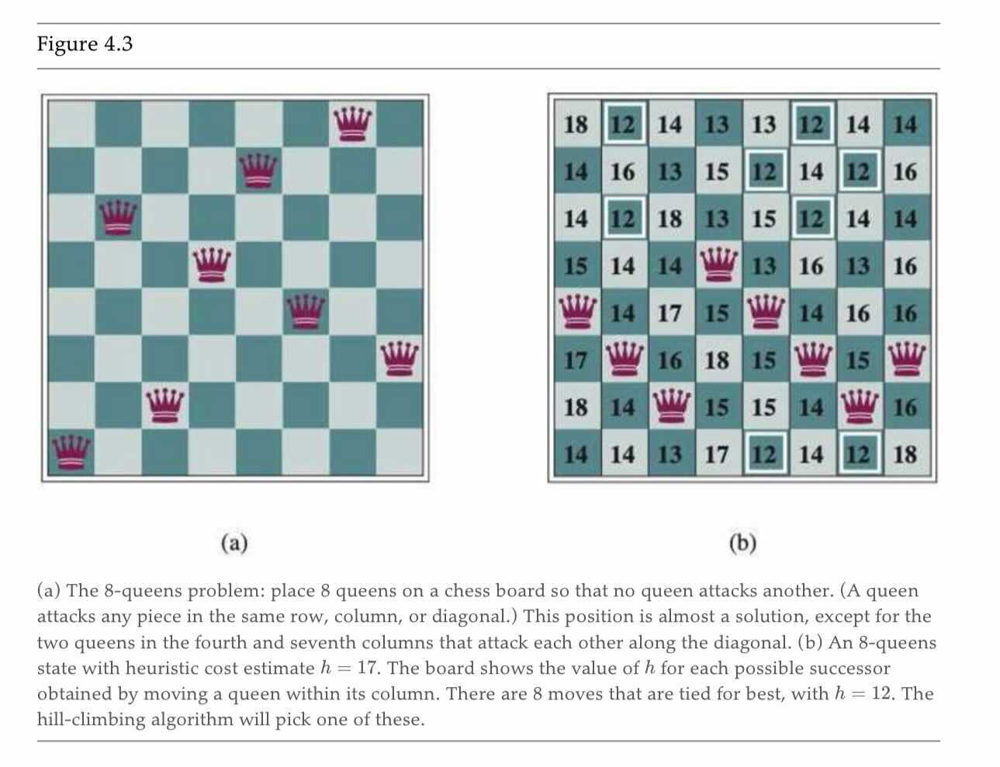
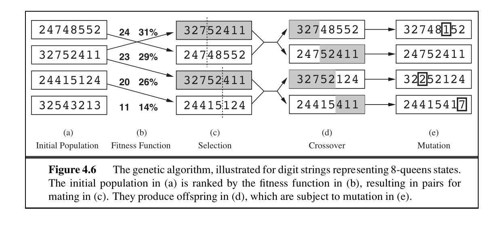
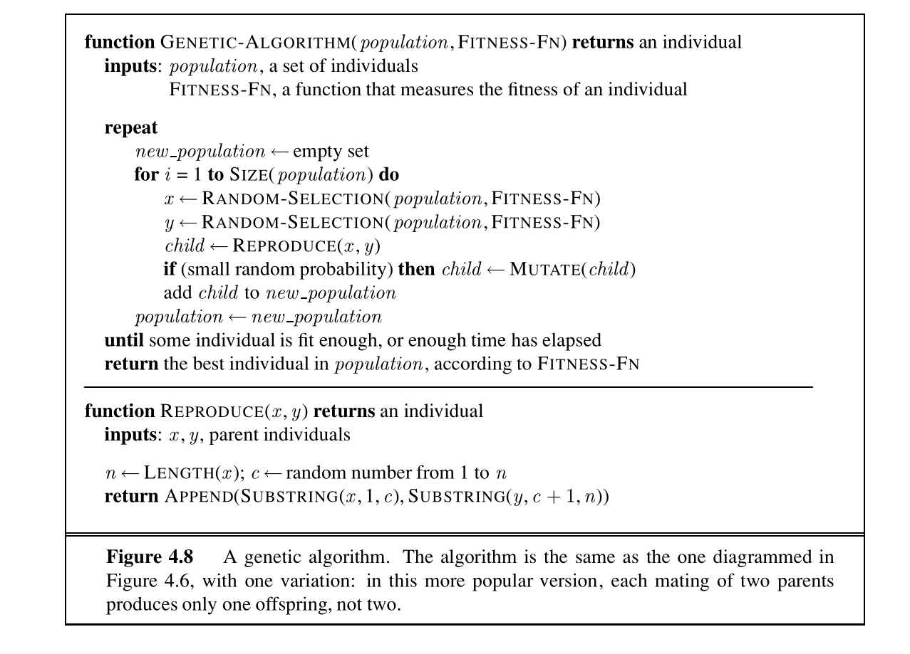
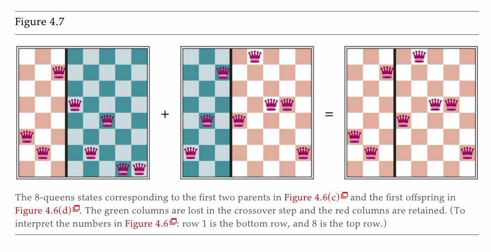

# 1.5 Local Search

In the previous note, we wanted to find the goal state, along with the optimal path to get there. But in some problems, we only care about finding the goal state — reconstructing the path can be trivial. For example, in Sudoku, the optimal configuration is the goal. Once you know it, you know how to get there by filling in the squares one by one.

Local search algorithms allow us to find goal states without worrying about the path to get there. In local search problems, the state space consists of sets of "complete" solutions. We use these algorithms to try to find a configuration that satisfies some constraints or optimizes some objective function.

The figure above shows the one-dimensional plot of an objective function on the state space. For that function, we wish to find the state that corresponds to the highest objective value. The basic idea of local search algorithms is that from each state, they locally move towards states that have a higher objective value until a maximum (hopefully the global one) is reached. We will be covering four such algorithms: **hill-climbing**, **simulated annealing**, **local beam search**, and **genetic algorithms**. All these algorithms are also used in optimization tasks to either maximize or minimize an objective function.

## 1.5.1 Hill-Climbing Search

The hill-climbing search algorithm (or **steepest-ascent**) moves from the current state towards the neighboring state that increases the objective value the most. The algorithm does not maintain a search tree but only tracks the states and the corresponding values of the objective. The "greediness" of hill-climbing makes it vulnerable to being trapped in **local maxima** (see figure 4.1), as locally those points appear as global maxima to the algorithm, and **plateaus** (see figure 4.1). Plateaus can be categorized into "flat" areas at which no direction leads to improvement ("flat local maxima") or flat areas from which progress can be slow ("shoulders").

Variants of hill-climbing, like **stochastic hill-climbing** (which selects an action randomly among the possible uphill moves), have been proposed. Stochastic hill-climbing has been shown in practice to converge to higher maxima at the cost of more iterations. Another variant, **random sideways moves**, allows moves that don't strictly increase the objective, helping the algorithm escape "shoulders."

The pseudocode of hill-climbing can be seen above. As the name suggests, the algorithm iteratively moves to a state with a higher objective value until no such progress is possible. Hill-climbing is incomplete. **Random-restart hill-climbing**, on the other hand, conducts a number of hill-climbing searches from randomly chosen initial states, making it trivially complete as, at some point, a randomly chosen initial state may converge to the global maximum.

As a note, later in this course, you will encounter the term "gradient descent." It is the exact same idea as hill-climbing, except instead of maximizing an objective function, we will want to minimize a cost function.

## 1.5.2 Simulated Annealing Search

The second local search algorithm we will cover is simulated annealing. Simulated annealing aims to combine random walk (randomly moving to nearby states) and hill-climbing to obtain a complete and efficient search algorithm. In simulated annealing, we allow moves to states that can decrease the objective.

The algorithm chooses a random move at each timestep. If the move leads to a higher objective value, it is always accepted. If it leads to a smaller objective value, the move is accepted with some probability. This probability is determined by the temperature parameter, which initially is high (allowing more "bad" moves) and decreases according to some "schedule." Theoretically, if the temperature is decreased slowly enough, the simulated annealing algorithm will reach the global maximum with a probability approaching 1.

## 1.5.3 Local Beam Search

Local beam search is another variant of the hill-climbing search algorithm. The key difference between the two is that local beam search keeps track of $$k$$ states (threads) at each iteration. The algorithm starts with a random initialization of $$k$$ states, and at each iteration, it selects $$k$$ new states, as done in hill-climbing. These aren't just $$k$$ copies of the regular hill-climbing algorithm. Crucially, the algorithm selects the $$k$$ best successor states from the complete list of successor states from all the threads. If any of the threads find the optimal value, the algorithm stops.

The $$k$$ threads can share information between them, allowing "good" threads (for which objectives are high) to "attract" the other threads to that region as well.

Local beam search is also susceptible to getting stuck in "flat" regions like hill-climbing does. **Stochastic beam search**, analogous to stochastic hill-climbing, can alleviate this issue.

## 1.5.4 Genetic Algorithms

Finally, we present **genetic algorithms**, which are a variant of local beam search and are extensively used in many optimization tasks. As indicated by the name, genetic algorithms take inspiration from evolution. Genetic algorithms begin as beam search with $$k$$ randomly initialized states called the **population**. States (called **individuals**) are represented as a string over a finite alphabet.

Let's revisit the **$$8$$-Queens problem** presented in lecture. As a recap, $$8$$-Queens is a constraint-satisfaction problem where we aim to situate $$8$$ queens on an $$8$$-by-$$8$$ board. The constraint-satisfying solution will not have any **attacking pairs** of queens, which are queens in the same row, column, or diagonal. All of the previously covered algorithms can be used to approach the $$8$$-Queens problem.

For a genetic algorithm, we represent each of the eight queens with a number from $$1-8$$, representing the location of each queen in its column (column (a) in Fig. 4.6). Each individual is evaluated using an evaluation function (**fitness function**), and they are ranked according to the values of that function. For the $$8$$-Queens problem, this is the number of non-attacking (non-conflicted) pairs of queens.

The probability of choosing a state to "reproduce" is proportional to the value of that state. We proceed to select pairs of states to reproduce by sampling from these probabilities (column (c) in Fig. 4.6). Offspring are generated by crossing over parent strings at the crossover point. The crossover point is chosen randomly for each pair. Finally, each offspring is susceptible to some random mutation with independent probability. The pseudocode for the genetic algorithm can be seen below.

Similar to stochastic beam search, genetic algorithms try to move uphill while exploring the state space and exchanging information between threads. Their main advantage is the use of crossovers — large blocks of letters that have evolved and lead to high valuations can be combined with other such blocks to produce a solution with a high total score.

