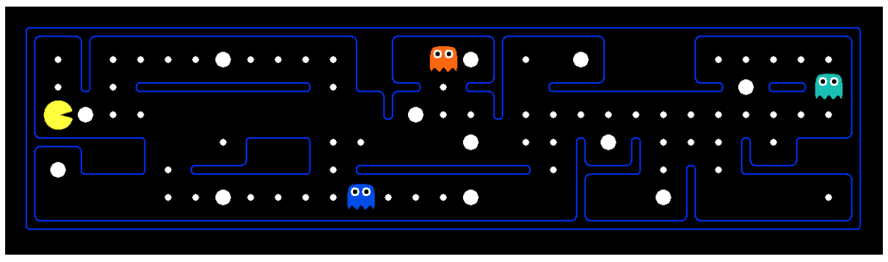
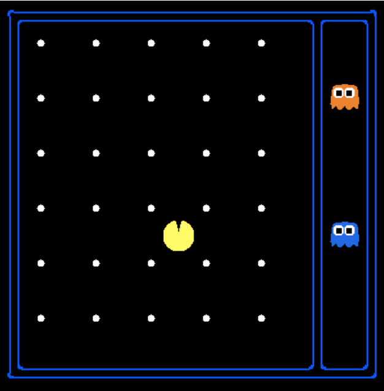
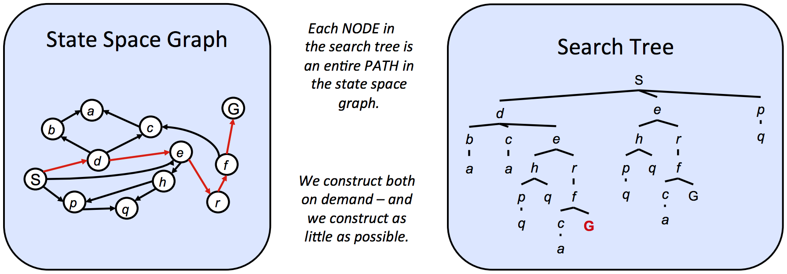

# State Spaces and Search Problems

In order to create a rational planning agent, we need a way to mathematically express the given environment in which the agent will exist. To do this, we must formally express a **search problem** - given our agent's current **state** (its configuration within its environment), how can we arrive at a new state that satisfies its goals in the best possible way? A search problem consists of the following elements:

- A **state space** - The set of all possible states that are possible in your given world
- A set of **actions** available in each state
- A **transition** model - Outputs the next state when a specific action is taken at current state
- An action **cost** - Incurred when moving from one state to another after applying an action
- A **start state** - The state in which an agent exists initially
- A **goal test** - A function that takes a state as input, and determines whether it is a goal state

Fundamentally, a search problem is solved by first considering the start state, then exploring the state space using the action and transition and cost methods, iteratively computing children of various states until we arrive at a goal state, at which point we will have determined a path from the start state to the goal state (typically called a **plan**). The order in which states are considered is determined using a predetermined **strategy**. We'll cover types of strategies and their usefulness shortly.

Before we continue with how to solve search problems, it's important to note the difference between a **world state**, and a **search state**. A world state contains all information about a given state, whereas a search state contains only the information about the world that's necessary for planning (primarily for space efficiency reasons). To illustrate these concepts, we'll introduce the hallmark motivating example of this course - Pacman. The game of Pacman is simple: Pacman must navigate a maze and eat all the (small) food pellets in the maze without being eaten by the malicious patrolling ghosts. If Pacman eats one of the (large) power pellets, he becomes ghost-immune for a set period of time and gains the ability to eat ghosts for points. 

Let's consider a variation of the game in which the maze contains only Pacman and food pellets. We can pose two distinct search problems in this scenario: pathing and eat-all-dots. Pathing attempts to solve the problem of getting from position $$(x_1, y_1)$$ to position $$(x_2, y_2)$$ in the maze optimally, while eat all dots attempts to solve the problem of consuming all food pellets in the maze in the shortest time possible. Below, the states, actions, transition model, and goal test for both problems are listed:

**Pathing**
- States: $$(x,y)$$ locations
- Actions: North, South, East, West
- Transition model (getting the next state): Update location only
- Goal test: Is $$(x,y)=END$$?

**Eat-all-dots**
- States: {$$(x,y)$$ location, dot booleans}
- Actions: North, South, East, West
- Transition model (getting the next state): Update location and booleans
- Goal test: Are all dot booleans false?

Note that for pathing, states contain less information than states for eat-all-dots, because for eat-all-dots we must maintain an array of booleans corresponding to each food pellet and whether or not it's been eaten in the given state. A world state may contain more information still, potentially encoding information about things like total distance traveled by Pacman or all positions visited by Pacman on top of its current $$(x,y)$$ location and dot booleans.

## State Space Size

An important question that often comes up while estimating the computational runtime of solving a search problem is the size of the state space. This is done almost exclusively with the **fundamental counting principle**, which states that if there are n variable objects in a given world which can take on $$x_1$$, $$x_2$$, ..., $$x_n$$ different values respectively, then the total number of states is $$x_1$$ · $$x_2$$ · ... · $$x_n$$. Let's use Pacman to show this concept by example:

Let's say that the variable objects and their corresponding number of possibilities are as follows:
- *Pacman positions* - Pacman can be in 120 distinct ($$x$$,$$y$$) positions, and there is only one Pacman
- *Pacman Direction* - this can be North, South, East, or West, for a total of 4 possibilities
- *Ghost positions* - There are two ghosts, each of which can be in 12 distinct ($$x$$,$$y$$) positions
- *Food pellet configurations* - There are 30 food pellets, each of which can be eaten or not eaten

Using the fundamental counting principle, we have 120 positions for Pacman, 4 directions Pacman can be facing, 12 · 12 ghost configurations (12 for each ghost), and 2 · 2 · ... · 2 = 2³⁰ food pellet configurations (each of 30 food pellets has two possible values - eaten or not eaten). This gives us a total state space size of **120 · 4 · 12² · 2³⁰**.

## State Space Graphs and Search Trees

Now that we've established the idea of a state space and the four components necessary to completely define one, we're almost ready to begin solving search problems. The final piece of the puzzle is that of state space graphs and search trees.

Recall that a graph is defined by a set of nodes and a set of edges connecting various pairs of nodes. These edges may also have weights associated with them. A **state space graph** is constructed with states representing nodes, with directed edges existing from a state to its children. These edges represent actions, and any associated weights represent the cost of performing the corresponding action. Typically, state space graphs are much too large to store in memory (even our simple Pacman example from above has ≈ 10¹³ possible states, yikes!), but they're good to keep in mind conceptually while solving problems. It's also important to note that in a state space graph, each state is represented exactly once - there's simply no need to represent a state multiple times, and knowing this helps quite a bit when trying to reason about search problems.

Unlike state space graphs, our next structure of interest, **search trees**, have no such restriction on the number of times a state can appear. This is because though search trees are also a class of graph with states as nodes and actions as edges between states, each state/node encodes not just the state itself, but the entire path (or **plan**) from the start state to the given state in the state space graph. Observe the state space graph and corresponding search tree below:

The highlighted path (S → d → e → r → f → G) in the given state space graph is represented in the corresponding search tree by following the path in the tree from the start state S to the highlighted goal state G. Similarly, each and every path from the start node to any other node is represented in the search tree by a path from the root S to some descendant of the root corresponding to the other node. Since there often exist multiple ways to get from one state to another, states tend to show up multiple times in search trees. As a result, search trees are greater than or equal to their corresponding state space graph in size. 

We've already determined that state space graphs themselves can be enormous in size even for simple problems, and so the question arises - how can we perform useful computation on these structures if they're too big to represent in memory? The answer lies in how we compute the children of a current state - we only store states we're immediately working with, and compute new ones on-demand using the corresponding getNextState, getAction, and getActionCost methods. Typically, search problems are solved using search trees, where we very carefully store a select few nodes to observe at a time, iteratively replacing nodes with their children until we arrive at a goal state. There exist various methods by which to decide the order in which to conduct this iterative replacement of search tree nodes, and we'll present these methods now.
