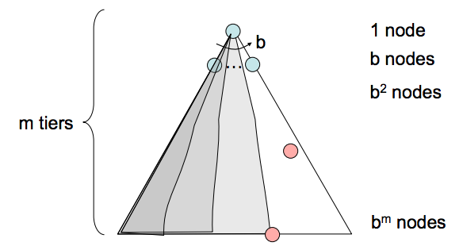
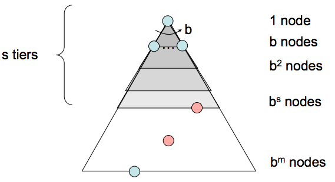
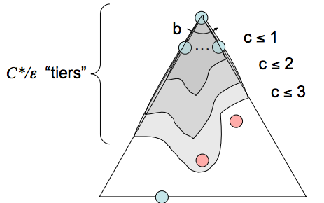

# Uninformed Search

The standard protocol for finding a plan to get from the start state to a goal state is to maintain an outer **frontier** of partial plans derived from the search tree. We continually **expand** our frontier by removing a node (which is selected using our given **strategy**) corresponding to a partial plan from the frontier, and replacing it on the frontier with all its children. Removing and replacing an element on the frontier with its children corresponds to discarding a single length n plan and bringing all length $$(n+1)$$ plans that stem from it into consideration. We continue this until eventually removing a goal state off the frontier, at which point we conclude the partial plan corresponding to the removed goal state is in fact a path to get from the start state to the goal state. 

Practically, most implementations of such algorithms will encode information about the parent node, distance to node, and the state inside the node object. This procedure we have just outlined is known as **tree search**, and the pseudocode for it is presented below:

```
function TREE-SEARCH(problem, frontier) return a solution or failure
    frontier ← INSERT(MAKE-NODE(INITIAL-STATE[problem]), frontier)
    while not IS-EMPTY(frontier) do
        node ← POP(frontier)
        if problem.IS-GOAL(node.STATE) then return node
        for each child-node in EXPAND(problem, node) do
            add child-node to frontier
    return failure
```

The `EXPAND` function appearing in the pseudocode returns all the possible nodes that can be reached from a given node by considering all available actions. The pseudocode of the function is as follows:

```
function EXPAND(problem, node) yields nodes
    s ← node.STATE
    for each action in problem.ACTIONS(s) do
        s' ← problem.RESULT(s, action)
        yield NODE(STATE=s', PARENT=node, ACTION=action)
```

When we have no knowledge of the location of goal states in our search tree, we are forced to select our strategy for tree search from one of the techniques that falls under the umbrella of **uninformed search**. We'll now cover three such strategies in succession: **depth-first search**, **breadth-first search**, and **uniform cost search**. Along with each strategy, some rudimentary properties of the strategy are presented as well, in terms of the following:

- The **completeness** of each search strategy - if there exists a solution to the search problem, is the strategy guaranteed to find it given infinite computational resources?
- The **optimality** of each search strategy - is the strategy guaranteed to find the lowest cost path to a goal state?
- The **branching factor** $$b$$ - The increase in the number of nodes on the frontier each time a frontier node is dequeued and replaced with its children is $$O(b)$$. At depth k in the search tree, there exists $$O(b^{k})$$ nodes.
- The maximum depth m.
- The depth of the shallowest solution s.

## Depth-First Search

- *Description* - Depth-first search (DFS) is a strategy for exploration that always selects the *deepest* frontier node from the start node for expansion. 
- *Frontier Representation* - Removing the deepest node and replacing it on the frontier with its children necessarily means the children are now the new deepest nodes - their depth is one greater than the depth of the previous deepest node. This implies that to implement DFS, we require a structure that always gives the most recently added objects highest priority. A last-in, first-out (LIFO) stack does exactly this, and is what is traditionally used to represent the frontier when implementing DFS.



- *Completeness* - Depth-first search is not complete. If there exist cycles in the state space graph, this inevitably means that the corresponding search tree will be infinite in depth. Hence, there exists the possibility that DFS will faithfully yet tragically get "stuck" searching for the deepest node in an infinite-sized search tree, doomed to never find a solution.
- *Optimality* - Depth-first search simply finds the "leftmost" solution in the search tree without regard for path costs, and so is not optimal.
- *Time Complexity* - In the worst case, depth first search may end up exploring the entire search tree. Hence, given a tree with maximum depth $$m$$, the runtime of DFS is $$O(b^{m})$$.
- *Space Complexity* - In the worst case, DFS maintains b nodes at each of $$m$$ depth levels on the frontier. This is a simple consequence of the fact that once $$b$$ children of some parent are enqueued, the nature of DFS allows only one of the subtrees of any of these children to be explored at any given point in time. Hence, the space complexity of DFS is $$O(bm)$$.

## Breadth-First Search

- *Description* - Breadth-first search is a strategy for exploration that always selects the *shallowest* frontier node from the start node for expansion. 
- *Frontier Representation* - If we want to visit shallower nodes before deeper nodes, we must visit nodes in their order of insertion. Hence, we desire a structure that outputs the oldest enqueued object to represent our frontier. For this, BFS uses a first-in, first-out (FIFO) queue, which does exactly this.



- *Completeness* - If a solution exists, then the depth of the shallowest node $$s$$ must be finite, so BFS must eventually search this depth. Hence, it's complete.
- *Optimality* - BFS is generally not optimal because it simply does not take costs into consideration when determining which node to replace on the frontier. The special case where BFS is guaranteed to be optimal is if all edge costs are equivalent, because this reduces BFS to a special case of uniform cost search, which is discussed below.
- *Time Complexity* - We must search $$1 + b + b^{2} + ... + b^{s}$$ nodes in the worst case, since we go through all nodes at every depth from 1 to $$s$$. Hence, the time complexity is $$O(bˢ)$$.
- *Space Complexity* - The frontier, in the worst case, contains all the nodes in the level corresponding to the shallowest solution. Since the shallowest solution is located at depth $$s$$, there are $$O(b^{s})$$ nodes at this depth.

## Uniform Cost Search

- *Description* - Uniform cost search (UCS), our last strategy, is a strategy for exploration that always selects the *lowest cost* frontier node from the start node for expansion.
- *Frontier Representation* - To represent the frontier for UCS, the choice is usually a heap-based priority queue, where the priority for a given enqueued node $$v$$ is the path cost from the start node to $$v$$, or the *backward cost* of $$v$$. Intuitively, a priority queue constructed in this manner simply reshuffles itself to maintain the desired ordering by path cost as we remove the current minimum cost path and replace it with its children.



- *Completeness* - Uniform cost search is complete. If a goal state exists, it must have some finite length shortest path; hence, UCS must eventually find this shortest length path.
- *Optimality* - UCS is also optimal if we assume all edge costs are nonnegative. By construction, since we explore nodes in order of increasing path cost, we're guaranteed to find the lowest-cost path to a goal state. The strategy employed in Uniform Cost Search is identical to that of Dijkstra's algorithm, and the chief difference is that UCS terminates upon finding a solution state instead of finding the shortest path to all states. Note that having negative edge costs in our graph can make nodes on a path have decreasing length, ruining our guarantee of optimality. (See Bellman-Ford algorithm for a slower algorithm that handles this possibility)
- *Time Complexity* - Let us define the optimal path cost as $$C*$$ and the minimal cost between two nodes in the state space graph as ε. Then, we must roughly explore all nodes at depths ranging from 1 to $$\frac{C*}{ε}$$, leading to an runtime of $$O(b^{\frac{C*}{ε}})$$.
- *Space Complexity* - Roughly, the frontier will contain all nodes at the level of the cheapest solution, so the space complexity of UCS is estimated as $$O(b^{\frac{C*}{ε}})$$.

As a parting note about uninformed search, it's critical to note that the three strategies outlined above are fundamentally the same - differing only in expansion strategy, with their similarities being captured by the tree search pseudocode presented above.